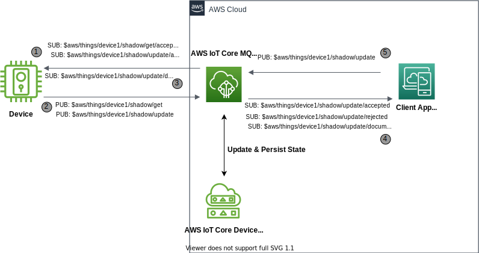
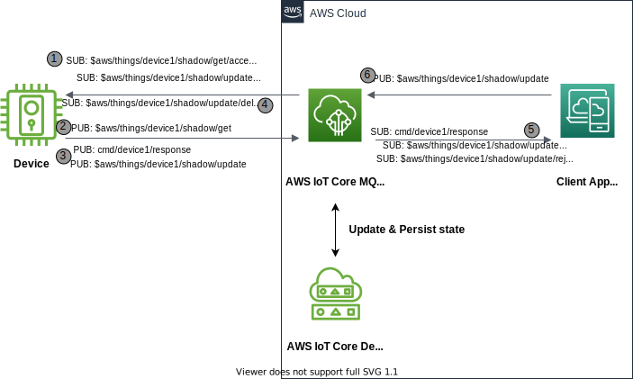

El comando y control es la operación de enviar un mensaje a un dispositivo solicitando que realice alguna acción o controle la configuración del dispositivo. Sin embargo, cuando la interacción ocurre con dispositivos a través de redes intermitentes, desplegados en áreas remotas, o cuando se utilizan dispositivos con recursos limitados, una solución IoT puede no enviar o recibir comandos o actualizaciones de configuración de manera confiable. Las aplicaciones o servicios IoT pueden simular y controlar la configuración del dispositivo de borde y ejecutar acciones utilizando la sombra del dispositivo.

{}
Esta implementación está diseñada utilizando el [servicio de sombra de dispositivos de AWS IoT](https://docs.aws.amazon.com/iot/latest/developerguide/iot-device-shadows.html) a través de temas MQTT reservados para sombras, y describe dos enfoques que utilizan sombras de dispositivos. Consulte el [Diseño de Temas MQTT para AWS IoT Core](https://docs.aws.amazon.com/whitepapers/latest/designing-mqtt-topics-aws-iot-core/designing-mqtt-topics-aws-iot-core.html), específicamente la sección _Aplicaciones en AWS_. Este documento técnico proporciona patrones alternativos adicionales que van más allá del alcance de esta implementación.
{}

## Casos de Uso

- Solicitar o actualizar la configuración del estado del dispositivo
  - _Quiero rastrear y controlar dispositivos inteligentes del hogar desde mi aplicación móvil_
  - _Quiero controlar remotamente calentadores domésticos encendiéndolos/apagándolos o configurando la temperatura deseada_
- Solicitar acciones del dispositivo basadas en algunos comandos
  - _Quiero desbloquear una puerta para un visitante familiar de forma remota_
  - _Quiero instruir remotamente a un dispositivo para alguna acción, en base a un comando_

## Arquitectura de Referencia

Esta sección describe consideraciones de arquitectura para comando y control utilizando la sombra del dispositivo de AWS IoT Core

- Cuando se solicita una actualización de la configuración del estado del dispositivo
- Cuando se solicitan acciones del dispositivo basadas en comandos


{}

# 

- _AWS IoT Core_ es el broker de mensajes MQTT que procesa los mensajes
- _Dispositivo_ es el objeto IoT que se va a controlar
- _Aplicación Cliente_ es la lógica remota que emite comandos, actualiza la configuración del estado del dispositivo y consume datos de telemetría del dispositivo
- _Sombra del Dispositivo_ es la réplica que hace que el estado del dispositivo esté disponible para aplicaciones y otros servicios
- _ShadowTopicPrefix_ es una forma abreviada del tema, referida como `$aws/things/device1/shadow` (tema de sombra clásica)

1. El _Dispositivo_ establece una conexión MQTT con el endpoint de _AWS IoT Core_ y luego se suscribe a los [temas reservados de sombra MQTT](https://docs.aws.amazon.com/iot/latest/developerguide/reserved-topics.html#reserved-topics-shadow) para obtener y actualizar las operaciones de eventos de sombra. Además, en lugar de suscribirse individualmente a cada tema de sombra reservado, se podría usar un comodín (_#_) para una suscripción generalizada como _`ShadowTopicPrefix/get/#`_, _`ShadowTopicPrefix/update/#`_.
2. Después de conectarse y suscribirse a los temas con éxito, el _Dispositivo_ publica una solicitud en el tema _`ShadowTopicPrefix/get`_ y procesa el último documento de sombra recibido en el tema _`ShadowTopicPrefix/get/accepted`_. Después de procesar los cambios de configuración de los datos _desired_ en el documento de sombra, el _Dispositivo_ realiza una solicitud de publicación en el tema _`ShadowTopicPrefix/update`_ con la última configuración del dispositivo como datos _reported_ en el documento de sombra.
3. Después de procesar, los atributos delta en la conexión inicial/reconexión. Si el dispositivo permanece conectado opcionalmente, puede recibir más cambios delta en el documento de sombra desde la _Aplicación Cliente_.
4. La _Aplicación Cliente_ establece una conexión MQTT con el endpoint de _AWS IoT Core_ y luego se suscribe a los temas de sombra _`ShadowTopicPrefix/update/accepted`_, _`ShadowTopicPrefix/update/rejected`_ para procesar las actualizaciones de configuración realizadas en el dispositivo.
5. Para actualizar la configuración del dispositivo, la _Aplicación Cliente_ publica un mensaje como estado _desired_ en el tema reservado _`ShadowTopicPrefix/update`_.

```plantuml
@startuml
!define AWSPuml https://raw.githubusercontent.com/awslabs/aws-icons-for-plantuml/v7.0/dist
!includeurl AWSPuml/AWSCommon.puml
!includeurl AWSPuml/InternetOfThings/all.puml
!includeurl AWSPuml/General/Client.puml

'Comment out to use default PlantUML sequence formatting
skinparam participant {
    BackgroundColor AWS_BG_COLOR
    BorderColor AWS_BORDER_COLOR
}
'Hide the bottom boxes
hide footbox

participant "<$IoTGeneric>\nDevice" as device
participant "<$IoTShadow>\nShadow" as shadow
participant "<$IoTCore>\nMQTT Broker" as broker
participant "<$Client>\nApplication" as app

== Device connect and subscribe ==
device -> broker : connect(iot_endpoint)
device -> broker : subscribe("$aws/things/device1/shadow/get/accepted")
device -> broker : subscribe("$aws/things/device1/shadow/get/rejected")
device -> broker : subscribe("$aws/things/device1/shadow/update/accepted")
device -> broker : subscribe("$aws/things/device1/shadow/update/rejected")
device -> broker : subscribe("$aws/things/device1/shadow/update/delta")

== Application connect and subscribe ==
app -> broker : connect(iot_endpoint)
app -> broker : subscribe("$aws/things/device1/shadow/update/accepted")
app -> broker : subscribe("$aws/things/device1/shadow/update/rejected")

== App to Device state control and update ==
app -> broker : publish("$aws/things/device1/shadow/update", "desired : {motorStatus: on}")
broker -> shadow : updates shadow for desired state changes from app
device -> broker : On initial connect/reconnect, publish("$aws/things/device1/shadow/get")
broker -> device : Send persisted shadow state, publish("$aws/things/device1/shadow/get/accepted") 
device -> device : Turn motor on
device -> broker : publish("$aws/things/device1/shadow/update", "reported : {motorStatus: on}")
broker -> shadow : updates reported state on shadow document
broker -> app : publish("$aws/things/device1/shadow/update/accepted", "success")
app -> app : reconcile("device1")
rnote over device #FFFFFF: If device remained connected
app -> broker : publish("$aws/things/device1/shadow/update", "desired : {motorStatus: off}")
broker -> shadow : updates shadow for desired state changes from app
broker -> device : publish("$aws/things/device1/shadow/update/delta", "desired : {motorStatus: off}")
device -> device : Turn motor off
device -> broker : publish("$aws/things/device1/shadow/update", "reported : {motorStatus: off}")
broker -> shadow : updates reported state on shadow document
broker -> app : publish("$aws/things/device1/shadow/update/accepted", "success")
app -> app : reconcile("device1")


@enduml
```


{}
{}




- _AWS IoT Core_ es el broker de mensajes MQTT que procesa los mensajes
- _Dispositivo_ es el objeto IoT que se va a controlar
- _Aplicación Cliente_ es la lógica remota que emite comandos, actualiza la configuración del dispositivo y consume datos de telemetría del dispositivo
- _Sombra del Dispositivo_ es la réplica que hace que el estado del dispositivo esté disponible para aplicaciones y otros servicios
- _ShadowTopicPrefix_ es una forma abreviada del tema, referida como `$aws/things/device1/shadow` (sombra clásica)

1. El _Dispositivo_ establece una conexión MQTT con el endpoint de _AWS IoT Core_ y luego se suscribe a los [temas reservados de sombra MQTT](https://docs.aws.amazon.com/iot/latest/developerguide/reserved-topics.html#reserved-topics-shadow) para obtener y actualizar las operaciones de eventos de sombra. Además, en lugar de suscribirse individualmente a cada tema de sombra reservado, se podría usar un comodín (_#_) para una suscripción generalizada como _`ShadowTopicPrefix/get/#`_, _`ShadowTopicPrefix/update/#`_.
2. Después de conectarse y suscribirse a los temas con éxito, el _Dispositivo_ publica una solicitud en el tema _`ShadowTopicPrefix/get`_ y procesa el último documento de sombra recibido en el tema _`ShadowTopicPrefix/get/accepted`_.
3. Después de recibir el _comando_ en el documento de sombra, el _Dispositivo_ realiza una solicitud de publicación en el tema `cmd/device1/response` como respuesta a la ejecución del comando. Al completar un comando, el _Dispositivo_ publica el estado en el tema `ShadowTopicPrefix/update` para la reconciliación del estado _reported_ en el documento de sombra.
4. Después de procesar, los atributos delta en la conexión inicial/reconexión. Si el dispositivo permanece conectado opcionalmente, puede recibir más cambios delta en el documento de sombra desde la _Aplicación Cliente_.
5. La _Aplicación Cliente_ establece una conexión MQTT con el endpoint de _AWS IoT Core_ y luego se suscribe a los temas de sombra `ShadowTopicPrefix/update/accepted`, `ShadowTopicPrefix/update/rejected` para reconciliar las actualizaciones del documento de sombra realizadas por el dispositivo. La _Aplicación Cliente_ también se suscribe al tema `cmd/device1/response` para procesar la respuesta de ejecución del comando.
6. Para enviar un comando, la _Aplicación Cliente_ publica un mensaje en el tema `ShadowTopicPrefix/update` agregando una solicitud de comando bajo los datos del estado _desired_ para el dispositivo.


```plantuml
@startuml
!define AWSPuml https://raw.githubusercontent.com/awslabs/aws-icons-for-plantuml/v7.0/dist
!includeurl AWSPuml/AWSCommon.puml
!includeurl AWSPuml/InternetOfThings/all.puml
!includeurl AWSPuml/General/Client.puml

'Comment out to use default PlantUML sequence formatting
skinparam participant {
    BackgroundColor AWS_BG_COLOR
    BorderColor AWS_BORDER_COLOR
}
'Hide the bottom boxes
hide footbox

participant "<$IoTGeneric>\nDevice" as device
participant "<$IoTShadow>\nShadow" as shadow
participant "<$IoTCore>\nMQTT Broker" as broker
participant "<$Client>\nApplication" as app

== Device connect and subscribe ==
device -> broker : connect(iot_endpoint)
device -> broker : subscribe("$aws/things/device1/shadow/get/accepted")
device -> broker : subscribe("$aws/things/device1/shadow/get/rejected")
device -> broker : subscribe("$aws/things/device1/shadow/update/accepted")
device -> broker : subscribe("$aws/things/device1/shadow/update/rejected")
device -> broker : subscribe("$aws/things/device1/shadow/update/delta")

== Application connect and subscribe ==
app -> broker : connect(iot_endpoint)
app -> broker : subscribe("$aws/things/device1/shadow/update/accepted")
app -> broker : subscribe("$aws/things/device1/shadow/update/rejected")
app -> broker : subscribe("cmd/device1/response")

== App to Device command control and response ==
app -> broker : publish("$aws/things/device1/shadow/update", "desired : {"command": [{ "do-something":{"payload":"goes here"} }]}")
broker -> shadow : updates shadow for desired command message from app
device -> broker : on initial connect/reconnect, publish("$aws/things/device1/shadow/get")
broker -> device : send persisted shadow state, publish("$aws/things/device1/shadow/get/accepted") 
device -> device : do-something as per command
device -> broker : On completion of command update reported state, publish("$aws/things/device1/shadow/update", "reported : {"command": [{ "do-something":{"payload":"goes here"} }]}")
broker -> shadow : updates reported state on shadow document
broker -> app : publish("$aws/things/device1/shadow/update/accepted", "success")
app -> app : reconcile("device1")
rnote over device #FFFFFF: If device remained connected
app -> broker : publish("$aws/things/device1/shadow/update", "desired : {"command": [{ "do-something":{"payload":"updated value"} }]}")
broker -> shadow : updates shadow for desired command message from app
broker -> device : publish("$aws/things/device1/shadow/update/delta", "desired : {"command": [{ "do-something":{"payload":"updated value"} }]}"")
device -> device : do-something as per command
device -> broker : On completion of command update reported state, publish("$aws/things/device1/shadow/update", "reported : {"command": [{ "do-something":{"payload":"updated value"} }]}")
broker -> shadow : updates reported state on shadow document
broker -> app : publish("$aws/things/device1/shadow/update/accepted", "success")
app -> app : reconcile("device1")

@enduml
```
{}


### Suposiciones

- Uso de la sombra clásica en lugar de una sombra nombrada.
- La sombra del _Dispositivo_ se crea previamente antes de que el dispositivo realice la solicitud de obtención al conectarse/reconectarse.
- El _Dispositivo_ permanece conectado al endpoint de _AWS IoT Core_ después de la conexión inicial; el dispositivo espera las actualizaciones de la configuración deseada o el comando.
- Todos los participantes reciben, reenvían y actúan sobre los flujos de mensajes en ambas direcciones con éxito.

## Implementación

Tanto la _Aplicación Cliente_ como el _Dispositivo_ pueden usar un enfoque similar al conectarse, enviar y recibir mensajes. Por lo tanto, los ejemplos de código a continuación son completos para cada participante.

{}
Los ejemplos de código se centran en el diseño del _comando_ en general. Consulte la [Guía de inicio de AWS IoT Core](https://docs.aws.amazon.com/iot/latest/developerguide/iot-gs.html) para obtener detalles sobre la creación de cosas, certificados y la obtención de su endpoint. Los ejemplos de código demuestran la capacidad esencial del patrón de _Comando_.
{}

### Dispositivo

El código del _Dispositivo_ se centra en conectarse al _Broker_ y luego suscribirse a los temas reservados de sombra para recibir comandos y cambios de configuración. Al recibir un comando, el _Dispositivo_ realiza alguna acción local y luego publica el resultado (éxito, fallo) del comando de vuelta a la _Aplicación Cliente_, que luego reconcilia el comando. Después de eso, el _Dispositivo_ continuará recibiendo y respondiendo a actualizaciones de configuración o comandos o ambos hasta que se detenga.

Consulte este [ejemplo de sombra](https://github.com/aws/aws-iot-device-sdk-python-v2/blob/main/samples/shadow.py) para más detalles.

- Instale el SDK desde PyPI: `python3 -m pip install awsiotsdk`
- Reemplace las variables globales con un endpoint, clientId y credenciales válidos
- Inicie en una sesión de terminal separada antes de ejecutar la _Aplicación_: `python3 client.py`


```python
# client.py - Este ejemplo demuestra la espera de comandos o actualizaciones de configuración para evaluación y procesamiento.

from awscrt import auth, io, mqtt, http
from awsiot import iotshadow
from awsiot import mqtt_connection_builder
from concurrent.futures import Future
import sys
import json
import datetime as datetime
import time as time

###################################################################################################################
# Este ejemplo utiliza el Servicio de Sombra de Dispositivos de AWS IoT para recibir comandos y mantener una propiedad sincronizada entre el dispositivo y el servidor. Al iniciar, el dispositivo solicita el documento de sombra para conocer el estado inicial de la propiedad y procesar los atributos y comandos pasados en el valor deseado del documento de sombra. El dispositivo también se suscribe a eventos "delta" desde el endpoint de AWS IoT Core, que se publican cuando el valor "deseado" de una propiedad difiere de su valor "reportado". Cuando el dispositivo se entera de un nuevo valor deseado, esos datos se procesan y se envía un nuevo valor "reportado" al servidor. En esta implementación de ejemplo, un dispositivo de borde IoT actúa como un actuador para encender/apagar el motor a través del atributo del documento de sombra. Además, el dispositivo actuará sobre el comando pasado desde la aplicación cliente en el documento de sombra del dispositivo.
###################################################################################################################

# Usando variables globales para simplificar el código de ejemplo

client_id = "REPLACE_WITH_DEVICE_ID"
client_token = "REPLACE_WITH_SECURE_DEVICE_TOKEN"
endpoint = "REPLACE_WITH_YOUR_ENDPOINT_FQDN"
client_certificate = "PATH_TO_CLIENT_CERTIFICATE_FILE"
client_private_key = "PATH_TO_CLIENT_PRIVATE_KEY_FILE"
root_ca = "PATH_TO_ROOT_CA_CERTIFICATE_FILE"
thing_name = "REPLACE_WITH_DEVICE_NAME"

# Variables de estado ficticias para mostrar la lógica y validación del programa de ejemplo.
# Para la implementación durante la conexión o reconexión del dispositivo, lea estos datos como el último estado procesado desde el almacenamiento del dispositivo o a través del último estado reportado en el documento de sombra.

DEVICE_MOTOR_STATUS = "off"
SHADOW_DOCUMENT_VERSION = 0

# Para simplificar, esta implementación utiliza operación de un solo hilo. En el caso de casos de uso de múltiples hilos, considere utilizar un bloqueo. Más detalles aquí - https://github.com/aws/aws-iot-device-sdk-python-v2/blob/main/samples/shadow.py

# Función para salir de este ejemplo de manera ordenada
def exit(msg_or_exception):
    
    print("Exiting sample:", msg_or_exception)
    future = mqtt_connection.disconnect()
    future.add_done_callback(on_disconnected)
    
def on_disconnected(disconnect_future):
    print("Disconnected.")

# Función de callback para codificar un payload en JSON
def json_encode(string):
        return json.dumps(string)

# Callback para publicar un mensaje en un tema específico
def send(topicname,message):
    mqtt_connection.publish(
                topic=topicname,
                payload=message,
                qos=mqtt.QoS.AT_LEAST_ONCE)
    print("Message published on topic - '{}'.".format(topicname))

def on_get_shadow_accepted(response):
    # type: (iotshadow.GetShadowResponse) -> None
    global SHADOW_DOCUMENT_VERSION
    global DEVICE_MOTOR_STATUS
    global thing_name
    global client_token
    processedAttrib = False
    processedCommand = False
    print ("Processing response on GetShadow")
  
    try:
        
        if response is not None:
            if response.client_token != client_token:
                print("Invalid client token passed")
                return
        
        if response.state is not None:
            if response.version is not None and response.version <= SHADOW_DOCUMENT_VERSION:
                print("No new data to process, skipping get shadow document processing!")
                return
            
            # Verificar si hay cambios delta para procesar    
            if response.state.delta is not None:
                
                # Actualizar la última versión del documento de sombra
                SHADOW_DOCUMENT_VERSION = response.version
                #########################################################################
                # El código para enviar la versión del documento de sombra procesado al almacenamiento del dispositivo va aquí
                # store__to_local_storage(SHADOW_DOCUMENT_VERSION)
                # Acabamos de actualizar la variable global para simplificar el código
                #########################################################################
                print("Updated local shadow document version on connect or reconnect")
                
                # Verificar si hay cambios en los atributos/configuración del dispositivo para procesar
                if response.state.delta.get("deviceAttrib") is not None:
                    DEVICE_MOTOR_STATUS = response.state.delta.get("deviceAttrib").get("motorStatus")
                    print("Motor is turned - {}".format(DEVICE_MOTOR_STATUS))
                    processedAttrib = True
                        
                # Verificar si se pasó algún comando para la acción del dispositivo
                if response.state.delta.get("command") is not None:
                    
                    # Recorrer todos los comandos para procesarlos
                    for eachcmd in response.state.delta.get("command"):
                        
                        ####################################################
                        # El código de procesamiento de comandos va aquí
                        ####################################################
                        if "relay-command" in eachcmd:
                            if eachcmd.get("relay-command").get("ttl") is not None:
                                value_ttl = eachcmd.get("relay-command").get("ttl")
                            
                            # Omitir la ejecución del comando si el desfase entre la hora del sistema y la marca de tiempo
                            # en el documento de sombra está más allá del umbral TTL del comando
                            if (int(datetime.datetime.now().timestamp()) - int(response.timestamp.timestamp()) > value_ttl):
                                print("Command validity expired, skipping action")
                                continue
                            else:
                                # Acción a realizar en el dispositivo para completar el comando
                                
                                print("Executing command action..")
                                
                                # El código real para la acción del comando va aquí. Para este ejemplo
                                # solo estamos retransmitiendo el mensaje en un tema específico    
                                value_message = eachcmd.get("relay-command").get("message")
                                relay_message = {'msg':value_message,'deviceId': thing_name}
                                value_topic = eachcmd.get("relay-command").get("topic")
                                send(value_topic,json_encode(relay_message))
                                processedCommand = True

                # Payload para el estado Reportado en el documento de sombra
                if processedAttrib and processedCommand:
                    shadowReportedMessage = {"deviceAttrib":{"motorStatus":DEVICE_MOTOR_STATUS},"command":[{"relay-command":{"message":value_message,"topic":value_topic,"ttl":value_ttl}}]}
                elif processedAttrib and not processedCommand:
                    shadowReportedMessage = {"deviceAttrib":{"motorStatus":DEVICE_MOTOR_STATUS}}
                elif processedCommand and not processedAttrib:
                    shadowReportedMessage = {"command":[{"relay-command":{"message":value_message,"topic":value_topic,"ttl":value_ttl}}]}
                    
                if processedAttrib or processedCommand:
                    
                    # Actualizar el estado reportado en la sombra del dispositivo
                    # use un token único para que podamos correlacionar este mensaje de "solicitud" con
                    # cualquier mensaje de "respuesta" recibido en los temas /accepted y /rejected
                    token = client_token
                    request = iotshadow.UpdateShadowRequest(
                                thing_name=thing_name,
                                state=iotshadow.ShadowState(
                                    reported = shadowReportedMessage
                                ),
                                client_token=token,
                            )
                
                    future = shadow_client.publish_update_shadow(request, mqtt.QoS.AT_LEAST_ONCE)
                    future.add_done_callback(on_publish_update_shadow)
                    print ("Device shadow updated during get accepted")
                    return
          
        print("Get response has no state for processing")
        return

    except Exception as e:
        exit(e)

def on_get_shadow_rejected(error):
    # type: (iotshadow.ErrorResponse) -> None
    try:
        
        if error.code == 404:
            print("Thing has no shadow document. Consider creating shadow first")
        else:
            exit("Get request was rejected. code:{} message:'{}'".format(
                error.code, error.message))

    except Exception as e:
        exit(e)

def on_shadow_delta_updated(delta):
    # type: (iotshadow.ErrorResponse) -> None
    global SHADOW_DOCUMENT_VERSION
    global DEVICE_MOTOR_STATUS
    global thing_name
    global client_token
    processedAttrib = False
    processedCommand = False
    print("Processing delta response from device shadow")
    
    try:
        if delta.state is not None:
            if delta.version is not None and delta.version <= SHADOW_DOCUMENT_VERSION:
                print("No new data to process, skipping delta shadow document processing!")
                return
            
            # Actualizar la última versión del documento de sombra
            SHADOW_DOCUMENT_VERSION = delta.version
            ##################################################################################
            # El código para enviar la versión del documento de sombra procesado al almacenamiento del dispositivo va aquí
            # store__to_local_storage(SHADOW_DOCUMENT_VERSION)
            # Acabamos de actualizar la variable global para simplificar el código
            ##################################################################################
            print("Updated local shadow document version for delta updates")
            
            # Verificar si hay cambios en los atributos/configuración del dispositivo para procesar 
            if delta.state.get("deviceAttrib") is not None:
                DEVICE_MOTOR_STATUS = delta.state.get("deviceAttrib").get("motorStatus")
                print("Motor is turned - {}".format(DEVICE_MOTOR_STATUS))
                processedAttrib = True
                    
            # Verificar si se pasó algún comando para la acción del dispositivo.
            # La matriz de comandos permite el procesamiento de múltiples comandos
            if delta.state.get("command") is not None:
                
                #Loop through all the commands for processing 
                for eachcmd in delta.state.get("command"):
                    
                    ###########################################################
                    # El código de procesamiento de comandos va aquí.
                    # solo estamos retransmitiendo el mensaje en un tema para simplificar
                    ###########################################################
                    if "relay-command" in eachcmd:
                        if eachcmd.get("relay-command").get("ttl") is not None:
                            value_ttl = eachcmd.get("relay-command").get("ttl")
                        
                        # Omitir la ejecución del comando si el desfase entre la hora del sistema y 
                        # la marca de tiempo en el documento de sombra está más allá del umbral TTL del comando
                        if (int(datetime.datetime.now().timestamp()) - int(delta.timestamp.timestamp()) > value_ttl):
                            print("Command validity expired, skipping action")
                            continue
                        else:
                            # Acción a realizar en el dispositivo para completar el comando
                            
                            print("Executing command action..")
                            
                            value_message = eachcmd.get("relay-command").get("message")
                            relay_message = {'msg':value_message,'deviceId': thing_name}
                            value_topic = eachcmd.get("relay-command").get("topic")
                            send(value_topic,json_encode(relay_message))
                            processedCommand = True
    
            # Payload para el estado Reportado en el documento de sombra
            if processedAttrib and processedCommand:
                shadowReportedMessage = {"deviceAttrib":{"motorStatus":DEVICE_MOTOR_STATUS},"command":[{"relay-command":{"message":value_message,"topic":value_topic,"ttl":value_ttl}}]}
            elif processedAttrib and not processedCommand:
                shadowReportedMessage = {"deviceAttrib":{"motorStatus":DEVICE_MOTOR_STATUS}}
            elif processedCommand and not processedAttrib:
                shadowReportedMessage = {"command":[{"relay-command":{"message":value_message,"topic":value_topic,"ttl":value_ttl}}]}
                
            if processedAttrib or processedCommand:
                
                # Actualizar el estado reportado en la sombra del dispositivo
                # use un token único para que podamos correlacionar este mensaje de "solicitud" con
                # cualquier mensaje de "respuesta" recibido en los temas /accepted y /rejected
                token = client_token
                request = iotshadow.UpdateShadowRequest(
                            thing_name=thing_name,
                            state=iotshadow.ShadowState(
                                reported = shadowReportedMessage
                            ),
                            client_token=token,
                        )
            
                future = shadow_client.publish_update_shadow(request, mqtt.QoS.AT_LEAST_ONCE)
                future.add_done_callback(on_publish_update_shadow)
                print ("Device shadow updated during get accepted")
                return
         
        else:
            print("Delta response has no state changes")
            return
            
    except Exception as e:
        exit(e)

def on_publish_update_shadow(future):
    #type: (Future) -> None
    try:
        future.result()
        print("Update request published.")
    except Exception as e:
        print("Failed to publish update request.")
        exit(e)

def on_update_shadow_accepted(response):
    # type: (iotshadow.UpdateShadowResponse) -> None
    try:
       
       print("Shadow update acepted - {}".format(response))

    except Exception as e:
        exit(e)

def on_update_shadow_rejected(error):
    # type: (iotshadow.ErrorResponse) -> None
    try:
       
        exit("Update request was rejected. code:{} message:'{}'".format(
            error.code, error.message))

    except Exception as e:
        exit(e)


if __name__ == '__main__':
    
    io.init_logging(getattr(io.LogLevel, "Info"), "stderr")


    # Crear recursos basados en el SDKs
    event_loop_group = io.EventLoopGroup(1)
    host_resolver = io.DefaultHostResolver(event_loop_group)
    client_bootstrap = io.ClientBootstrap(event_loop_group, host_resolver)

    # Crear conexión MQTT nativa a partir de credenciales en la ruta (sistema de archivos)
    mqtt_connection = mqtt_connection_builder.mtls_from_path(
        endpoint=endpoint,
        cert_filepath=client_certificate,
        pri_key_filepath=client_private_key,
        client_bootstrap=client_bootstrap,
        ca_filepath=root_ca,
        client_id=client_id,
        clean_session=True,
        keep_alive_secs=30,
    )

    print("Connecting to {} with client ID '{}'...".format(
        endpoint, client_id))

    connected_future = mqtt_connection.connect()

    shadow_client = iotshadow.IotShadowClient(mqtt_connection)

    # Esperar a que la conexión esté completamente establecida.
    # Tenga en cuenta que no es necesario esperar, los comandos emitidos a la
    # mqtt_connection antes de que esté completamente conectada simplemente se pondrán en cola.
    # Pero este ejemplo espera aquí para que sea obvio cuando una conexión
    # falla o tiene éxito.
    connected_future.result()
    print("Connected!")

    try:
        # Suscribirse a los temas necesarios.
        # Tenga en cuenta que es **importante** esperar a que las suscripciones "accepted/rejected"
        # tengan éxito antes de publicar la correspondiente "request".
        print("Subscribing to Update responses...")
        update_accepted_subscribed_future, _ = shadow_client.subscribe_to_update_shadow_accepted(
            request=iotshadow.UpdateShadowSubscriptionRequest(thing_name=thing_name),
            qos=mqtt.QoS.AT_LEAST_ONCE,
            callback=on_update_shadow_accepted)

        update_rejected_subscribed_future, _ = shadow_client.subscribe_to_update_shadow_rejected(
            request=iotshadow.UpdateShadowSubscriptionRequest(thing_name=thing_name),
            qos=mqtt.QoS.AT_LEAST_ONCE,
            callback=on_update_shadow_rejected)

        # Esperar a que las suscripciones tengan éxito
        update_accepted_subscribed_future.result()
        update_rejected_subscribed_future.result()

        print("Subscribing to Get responses...")
        get_accepted_subscribed_future, _ = shadow_client.subscribe_to_get_shadow_accepted(
            request=iotshadow.GetShadowSubscriptionRequest(thing_name=thing_name),
            qos=mqtt.QoS.AT_LEAST_ONCE,
            callback=on_get_shadow_accepted)

        get_rejected_subscribed_future, _ = shadow_client.subscribe_to_get_shadow_rejected(
            request=iotshadow.GetShadowSubscriptionRequest(thing_name=thing_name),
            qos=mqtt.QoS.AT_LEAST_ONCE,
            callback=on_get_shadow_rejected)

        # Esperar a que las suscripciones tengan éxito
        get_accepted_subscribed_future.result()
        get_rejected_subscribed_future.result()

        print("Subscribing to Delta events...")
        delta_subscribed_future, _ = shadow_client.subscribe_to_shadow_delta_updated_events(
            request=iotshadow.ShadowDeltaUpdatedSubscriptionRequest(thing_name=thing_name),
            qos=mqtt.QoS.AT_LEAST_ONCE,
            callback=on_shadow_delta_updated)

        # Esperar a que la suscripción tenga éxito
        delta_subscribed_future.result()


        # Emitir solicitud para el estado actual de la sombra.
        # La respuesta será recibida por la callback on_get_accepted()
        print("Solicitando el estado actual de la sombra...")

        # use un token único para que podamos correlacionar este mensaje de "solicitud" con
        # cualquier mensaje de "respuesta" recibido en los temas /accepted y /rejected
        token = client_token

        publish_get_future = shadow_client.publish_get_shadow(
            request=iotshadow.GetShadowRequest(thing_name=thing_name, client_token=token),
            qos=mqtt.QoS.AT_LEAST_ONCE)
     
        # Asegurarse de que la publicación tenga éxito
        publish_get_future.result()

    except Exception as e:
        exit(e)

    # Temporizador de espera para recibir eventos delta cuando el dispositivo permanece conectado después de la conexión/reconexión inicial   
    try:
        while True:
            time.sleep(1)
    except KeyboardInterrupt:
        # Desconectar
        print("Disconnecting...")
        disconnect_future = mqtt_connection.disconnect()
        disconnect_future.result()
        print("Disconnected!")

```
- Esquema de documento de sombra de ejemplo utilizado para enviar solicitudes de actualización desde la Aplicación Cliente

```json

{
  "state": {
    "desired": {
      "deviceAttrib" :{
      		"motorStatus" : "on"
      },
      "command":[{
      		"relay-command":{
                "message": "Message sent as part of command action",
      		    "topic":"cmd/device1/response",
      		    "ttl":300
              }
      }]
    },
    "reported": {
      "deviceData" :{
      		"motorStatus" : "off"
      }
    }
  },
  "clientToken":"myapp123"
}

```

### Aplicación

El código de la _Aplicación Cliente_ se conecta al Broker y se suscribe al tema de respuesta del _Dispositivo_ y a los temas MQTT reservados para la sombra del dispositivo. La _Aplicación Cliente_ puede procesar el estado reportado utilizando los temas reservados de sombra. La implementación de referencia para el procesamiento completo en la _Aplicación Cliente_ se puede ajustar utilizando la implementación del dispositivo anterior.

La implementación a continuación utiliza AWS CLI para demostrar rápidamente cómo una aplicación puede interactuar con una sombra utilizando la línea de comandos.

- Para obtener el estado actual de la sombra utilizando AWS CLI. Desde la línea de comandos, ingrese este comando.

    ```cmd

    aws iot-data get-thing-shadow --thing-name REPLACE_WITH_DEVICE_NAME  /dev/stdout

    ```

- Para actualizar la sombra desde la línea de comandos utilizando AWS CLI

    ```cmd


    aws iot-data update-thing-shadow --thing-name REPACE_WITH_DEVICE_NAME \
        --cli-binary-format raw-in-base64-out \
        --payload '{"state":{"desired":{"deviceAttrib":{"motorStatus":"on"},"command":[{"relay-command":{"message":"Message to relay back","topic":"relay-command/response","ttl":300}}]}},"clientToken":"myapp123"}' /dev/stdout

    ```


## Consideraciones

Esta implementación cubre los aspectos básicos de un patrón de comando y control. Sin embargo, no cubre ciertos aspectos que pueden surgir en el uso en producción.

#### Elegir usar sombras nombradas o no nombradas
El servicio de Sombra de Dispositivos admite sombras clásicas nombradas y no nombradas, como se usaba en el pasado. Un objeto thing puede tener múltiples sombras nombradas y no más de una sombra clásica. Además, un objeto thing puede tener tanto sombras clásicas nombradas como no nombradas simultáneamente; sin embargo, la API utilizada para acceder a cada una es ligeramente diferente, por lo que podría ser más eficiente decidir qué tipo de sombra funcionaría mejor para su solución y usar solo ese tipo. Para obtener más información sobre la API para acceder a las sombras, consulte [Temas de sombra](https://docs.aws.amazon.com/iot/latest/developerguide/reserved-topics.html#reserved-topics-shadow).

#### Versionado y Orden de Mensajes
No hay garantía de que el dispositivo reciba los mensajes del servicio AWS IoT en orden. Por lo tanto, para evitar actualizaciones de configuración obsoletas, el dispositivo puede ignorar actualizaciones de estado anteriores aprovechando el número de versión dentro de cada mensaje y omitir el procesamiento de versiones antiguas, consulte [Documento del servicio de sombra](https://docs.aws.amazon.com/iot/latest/developerguide/device-shadow-document.html#device-shadow-example-response-json-delta).

#### Detectar si el Dispositivo está Conectado
Last Will Testament (LWT) es una característica de MQTT que AWS IoT Core admite. Es un mensaje que el cliente MQTT configura para ser enviado a un tema MQTT cuando el dispositivo se desconecta. LWT se puede aprovechar para establecer una propiedad de la sombra del dispositivo, como una propiedad conectada, y permite que otras aplicaciones y servicios conozcan el estado de conexión del dispositivo. Consulte [Detectar si un dispositivo está conectado](https://docs.aws.amazon.com/iot/latest/developerguide/lwt.html).

#### Tamaño del Mensaje
Muchos dispositivos IoT tienen un ancho de banda limitado disponible, lo que requiere que la comunicación sea optimizada. Una forma de mitigar el problema es reducir el tamaño de los mensajes MQTT y publicarlos en otro tema para que el dispositivo los consuma. Por ejemplo, configure una regla para tomar mensajes del tema shadow/update, recortarlos y publicarlos en el tema shadow/trimmed/update para que el dispositivo se suscriba. Consulte [Reglas para AWS IoT](https://docs.aws.amazon.com/iot/latest/developerguide/iot-rules.html) para más detalles.

Otra consideración con el tamaño es el límite de tamaño del documento de Sombra de Dispositivos de AWS IoT de 8KB. Este límite de tamaño se aplica al documento del mensaje en general, incluyendo el estado deseado y el estado reportado. Por lo tanto, si hay suficientes cambios en el estado deseado y reportado, intente acortar los nombres de los campos dentro de su documento de sombra JSON o cree más sombras nombradas para el dispositivo. Un dispositivo puede tener sombras ilimitadas asociadas con él. El único requisito es que cada nombre debe ser único en su cuenta.

#### Seguimiento del progreso del comando
Cada comando debe tener un tipo de solución único, y cada mensaje de comando debe contener un ID de mensaje globalmente único. El ID del mensaje de comando permite que la solución rastree el estado de comandos distintos. Además, el tipo de comando permite el diagnóstico de cualquier problema potencial en categorías de comandos a lo largo del tiempo. Finalmente, los mensajes deben ser idempotentes y no deben perderse o duplicarse sin el conocimiento del dispositivo y del solicitante.

#### ¿Algunos comandos en la solución se ejecutan significativamente más tiempo de lo normal?
Un simple mensaje de finalización de comando SUCCESS o FAILURE no será suficiente cuando algunos comandos se ejecuten más tiempo de lo normal. En su lugar, la solución debe aprovechar al menos tres estados de comando: SUCCESS, FAILURE y RUNNING. Además, el dispositivo debe devolver RUNNING en un intervalo esperado hasta que el comando se complete. Al usar un estado RUNNING reportado en una frecuencia programada, una solución puede determinar cuándo un comando de larga duración falla silenciosamente.

#### Integración de Aplicaciones
Este ejemplo demostró cómo un dispositivo y una aplicación pueden interactuar con el servicio de Sombra de Dispositivos de AWS IoT. Sin embargo, el servicio también admite una API REST que puede integrarse mejor con aplicaciones específicas. Por ejemplo, una aplicación móvil que interactúa con otras API REST sería una buena candidata para usar la API REST de Sombra de Dispositivos. Consulte [API REST de Sombra de Dispositivos](https://docs.aws.amazon.com/iot/latest/developerguide/device-shadow-rest-api.html) para más detalles.

Además, considere cómo una aplicación podría usar Reglas de AWS IoT. Por ejemplo, podría aprovechar las reglas para enviar una notificación a una aplicación o ejecutar alguna lógica personalizada antes de entregar los datos a la aplicación móvil. Usar reglas puede facilitar la integración con su aplicación o agregar características adicionales para sus usuarios. Consulte [Reglas para AWS IoT](https://docs.aws.amazon.com/iot/latest/developerguide/iot-rules.html) para más detalles.