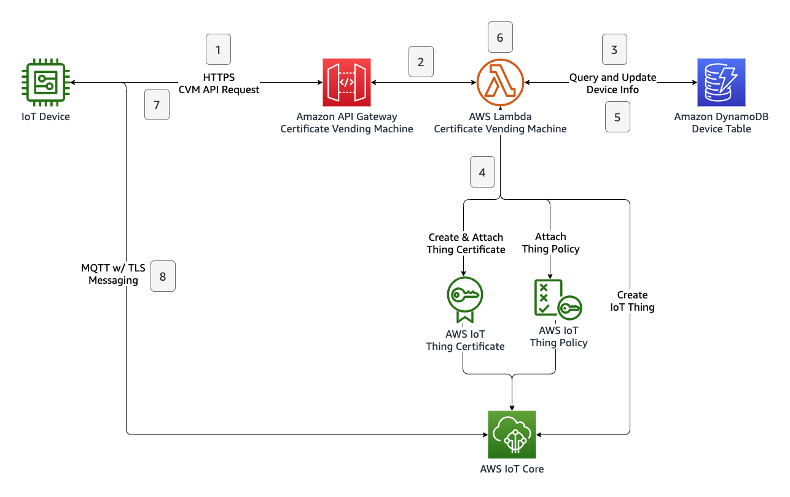

La Máquina Expendedora de Certificados es un patrón de registro de dispositivos aplicado cuando los dispositivos no tienen certificados únicos durante la fabricación y comparten el mismo firmware. Utilizando un endpoint de API de Máquina Expendedora de Certificados (CVM, en resumen), los dispositivos se registran mediante lógica en la nube con la afirmación del dispositivo de un identificador único y un hash calculado con él. Este identificador único puede ser cualquier número de serie, dirección MAC o IMEI. Esta API pública expuesta apunta a una aplicación en la nube que valida la solicitud entrante y realiza las operaciones necesarias para generar y adjuntar certificados al dispositivo.

{}
Esta implementación se centra en el uso de una combinación de AWS Lambda + Amazon DynamoDB + Amazon API Gateway para validar, registrar y realizar un seguimiento de los dispositivos y el proceso de registro de dispositivos. El dispositivo invoca la API cuando se conecta por primera vez a Internet. Luego, AWS Lambda verifica la identidad y validez de la solicitud de certificado con la ayuda de los datos almacenados sobre el dispositivo en DynamoDB. Hay muchas opciones de provisionamiento y registro de dispositivos disponibles para diferentes tipos de circunstancias de fabricación y distribución. Consulte la [sección de arranque de dispositivos de IoT Atlas](..) para explorar otros métodos de provisionamiento y registro de dispositivos.
{}

{}
Otro método puede ser [arrancar el dispositivo con un usuario de confianza](../fleet\_provisioning\_trusted\_user/) cuando los dispositivos no tienen certificados únicos y un usuario de confianza está disponible con una aplicación móvil que puede retransmitir los certificados al dispositivo.
{}


## Casos de Uso

El enfoque de Máquina Expendedora de Certificados para el registro de dispositivos puede ser un método preferido bajo las siguientes condiciones:

- Los dispositivos no tienen certificados únicos durante la fabricación y comparten el mismo firmware.
- Los dispositivos pueden declarar un identificador único como número de serie, ID de producto, IMEI o ID de Mac.
- La cadena de suministro de fabricación no es confiable o están involucrados terceros en el ciclo de vida del dispositivo.
- Se necesitan validaciones detalladas o llamadas a servicios de terceros durante el registro.
- El dispositivo IoT necesita interactuar con un endpoint de API seguro y autenticado para realizar su registro.

## Arquitectura de Referencia

La arquitectura del sistema CVM es la siguiente:



Los siguientes pasos están involucrados durante el registro de un dispositivo IoT con el método de máquina expendedora de certificados:

1. El dispositivo envía una solicitud de registro con un payload que contiene el identificador único del dispositivo y un token de registro al endpoint de Amazon API Gateway.
2. El servicio Amazon API Gateway verifica la solicitud e invoca la función Lambda de CVM.
3. La función Lambda de CVM verifica la solicitud de registro consultando la tabla de Amazon DynamoDB.
4. La función Lambda de CVM aplica el proceso de registro creando un certificado de dispositivo IoT, adjuntando la política de IoT predefinida al certificado, creando un dispositivo IoT y adjuntando el certificado al dispositivo IoT.
5. La función Lambda de CVM actualiza la información del estado del dispositivo en el registro correspondiente de DynamoDB.
5. La función Lambda de CVM actualiza la información del estado del dispositivo en el registro correspondiente de DynamoDB.
6. La función Lambda de CVM prepara un payload de respuesta JSON que incluye tanto certificados únicos como información del endpoint de AWS IoT Core.
7. El dispositivo recibe los certificados y la información del endpoint de IoT Core, completando el proceso de registro.
8. El dispositivo inicia una nueva conexión MQTT con TLS utilizando sus propios certificados y parámetros obtenidos de la respuesta de la API de CVM.

La representación básica de este flujo se muestra a continuación:


## Autenticación

Los dispositivos utilizarán el endpoint de API pública para iniciar su proceso de registro. Esta solicitud contendrá el identificador único del dispositivo y el token de registro. El identificador único se utilizará para construir el nombre del dispositivo. El token de registro es un valor hash calculado que se almacenará en la tabla de DynamoDB. El token será calculado por el dispositivo utilizando el mismo algoritmo de hash durante la preparación de la solicitud de la API de CVM. Cuando la Lambda de CVM recibe una solicitud de registro, valida el token de registro proporcionado por el dispositivo comparándolo con el calculado previamente y almacenado en la tabla de DynamoDB. Dado que todos los dispositivos comparten el mismo firmware, este token puede ser calculado mediante una combinación de una "sal" y el identificador único del dispositivo. Esta sal es una cadena secreta que hace que `SHA256()` sea menos predecible al hacer que la cadena de entrada sea más larga. Esta cadena secreta de sal se colocará en su firmware. Dado que la cadena de sal es un dato sensible para el arranque del dispositivo, la solución debe considerar la seguridad de cómo se almacena la cadena de sal. Lea más en la sección de **Consideraciones** a continuación.

Podemos resumir el proceso de la siguiente manera:

1. El fabricante del dispositivo inserta un registro en la tabla de DynamoDB como: `device_uid=DEVICE001, device_token=SHA256("YOUR_SECRET_SALT//DEVICE001")` _Puedes calcular este hash SHA256 con tu lenguaje de programación favorito o utilizando calculadoras SHA256 en línea._
2. El fabricante del dispositivo coloca la cadena de sal en el firmware para el hashing.
3. Durante el tiempo de ejecución, el firmware combina la cadena de sal y el identificador único del dispositivo para calcular el hash.
4. Luego, el dispositivo envía una solicitud con su identificador único y el token de registro calculado para iniciar el proceso de registro.
5. El dispositivo recibirá una respuesta HTTP a la solicitud. La respuesta contiene el nombre del dispositivo que se utilizará como ID de cliente, certificados y el endpoint MQTT de AWS IoT Core. El dispositivo debe guardar esta información en una ubicación no volátil.

## Implementación

Esta sección proporciona orientación de implementación para la arquitectura mostrada arriba. Necesitas tener AWS CLI instalado en tu estación de trabajo.

### 1. Crear una Política de IoT

Puedes asignar una plantilla genérica a cada dispositivo aprovisionado por la máquina expendedora de certificados. Puedes aprovechar el uso de variables de política para hacer que la política de tu dispositivo sea parametrizada y para definir declaraciones de permisos dinámicos. La siguiente política de referencia puede ser utilizada como un ejemplo para restringir cada dispositivo a su propio tema con la ayuda de la variable "thing name".

Guarda el siguiente archivo como `iot-policy.json`.

```json
{
  "Version": "2012-10-17",
  "Statement": [
    {
      "Effect": "Allow",
      "Action": [
        "iot:Connect"
      ],
      "Resource": [
        "*"
      ],
      "Condition": {
        "Bool": {
          "iot:Connection.Thing.IsAttached": [
            "true"
          ]
        }
      }
    },
    {
      "Effect": "Allow",
      "Action": [
        "iot:Subscribe"
      ],
      "Resource": [
        "arn:aws:iot:*:*:topicfilter/comm/${iot:Connection.Thing.ThingName}"
      ]
    },
    {
      "Effect": "Allow",
      "Action": [
        "iot:Receive",
        "iot:Publish"
      ],
      "Resource": [
        "arn:aws:iot:*:*:topic/comm/${iot:Connection.Thing.ThingName}"
      ]
    }
  ]
}

```

Ejecute el siguiente comando para crear `iot-policy.json` como una Política de IoT llamada `SingleDevicePolicy`.

```bash
aws iot create-policy \
    --policy-name SingleDevicePolicy \     
    --policy-document file://iot-policy.json
```

### 2. Crear la tabla DynamoDB para almacenar información del dispositivo.

Amazon DynamoDB almacena la información necesaria para el aprovisionamiento del dispositivo antes de que comience el proceso de registro y después de que se complete el proceso de registro. En esta implementación, se diseña el siguiente esquema JSON para almacenar la información del dispositivo. Puedes extender el esquema con tus requisitos y lógica de aplicación.

| Nombre del Atributo | Tipo | Descripción |
| ----------- | ----------- |----- |
| device_uid | String, Partition Key | Identificador único del dispositivo |
| device_token | String | Hash calculado del dispositivo |
| is_enabled | Number | Permitir/denegar el registro del dispositivo. Valores: `0` - `1`. |
| is_registered | Number | Estado de registro del dispositivo. Este valor se escribe como `1` después del registro. Valores: `0` - `1`. |
| iot_core_thing_name | String | Nombre del thing del dispositivo registrado en el servicio IoT Core. Disponible solo después del registro. |
| iot_core_registered_on | String | Marca de tiempo de registro del dispositivo en el servicio IoT Core. Disponible solo después del registro. |

Navega a la consola de Amazon DynamoDB para crear una tabla. Dale el nombre a la tabla como `DeviceProvisioningInfoDB`, configura el campo de clave de partición `device_uid` como `String`, deja la clave de ordenación en blanco. Los registros de DynamoDB en una tabla se acceden utilizando una combinación de claves de partición y de ordenación. Con esta configuración, la función Lambda de CVM puede acceder a la información del dispositivo utilizando el identificador único del dispositivo. Como otra opción, puedes ejecutar el siguiente comando para crear la tabla DynamoDB en tu región predeterminada.

```
aws dynamodb create-table \
    --table-name DeviceProvisioningInfoDB \
    --attribute-definitions AttributeName=device_uid,AttributeType=S \
    --key-schema AttributeName=device_uid,KeyType=HASH \
    --provisioned-throughput ReadCapacityUnits=5,WriteCapacityUnits=5
```


### 3. Desplegar una Función Lambda que realice la lógica de registro.

AWS Lambda ejecuta la lógica de la aplicación que realiza el registro y aprovisionamiento del dispositivo en la nube. La función interactúa con los servicios de Amazon DynamoDB y AWS IoT Core para realizar validaciones y crear la identidad del dispositivo en el servicio IoT Core. Finalmente, la función AWS Lambda prepara una respuesta en formato JSON que se devuelve al dispositivo a través del API Gateway.

Puedes usar la siguiente implementación como la función Lambda de CVM. Navega a la consola de Amazon Lambda y crea una nueva función Lambda `python3.9`.


```python
import json
import os
from datetime import datetime
import boto3
from botocore.exceptions import ClientError
import urllib.request

def lambda_handler(event, context):
    dynamodb_client = boto3.resource('dynamodb', region_name=os.environ['region'])
    iot_client = boto3.client('iot', region_name=os.environ['region'])

    try:
        device_uid = event['device_uid']
        device_token = event['device_token']
    except Exception:
        return prepare_result(event, "ERROR", 500, {"message": "Missing input data"})
        
    print("Device registration request for {}".format(device_uid))
    
    dynamodb_table = dynamodb_client.Table(os.environ['device_dynamodb_table'])
    
    try:
        device_info = dynamodb_table.query(
            KeyConditionExpression="device_uid = :a",
            ExpressionAttributeValues={
                ":a": device_uid
            }
        )
    except ClientError:
        return prepare_result(event, "ERROR", 500, {"message": "Device database access error"})
        
    if len(device_info['Items']) <= 0:
        return prepare_result(event, "ERROR", 404, {"message": "Device not found"})
    else:
        if device_info['Items'][0]['is_registered'] == 1:
            return prepare_result(event, "ERROR", 500, {"message": "Device is already registered"})
        if device_info['Items'][0]['is_enabled'] == 0:
            return prepare_result(event, "ERROR", 500, {"message": "Device isn't enabled"})
        if device_info['Items'][0]['device_token'] != device_token:
            return prepare_result(event, "ERROR", 500, {"message": "Device token is not valid"})

    print("Database checks passed for {}, the next is create_keys_and_certificate()".format(device_uid))
    
    certificate = iot_client.create_keys_and_certificate(setAsActive=True)
    if not certificate:
        return prepare_result(event, "ERROR", 500, {"message": "Unable to create device certificates"})

    print("Database checks passed for {}, the next is attach_policy()".format(device_uid))
    
    try:
        iot_client.attach_policy(policyName=os.environ['iot_policy_name'], target=certificate['certificateArn'])
    except:
        return prepare_result(event, "ERROR", 500, {"message": "Unable to attach policy to the certificate"})

    try:
        time_registered = datetime.now().isoformat()
        attribute_payload = {
            "attributes": {
                'device_uid': device_uid,
                'registered_via': "iot-core-cvm",
                'registered_on': time_registered
            },
            "merge": True
        }
        
        thing_name = os.environ['thing_name_format'].replace("%DEVICE_UID%", "{}").format(device_uid)
        thing = iot_client.create_thing(thingName=thing_name, attributePayload=attribute_payload)
    except:
        return prepare_result(event, "ERROR", 500, {"message": "Unable to create thing"})
        
    try:
        iot_client.attach_thing_principal(principal=certificate['certificateArn'], thingName=thing_name)
    except:
        return prepare_result(event, "ERROR", 500, {"message": "Unable to attach certificate to the device"})


    root_certificate_request = urllib.request.urlopen(os.environ['iot_root_ca_url'])
    if root_certificate_request.getcode() != 200:
        return prepare_result(event, "ERROR", 500, {"message": "Unable to download root CA"})
    
    root_certificate = root_certificate_request.read()
    
    try:
        device_info_update = dynamodb_table.update_item(
            Key={"device_uid": device_uid},
            UpdateExpression="set iot_core_thing_name = :t, iot_core_registered_on = :o, is_registered = :r ",
            ExpressionAttributeValues={
                ":t": thing_name,
                ":o": time_registered,
                ":r": 1
            },
            ReturnValues="UPDATED_NEW"
        )
    except ClientError:
        return prepare_result(event, "ERROR", 500, {"message": "Database error during device record update"})
        
    if 'Attributes' not in device_info_update:
        return prepare_result(event, "ERROR", 500, {"message": "Device info couldnt updated."})
    
    try:
        iot_core_endpoint = iot_client.describe_endpoint(
            endpointType='iot:Data-ATS'
        )
    except:
        return prepare_result(event, "ERROR", 500, {"message": "Error while getting IoT Core endpoint"})
        
    if not "endpointAddress" in iot_core_endpoint:
        return prepare_result(event, "ERROR", 500, {"message": "Invalid IoT Core endpoint response"})

    payload = {
        "endpoint": iot_core_endpoint["endpointAddress"],
        "thing_name": thing_name,
        "certificates": {
            "device_certificate": certificate['certificatePem'],
            "root_ca": root_certificate
        },
        "keyPair": {
            "publicKey": certificate['keyPair']['PublicKey'],
            "privateKey": certificate['keyPair']['PrivateKey']
        }
    }

    return prepare_result(event, "SUCCESS", 200, payload)


def prepare_result(event, result_type, status_code=200, payload=None):

    result = {
        'statusCode': status_code,
        'status':result_type
    }
    
    if payload:
        result["payload"] = payload
    
    print("Invocation for EVENT='{}', finished with STATUS='{}', STATUS_CODE='{}'".format(
            json.dumps(event), 
            result_type, 
            status_code)
        )
    
    return result

```

Asegúrate de haber creado un rol de IAM para permitir que la función Lambda acceda a los servicios de AWS IoT Core y DynamoDB para ejecutar las llamadas a la API requeridas. Puedes usar el siguiente archivo como una política de ejemplo para adjuntar al rol. Esta política de referencia de IAM permitirá que la función Lambda realice las siguientes acciones restringidas de IoT y DynamoDB.

```json
{
    "Version": "2012-10-17",
    "Statement": [
        {
            "Sid": "AllowIoTActions",
            "Effect": "Allow",
            "Action": [
                "iot:CreateKeysAndCertificate",
                "iot:AttachPolicy",
                "iot:CreateThing",
                "iot:AttachThingPrincipal",
                "iot:DescribeEndpoint"
            ],
            "Resource": "*"
        },
        {
            "Sid": "AllowDeviceTableAccess",
            "Effect": "Allow",
            "Action": [
                "dynamodb:Query",
                "dynamodb:UpdateItem"
            ],
            "Resource": [
                "arn:aws:dynamodb:*:*:table/DeviceProvisioningInfoDB"
            ]
        }
    ]
}
```

Esta implementación de la función Amazon Lambda utiliza las siguientes variables de entorno para almacenar parámetros configurables. Después del despliegue de la función Lambda, navega a **Configuration > Environment Variables** para definir las siguientes variables.

| Variable | Valor de Ejemplo | Descripción |
| ----------- | ----------- |----- |
| device_dynamodb_table | `DeviceProvisioningInfoDB` | Nombre de la tabla DynamoDB utilizada como almacén de dispositivos. |
| iot_root_ca_url | `https://www.amazontrust.com/repository/AmazonRootCA1.pem` | URL del certificado IoT Root CA, este certificado se incluirá en la respuesta de la API. |
| region | _Tu Región Predeterminada_, por ejemplo, `eu-west-1` | Región de los recursos de DynamoDB y IoT Core. |
| thing_name_format | `thing_%DEVICE_UID%` | Plantilla de nombre de dispositivo para los things de AWS IoT Core, usa la variable `%DEVICE_UID%` para construir nombres de things dinámicos. |
| iot_policy_name | `SingleDevicePolicy` | Política de IoT predeterminada que se asignará a los dispositivos después del registro. |

Después del despliegue de la función Lambda, configúrala para que sea activada por Amazon API Gateway.

### 4. Configurar API Gateway para activar la función Lambda

Crea y configura un AWS API Gateway para que tu función Lambda sea activada por una llamada HTTP POST desde el dispositivo. El servicio AWS API Gateway te proporciona un endpoint de API. El dispositivo utilizará este endpoint de API para realizar el proceso de registro.

- Navega a la [consola de API Gateway](https://console.aws.amazon.com/apigateway).
- Crea una API REST de API Gateway (`IoTCVMApi`).
- Crea un recurso (`Registration`) como endpoint `/registration`.
- Crea un método (`POST`) para el recurso.
- Asocia el método POST con tu función Lambda.
- Despliega la API.

Después del despliegue de la API, copia y guarda la URL de invocación de la API. Esta URL es el endpoint de la API de IoT CVM.

## Pruebas y simulación del comportamiento de un dispositivo

Para probar el registro de un dispositivo con el UID de `DEVICE001`, primero crea el hash SHA256 utilizando el siguiente código en Python en la consola de comandos. Luego, copia el hash calculado.

```bash
python3 <<< 'import hashlib; print(hashlib.sha256(b"YOUR_SECRET_SALT//DEVICE001").hexdigest())'
 
$ ecab892722df5937d055dd496cdff41ac6bdece2cfc18b31e896960e52df5787
```

Navega a la consola de DynamoDB y añade un registro a la tabla de DynamoDB. La función Lambda verificará la identidad del dispositivo contra el registro de DynamoDB. Puedes usar el siguiente JSON como referencia:


```json
{
    "device_uid": "DEVICE001",
    "device_token": "ecab892722df5937d055dd496cdff41ac6bdece2cfc18b31e896960e52df5787",
    "is_enabled": "1",
    "is_registered": "0"
}
```

Usa el siguiente comando de shell para realizar una llamada a la API de registro del dispositivo actuando como el firmware de tu dispositivo. Reemplaza `API_ENDPOINT` en la URL con tu endpoint de API de IoT CVM que desplegaste anteriormente.


```bash
curl -d '{"device_uid":"DEVICE001", "device_token":"ecab892722df5937d055dd496cdff41ac6bdece2cfc18b31e896960e52df5787"}' -H "Content-Type: application/json" -X POST https://API_ENDPOINT/registration

{"statusCode": 200, "status": "SUCCESS", "payload": {...}}
```

La respuesta indica que el dispositivo ha sido registrado exitosamente y contiene la información de conexión y los certificados. Esta respuesta solo está disponible una vez, así que asegúrate de guardar la respuesta HTTP. Las solicitudes posteriores responderán como _el dispositivo ya está registrado._

Verifica el registro de DynamoDB para ver la información actualizada del dispositivo.

El dispositivo está registrado en AWS IoT Core utilizando el método de máquina expendedora de certificados. Puedes navegar a la [Consola de AWS IoT Core](https://console.aws.amazon.com/iot/home) para ver el nuevo thing de IoT creado y sus recursos adjuntos.

## Consideraciones

Esta implementación cubre los aspectos básicos de un método de máquina expendedora de certificados para IoT. No cubre ciertos aspectos que pueden surgir en el uso en producción.

### Seguridad y Autenticación
Si tus dispositivos IoT están expuestos a internet en lugar de una intranet, tu API debería ser desplegada como un endpoint de API pública. Esto permitirá que cualquier red conectada a internet se conecte a tu API, pero también expone tu endpoint de API a posibles ataques. Para proteger tu endpoint de API Gateway, consulta la documentación de [Seguridad en Amazon API Gateway](https://docs.aws.amazon.com/apigateway/latest/developerguide/security.html) para habilitar características como limitación de tasa de API o restricciones basadas en direcciones IP con AWS WAF - Web Application Firewall.

Esta implementación depende de un único identificador único de un dispositivo. Si los identificadores únicos de tu dispositivo son secuenciales o fáciles de predecir, debes considerar que tu fórmula de cálculo del token del dispositivo sea revertida. Por esta razón, puede que necesites implementar un segundo identificador único para mitigar los ataques de repetición o incremento. En esta situación, el dispositivo debería declarar su primer ID único, el segundo ID único coincidente y el hash calculado coincidente, por ejemplo `device_token=SHA256("YOUR_SECRET_SALT//DEVICE_UID_1+DEVICE_UID_2")` para ser registrado.

Tu `device_token` se calcula mediante funciones de hash utilizando tu cadena de sal secreta. Para aumentar la protección de la lógica de registro y proteger el material sensible, deberías implementar algunas capas adicionales, tales como:
- Si el entorno de computación de tu dispositivo proporciona bloques de cifrado basados en hardware o bloques de memoria de lectura protegida, puedes aprovechar estas características para reducir la posible superficie de ataque. De lo contrario, es posible que necesites incluir un componente TPM (Trusted Platform Module) en el diseño de tu hardware.
- Puedes usar diferentes sales secretas para diferentes lotes o series de dispositivos. Esto reduce el radio de impacto si tu sal secreta es obtenida a un solo lote o serie de dispositivos.

### Cuotas del Servicio
Esta implementación utiliza una función AWS Lambda para realizar llamadas a la API de AWS IoT Core. Necesitas identificar posibles eventos de registro por lotes y el rendimiento estimado de las llamadas a la API de IoT para evitar alcanzar los límites y cuotas del servicio.

### Registro y Monitoreo del Registro de Dispositivos

Define KPI's como "tasa de éxito de registro" e "intentos de registro por dispositivo" en relación con tu caso de uso de registro de dispositivos. Luego, implementa un mecanismo de registro y monitoreo para pasos críticos para construir un panel de registro. Esta estrategia de monitoreo puede incluir lo siguiente:

- Insights de registros de CloudWatch de la función Lambda de CVM
- Métricas de invocación de la función Lambda
- Métricas de CloudWatch del servicio IoT
- Registros del servicio IoT Core
- Eventos del servicio IoT Core

### Tiempos de Respuesta de la API, Errores y Reintentos

La implementación de registro de tu dispositivo IoT debe ser consciente de los tiempos de respuesta de la API de CVM y de los posibles códigos de error. En caso de un error, debe activar reintentos o escenarios de reporte dentro de un flujo bien definido.

El tiempo de respuesta de la API de CVM depende de posibles inicios en frío de Lambda, llamadas a la API de IoT Core ejecutadas en la función Lambda y tu otra lógica personalizada en la función.

En el código Lambda anterior, se implementan algunos capturas de errores a nivel de aplicación (try/except) como ejemplos. Asegúrate de que el código de tu aplicación pueda manejar todas las condiciones de error potenciales y siempre responda con un mensaje de error descriptivo.

### Estrategia Multi-Región
Esta implementación muestra cómo aprovisionar recursos de IoT en una sola región. Además, la base de datos de dispositivos en Amazon DynamoDB y el endpoint de Amazon API Gateway se despliegan en una sola región. Si tu caso de uso requiere la creación de recursos de IoT en diferentes regiones, puedes implementar lógica adicional en la función Lambda y llamar a las APIs en diferentes regiones para crear recursos. Si tu caso de uso requiere una completa aislamiento de recursos en diferentes regiones, o una tolerancia a fallos multi-región, puedes desplegar la solución CVM en múltiples regiones. Puedes aprovechar las características multi-región de los servicios utilizados, por ejemplo, la característica de **tablas globales** de Amazon DynamoDB, que proporciona una base de datos totalmente gestionada, multi-región y multi-activa, que se replica automáticamente en las regiones de AWS que elijas.