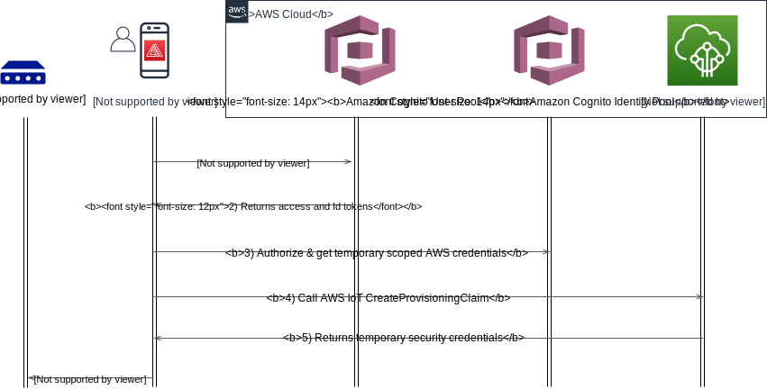
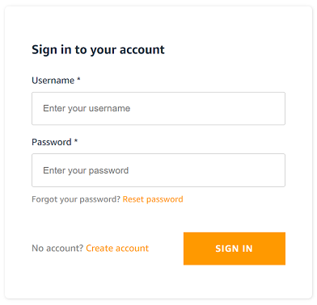
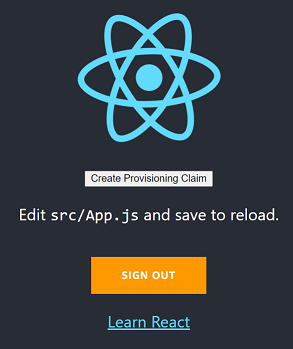

AWS IoT proporciona una interfaz de programación de aplicaciones (API) que permite a las aplicaciones móviles/web generar certificados temporales y claves privadas. El dispositivo sale de la fábrica sin credenciales únicas, y solo los [Usuarios de Confianza]() pueden aprovisionar el dispositivo con sus credenciales únicas.

Un instalador utiliza la aplicación y se autentica con AWS. Usando las APIs de Usuario de Confianza, el instalador recibe un certificado X.509 temporal y una clave privada que son válidos por cinco minutos. Usando la aplicación, las credenciales se entregan al dispositivo. El dispositivo se conecta a AWS IoT e intercambia las credenciales temporales por un certificado X.509 único firmado con la CA de AWS y una clave privada. Durante este flujo de trabajo, los recursos de AWS, incluyendo el nombre del Thing, la Política y el Certificado, se configuran en la Cuenta de AWS.

{}
Los fabricantes de dispositivos que utilizan el flujo de Usuario de Confianza deben desarrollar y mantener una aplicación móvil/web que utilice las APIs de Usuario de Confianza.
{}
{}
Los dispositivos deben tener la capacidad de aceptar credenciales temporales a través de una conexión segura como Bluetooth Low Energy, WiFi o USB. Los dispositivos deben implementar la lógica necesaria para publicar y suscribirse a los temas MQTT de Aprovisionamiento de Flota, aceptar las credenciales permanentes y escribir las credenciales en un almacenamiento seguro.
{}


## Casos de Uso

El Aprovisionamiento de Flota por Usuario de Confianza es el enfoque recomendado cuando se necesita un alto grado de seguridad, cuando la cadena de fabricación no es confiable, o no es posible aprovisionar dispositivos en la cadena de fabricación debido a limitaciones técnicas, costos o limitaciones específicas de la aplicación. Usando este enfoque, las credenciales nunca se exponen a la cadena de suministro de fabricación.

Ejemplos de casos de uso donde se debe utilizar el Aprovisionamiento de Flota por Usuario de Confianza son:
1. Cuando el dispositivo proviene de un fabricante de dispositivos original y no tienes la capacidad de incluir material de clave único.
2. Cuando el costo de mantener una [infraestructura de clave pública (PKI)](https://en.wikipedia.org/wiki/Public_key_infrastructure) es demasiado alto.
3. No hay un canal de confianza entre tu PKI y la instalación de fabricación, o usar la PKI del fabricante no es una opción.
4. Dispositivos que ingresan a canales inseguros como un distribuidor de terceros.

## Arquitectura de Referencia


Los detalles de este flujo son los siguientes:
1. El cliente se autentica contra un grupo de usuarios.
2. El grupo de usuarios asigna 3 tokens JWT (Id, Acceso y Refresco) al cliente.
3. El JWT de Id se pasa al grupo de identidades y se elige un rol a través de las afirmaciones del JWT. Luego, el usuario recibe credenciales temporales de IAM con privilegios basados en el rol de IAM que se asignó al grupo al que pertenece el usuario.
4. El usuario puede entonces hacer una llamada CreateProvisioningClaim a AWS IoT Core para una plantilla de aprovisionamiento específica.
5. AWS IoT Core responde con un certificado temporal y un par de claves.
6. El usuario aprovisiona el certificado temporal y el par de claves al dispositivo, e inicia el aprovisionamiento de flota con el certificado de arranque.

En este punto, el dispositivo tiene un certificado válido para autenticarse con el gateway MQTT de AWS IoT.

El diagrama a continuación describe el flujo de aprovisionamiento de flota de extremo a extremo por un usuario de confianza:


## Implementación

Para experimentar rápidamente, puedes probar este patrón utilizando [AWS Amplify](https://aws.amazon.com/amplify/) y [Amazon Cognito](https://aws.amazon.com/cognito/).
AWS Amplify es un conjunto de herramientas y servicios que se pueden usar juntos o por separado, para ayudar a los desarrolladores de aplicaciones web y móviles a construir aplicaciones full stack escalables, impulsadas por AWS.
Amazon Cognito te permite agregar registro de usuarios, inicio de sesión y control de acceso a tus aplicaciones web y móviles de manera rápida y sencilla. Amazon Cognito escala a millones de usuarios y admite el inicio de sesión con proveedores de identidad social, como Apple, Facebook, Google y Amazon, y proveedores de identidad empresarial a través de SAML 2.0 y OpenID Connect.

### AWS Amplify
El marco de trabajo de código abierto Amplify proporciona los siguientes productos para construir aplicaciones full stack en iOS, Android, Flutter, Web y React Native:

- [Amplify CLI](https://docs.amplify.aws/cli/) - Configura todos los servicios necesarios para impulsar tu backend a través de una interfaz de línea de comandos simple.
- [Amplify Libraries](https://docs.amplify.aws/lib/) - Bibliotecas de clientes centradas en casos de uso para integrar el código de tu aplicación con un backend utilizando interfaces declarativas.
- [Amplify UI Components](https://docs.amplify.aws/ui/) - Bibliotecas de UI para React, React Native, Angular, Ionic y Vue.

El Amplify Console es un servicio de AWS que proporciona un flujo de trabajo basado en git para la implementación continua y el hosting de aplicaciones web full stack. Los recursos en la nube creados por el Amplify CLI también son visibles en la consola.

#### Autenticación y Autorización de la Aplicación
El marco de trabajo Amplify utiliza Amazon Cognito como el principal proveedor de autenticación. Amazon Cognito es un robusto servicio de directorio de usuarios que maneja el registro de usuarios, autenticación, recuperación de cuentas y otras operaciones.

Ejecutar el simple comando de Amplify CLI ```amplify add auth``` agregará los recursos de Amazon Cognito requeridos por la aplicación a tu proyecto Amplify.

```
amplify add auth

? Do you want to use the default authentication and security configuration? Default configuration
? How do you want users to be able to sign in? Username
? Do you want to configure advanced settings?  No, I am done.
```

Una vez agregado, puedes aprovechar [Cognito User Pool](https://docs.aws.amazon.com/cognito/latest/developerguide/cognito-user-identity-pools.html) para gestionar tu directorio de usuarios.
Sin embargo, autenticar a un usuario no es suficiente. Los usuarios deben ser autorizados si desean acceder a los servicios de AWS. Para este propósito, utiliza
[Cognito Identity Pool](https://docs.aws.amazon.com/cognito/latest/developerguide/cognito-identity.html). Con un grupo de identidades, puedes obtener credenciales temporales y de privilegios limitados de AWS para acceder a otros servicios de AWS.

La clase [Auth](https://aws-amplify.github.io/amplify-js/api/classes/authclass.html) de Amplify proporciona pasos de autenticación, y 
tiene más de 30 métodos, incluyendo signUp, signIn, forgotPassword y signOut, que te permiten tener control total sobre todos los aspectos del flujo de autenticación de usuarios.

#### Agregar flujo de autenticación
Crear un flujo de inicio de sesión en tu aplicación puede ser bastante difícil y llevar mucho tiempo hacerlo bien. Afortunadamente, el marco de trabajo Amplify tiene un componente de UI de autenticación que podemos usar y que proporcionará todo el flujo de autenticación para nosotros,
incluyendo Registro e Inicio de Sesión.

En este ejemplo, usamos la biblioteca de UI de Amplify React y el componente ```withAuthenticator``` para comenzar rápidamente con un flujo de autenticación del mundo real.
Consulta [aquí](https://docs.amplify.aws/ui/q/framework/react/) para aprender más sobre los componentes y capacidades de la UI de autenticación de Amplify.

El ```withAuthenticator``` es un componente de orden superior (HoC) que envuelve ```AmplifyAuthenticator```. También notarás el componente ```AmplifySignOut```. Este es un componente opcional si deseas renderizar un botón de cierre de sesión.

```javascript
import logo from './logo.svg';
import './App.css';
import { withAuthenticator, AmplifySignOut } from '@aws-amplify/ui-react'
import { Auth } from 'aws-amplify';

var AWS = require('aws-sdk');
AWS.config.update({region: 'us-east-1'});

// Esta función se llama cuando el usuario hace clic en el botón Crear Reclamación de Aprovisionamiento
async function CreateProvisioningClaim() {
  try {
    // Llamar a AWS IoT Core con las credenciales actuales del usuario
    // El rol de autenticación del grupo de identidades de Cognito debe tener permisos apropiados para acceder a la API de AWS IoT
    Auth.currentCredentials()
      .then(credentials => {
        const iot = new AWS.Iot({
          apiVersion: '2015-05-28',
          credentials: Auth.essentialCredentials(credentials)
        });

        // Establecer el nombre de la plantilla de aprovisionamiento de flota
        var params = {
          templateName: 'PROVISIONING TEMPLATE NAME'
        };
        
        // Llamar a la API de AWS IoT
        iot.createProvisioningClaim(params, function(err, data) {
          if (err) console.log(err, err.stack); // an error occurred
          else     console.log(data);           // successful response
        });
      });
  } catch (error) {
    // manejo de errores.
    alert(error);
  }
}

function App() {
  return (
    <div className="App">
      <header className="App-header">
        
        <div>
          <input type="button" value="Create Provisioning Claim" onClick={CreateProvisioningClaim} />
        </div>
        <p>
          Edit <code>src/App.js</code> and save to reload.
        </p>
        <p>
          <AmplifySignOut />
        </p>
        <a
          className="App-link"
          href="https://reactjs.org"
          target="_blank"
          rel="noopener noreferrer"
        >
          Learn React
        </a>
      </header>
    </div>
  );
}

export default withAuthenticator(App);
```

El código anterior resultará en esta página de inicio para usuarios no autenticados:


Una vez que el usuario inicie sesión, será redirigido a la página siguiente. Nota el botón "Create Provisioning Claim". Al hacer clic en el botón se invocará la función ```CreateProvisioningClaim``` pidiendo a AWS IoT Core que genere una reclamación temporal para la plantilla de aprovisionamiento de flota dada.



{}
Asegúrate de agregar al rol IAM ```authRole``` del Cognito Identity Pool la política apropiada que le otorgue acceso a la acción ```createProvisioningClaim``` de AWS IoT.
Este rol IAM ```authRole``` es asumido por el usuario cuando desea acceder a los servicios de AWS. El código anterior lo maneja llamando a ```Auth.currentCredentials()```.
{}

### Plantilla de Aprovisionamiento de Flota de AWS IoT
Una [plantilla de aprovisionamiento](https://docs.aws.amazon.com/iot/latest/developerguide/provision-template.html) es un documento JSON que utiliza parámetros para describir los recursos que tu dispositivo debe usar para interactuar con AWS IoT.
Al configurar la plantilla de Aprovisionamiento de Flota, tienes la opción de configurar un [Pre Provisioning Hook](https://docs.aws.amazon.com/iot/latest/developerguide/pre-provisioning-hook.html).
El Pre Provisioning Hook es una función Lambda para validar los parámetros pasados desde el dispositivo antes de permitir que el dispositivo sea aprovisionado.

Oculto dentro del código React anterior está el parámetro de entrada ```templateName``` dado a la llamada a la API ```createProvisioningClaim``` de AWS IoT. El parámetro
hace referencia al recurso de plantilla de Aprovisionamiento de Flota de AWS IoT.
Esto vincula la reclamación temporal aprovisionada con la plantilla. Cuando el dispositivo se conecta utilizando la reclamación temporal, AWS IoT invoca el flujo de trabajo de aprovisionamiento de la plantilla vinculada.

A continuación se muestra un ejemplo simple de plantilla. Cuando el dispositivo desencadena el proceso de aprovisionamiento, puede pasar entradas para ser inyectadas como parámetros en la plantilla.

```json
{
    "Parameters" : {
        "ThingName" : {"Type" : "String" }
    },
    "Resources" : {
        "thing" : {
            "Type" : "AWS::IoT::Thing",
            "Properties" : {
                "ThingName" : {"Ref" : "ThingName"}
            }
        },  
        "certificate" : {
            "Type" : "AWS::IoT::Certificate",
            "Properties" : {
                "CertificateId": {"Ref": "AWS::IoT::Certificate::Id"},
                "Status" : "ACTIVE"      
            }
        },
        "policy" : {
            "Type" : "AWS::IoT::Policy",
            "Properties" : {
                "PolicyName": "iot policy name"
            }
        }
    }
}
```

## Consideraciones

Esta implementación cubre los aspectos básicos de Amplify y el código React. No cubre ciertos aspectos que pueden surgir en el uso en producción.

### Enfoque para Otra Autenticación de Usuario o Lenguajes

Aunque el ejemplo anterior utiliza servicios de AWS, el Usuario de Confianza para el aprovisionamiento de flota se puede lograr con otros enfoques de autenticación de usuario.
Siempre que un usuario autenticado pueda invocar la API [```createProvisioningClaim()```](https://docs.aws.amazon.com/iot/latest/apireference/API_CreateProvisioningClaim.html),
esto cumple con el requisito para obtener las credenciales temporales para pasar al dispositivo. Los SDK de AWS para otros lenguajes tienen soporte para ```createProvisioningClaim()``` utilizando el [proceso de firma de la Versión 4 de la Firma de AWS](https://docs.aws.amazon.com/general/latest/gr/signature-version-4.html).