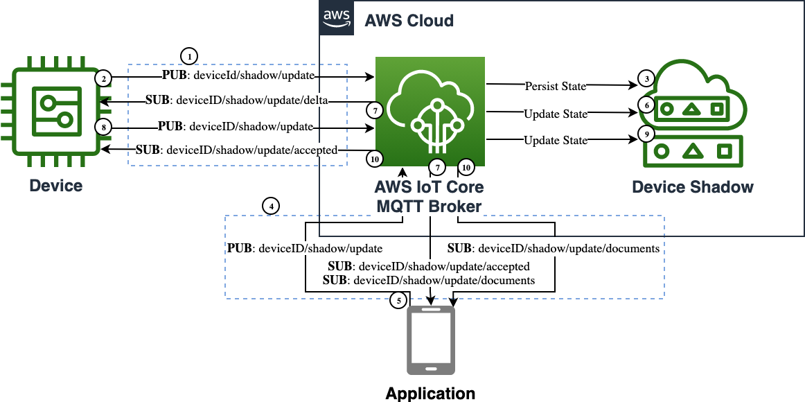

_Sombra de Dispositivo_ es un servicio de AWS IoT Core. Las sombras pueden hacer que el estado de un dispositivo esté disponible a través de temas MQTT, ya sea que el dispositivo esté conectado o no. Esto permite que las aplicaciones y servicios interactúen con el estado del dispositivo en cualquier momento.

## Casos de Uso

- Actualizar el estado del dispositivo cuando el dispositivo no está conectado
  - _Quiero apagar las luces de mi vehículo_
  - _Quiero programar mi cafetera para que se encienda por la mañana_
  - _Quiero configurar la alarma de temperatura para mi bomba_
- Ver el último estado conocido del dispositivo cuando el dispositivo no está conectado
  - _Quiero verificar si mi vehículo está bloqueado_
  - _Quiero verificar cuándo terminó de preparar mi café_
  - _Quiero ver la temperatura de mi bomba_
- Actualizar una flota de configuraciones de dispositivos.
  - _Quiero establecer el límite de temperatura para todas mis cafeteras_

## Reference Architecture

## Arquitectura de Referencia



- _AWS IoT Core_ es el broker de mensajes MQTT que procesa mensajes en nombre de los clientes.
- _Dispositivo_ es el objeto IoT cuyo estado se replica.
- _Sombra del Dispositivo_ es el servicio IoT que resuelve conflictos, almacena y procesa el estado.
- _Aplicación_ es la lógica remota que actualiza el estado deseado.

1. El _Dispositivo_ establece una conexión MQTT con el endpoint de _AWS IoT Core_ y luego se suscribe a los temas `deviceId/shadow/update/delta`, `deviceId/shadow/update/accepted` y `deviceId/shadow/update/rejected` para recibir actualizaciones de cambios de estado de la sombra.
1. El _Dispositivo_ publica su estado inicial en el tema `deviceID/shadow/update`. Este es el tema donde se reciben actualizaciones del estado actual y deseado.
1. El broker de _AWS IoT Core_ escribe el estado del dispositivo en el almacén persistente de _Sombra del Dispositivo_.
1. La _Aplicación_ establece una conexión MQTT con el endpoint de _AWS IoT Core_ y luego se suscribe a los temas `deviceId/shadow/update/documents`, `deviceId/shadow/update/accepted` y `deviceId/shadow/update/rejected` para recibir actualizaciones de cambios de estado de la sombra.
1. La _Aplicación_ publica el estado deseado en el tema `deviceID/shadow/update`.
1. El broker de _AWS IoT Core_ actualiza el estado persistente de la _Sombra del Dispositivo_.
1. El broker de _AWS IoT Core_ publica un mensaje de reconocimiento en el tema `deviceId/shadow/update/accepted`, un mensaje de estado delta en el tema `deviceId/shadow/update/delta` y un mensaje de documento en el tema `deviceId/shadow/update/documents`.
1. El _Dispositivo_ recibe el mensaje delta, realiza los cambios de estado deseados y publica en el tema `deviceId/shadow/update` un mensaje de reconocimiento que refleja el nuevo estado.
1. El broker de _AWS IoT Core_ actualiza el estado persistente de la _Sombra del Dispositivo_.
1. El broker de _AWS IoT Core_ publica un mensaje de reconocimiento en el tema `deviceId/shadow/update/accepted` y un mensaje de documento en el tema `deviceId/shadow/update/documents`.
{}

```plantuml
@startuml
!define AWSPuml https://raw.githubusercontent.com/awslabs/aws-icons-for-plantuml/v7.0/dist
!includeurl AWSPuml/AWSCommon.puml
!includeurl AWSPuml/InternetOfThings/all.puml
!includeurl AWSPuml/General/Client.puml

'Comment out to use default PlantUML sequence formatting
skinparam participant {
    BackgroundColor AWS_BG_COLOR
    BorderColor AWS_BORDER_COLOR
}
'Hide the bottom boxes
hide footbox

participant "<$IoTGeneric>\nDevice" as device
participant "<$IoTCore>\nMQTT Broker" as broker
participant "<$IoTShadow>\nDevice Shadow" as shadow
participant "<$Client>\nApplication" as app

== Device Shadow Connection ==
device -> broker : connect(iot_endpoint)
device -> broker : subscribe("deviceID/shadow/update/accepted")
device -> broker : subscribe("deviceID/shadow/update/rejected")
device -> broker : subscribe("deviceID/shadow/update/delta")
device -> broker : publish("deviceID/shadow/update", state:{reported:{lights:on,doors:locked}})
broker -> shadow : update_shadow(state:{reported:{lights:on,doors:locked}})
rnote over shadow #FFFFFF: reported:{lights:on,doors:locked}
app -> broker : connect(iot_endpoint)
app -> broker : subscribe("deviceID/shadow/update/accepted")
app -> broker : subscribe("deviceID/shadow/update/rejected")
app -> broker : subscribe("deviceID/shadow/update/documents")

== App to Device Updates ==
app -> broker : publish("deviceID/shadow/update", state:{desired:{lights:off}})
broker -> shadow : update_shadow(state:{desired:{lights:off}})
rnote over shadow #FFFFFF: desired:{lights:off}, reported:{lights:on,doors:locked}
broker -> app : publish("deviceID/shadow/update/accepted", state:{desired:{lights:off}})
broker -> app : publish("deviceID/shadow/update/documents", state:{desired:{lights:off}, reported:{lights:on,doors:locked}})
broker -> device : publish("deviceID/shadow/update/delta", state:{lights:off})
device -> device : Turn off lights
device -> broker : publish("deviceID/shadow/update", state:{reported:{lights:off,doors:locked}})
broker -> shadow : update_shadow(state:{reported:{lights:off,doors:locked}})
rnote over shadow #FFFFFF: desired:{lights:off}, reported:{lights:off,doors:locked}
broker -> device : publish("deviceID/shadow/update/accepted", state:{reported:{lights:off,doors:locked}})
broker -> app : publish("deviceID/shadow/update/documents", state:{desired:{lights:off}, reported:{lights:off,doors:locked}})

== Device to App Updates ==
device -> device : Turn on lights
device -> broker : publish("deviceID/shadow/update", state:{desired:{lights:on},reported:{lights:on}})
broker -> shadow : update_shadow(state:{desired:{lights:on},reported:{lights:on}})
rnote over shadow #FFFFFF: desired:{lights:on}, reported:{lights:on,doors:locked}
broker -> device : publish("deviceID/shadow/update/accepted", state:{desired:{lights:on},reported:{lights:on}})
broker -> app : publish("deviceID/shadow/update/documents", state:{desired:{lights:on}, reported:{lights:on,doors:locked}})
@enduml
```

{}

### Suposiciones

El código de la _aplicación_ asume que el _dispositivo_ ya se ha conectado a AWS IoT Core y ha creado su _sombra del dispositivo_. La _aplicación_ y el _dispositivo_ pueden detenerse y arrancarse mientras interactúan con la _sombra del dispositivo_ una vez que el _dispositivo_ ha hecho su primera conexión.

## Implementación

Tanto la _Aplicación_ como el _Dispositivo_ utilizan enfoques similares para interactuar con la sombra del dispositivo. Los ejemplos de código a continuación son completos para cada participante.

{}
Los ejemplos de código se centran en el diseño general de la _Réplica del Estado del Dispositivo_. Por favor, consulta la [Guía de inicio de AWS IoT Core](https://docs.aws.amazon.com/iot/latest/developerguide/iot-gs.html) para obtener detalles sobre la creación de cosas, certificados y la obtención de tu endpoint. Los ejemplos de código a continuación se utilizan para demostrar la capacidad básica del patrón de _Réplica del Estado del Dispositivo_.
{}

### Dispositivo

El código del _Dispositivo_ se centra en conectarse al _Broker_ y luego suscribirse a los temas MQTT de la _sombra del dispositivo_. En la primera conexión, el _dispositivo_ inicializará su estado de sombra con la _sombra del dispositivo_. El _dispositivo_ esperará actualizaciones del estado deseado, las procesará y enviará el estado reportado de vuelta a la _sombra del dispositivo_. El _dispositivo_ también puede actualizar su propio estado deseado y actualizar la _sombra del dispositivo_.


{}
Por favor, consulta este [ejemplo de sombra](https://github.com/aws/aws-iot-device-sdk-python-v2/blob/main/samples/shadow) para más detalles.

- Instalar SDK desde PyPI: `python3 -m pip install awsiotsdk`
- Reemplaza las variables globales con un endpoint, clientId y credenciales válidos
- Inicia en una sesión de terminal separada antes de ejecutar la _Aplicación_: `python3 device.py`

```python
# Copyright Amazon.com, Inc. or its affiliates. All Rights Reserved.
# SPDX-License-Identifier: Apache-2.0.

import argparse
from awscrt import auth, io, mqtt, http
from awsiot import iotshadow
from awsiot import mqtt_connection_builder
from concurrent.futures import Future
import sys
import threading
import traceback
import json
from uuid import uuid4

# Este ejemplo utiliza el Servicio de Sombra de Dispositivos de AWS IoT para mantener un conjunto de propiedades
# sincronizadas entre el dispositivo y el servidor. Imagina un conjunto de controles de vehículo que 
# pueden ser cambiados a través de una aplicación, o configurados por un usuario local.


io.init_logging(getattr(io.LogLevel, "Info"), "stderr")

# Usando variables globales para simplificar el código de ejemplo
thing_name = "shadow_test"
client_id = "shadow_test-device"
endpoint = "REPLACE_WITH_YOUR_ENDPOINT_FQDN"
client_certificate = "PATH_TO_CLIENT_CERTIFICATE_FILE"
client_private_key = "PATH_TO_CLIENT_PRIVATE_KEY_FILE"
root_ca = "PATH_TO_ROOT_CA_CERTIFICATE_FILE"

is_sample_done = threading.Event()

mqtt_connection = None
shadow_client = None
shadow_property = ""

SHADOW_VALUE_DEFAULT = {"light":"on","locked":True,"power":11.9}

class LockedData:
    def __init__(self):
        self.lock = threading.Lock()
        self.shadow_value = None
        self.disconnect_called = False
        self.request_tokens = set()

locked_data = LockedData()

# Los callbacks son el método principal para procesar eventos MQTT de manera asíncrona
# utilizando los SDKs de dispositivos.

# Función para salir de este ejemplo de manera ordenada
def exit(msg_or_exception):
    if isinstance(msg_or_exception, Exception):
        print("Exiting sample due to exception.")
        traceback.print_exception(msg_or_exception.__class__, msg_or_exception, sys.exc_info()[2])
    else:
        print("Exiting sample:", msg_or_exception)

    with locked_data.lock:
        if not locked_data.disconnect_called:
            print("Disconnecting...")
            locked_data.disconnect_called = True
            future = mqtt_connection.disconnect()
            future.add_done_callback(on_disconnected)

# Callback para la desconexión de mqtt
def on_disconnected(disconnect_future):
    print("Disconnected.")

    # Señalar que el ejemplo ha terminado
    is_sample_done.set()

# Callback para recibir un mensaje del tema de actualización aceptada
def on_get_shadow_accepted(response):
    try:
        with locked_data.lock:
            # check that this is a response to a request from this session
            try:
                locked_data.request_tokens.remove(response.client_token)
            except KeyError:
                print("Ignoring get_shadow_accepted message due to unexpected token.")
                print("""Enter desired value ex:{"light":"off"}: """) 
                return

            print("Finished getting initial shadow state.")
            if locked_data.shadow_value is not None:
                print("  Ignoring initial query because a delta event has already been received.")
                return

        if response.state:
            if response.state.delta:
                value = response.state.delta
                if value:
                    print("  Shadow contains delta value '{}'.".format(value))
                    change_shadow_value(value, update_desired=False)
                    return

            if response.state.reported:
                value = response.state.reported
                if value:
                    print("  Shadow contains reported value '{}'.".format(value))
                    set_local_shadow_value(response.state.reported)
                    return

        print("  Shadow document lacks '{}' property. Setting defaults")
        change_shadow_value(SHADOW_VALUE_DEFAULT)
        return

    except Exception as e:
        exit(e)

# Callback para obtener una notificación desde el tema de actualización rechazado 
def on_get_shadow_rejected(error):
    try:
        # check that this is a response to a request from this session
        with locked_data.lock:
            try:
                locked_data.request_tokens.remove(error.client_token)
            except KeyError:
                print("Ignoring get_shadow_rejected message due to unexpected token.")
                return

        if error.code == 404:
            print("Thing has no shadow document. Creating with defaults...")
            change_shadow_value(SHADOW_VALUE_DEFAULT)
        else:
            exit("Get request was rejected. code:{} message:'{}'".format(
                error.code, error.message))

    except Exception as e:
        exit(e)

# Callback for receiving a message from the delta updated topic
def on_shadow_delta_updated(delta):
    try:
        print("Received shadow delta event.")
        if delta.state:
            print("  Delta reports that desired value is '{}'. Changing local value...".format(delta.state))
            change_shadow_value(delta.state, update_desired=False)
        else:
            print("  Delta did not report a change")

    except Exception as e:
        exit(e)

# Callback for after the shadow update is published
def on_publish_update_shadow(future):
    try:
        future.result()
        print("Update request published.")
    except Exception as e:
        print("Failed to publish update request.")
        exit(e)

# Callback for if the shadow update is accepted
def on_update_shadow_accepted(response):
    try:
        # check that this is a response to a request from this session
        with locked_data.lock:
            try:
                locked_data.request_tokens.remove(response.client_token)
            except KeyError:
                print("Ignoring update_shadow_accepted message due to unexpected token.")
                return

        try:
            print("Finished updating reported shadow value to '{}'.".format(response.state.reported))
            print("""Enter desired value ex:{"light":"off"}: """)
        except:
            exit("Updated shadow is missing the target property.")

    except Exception as e:
        exit(e)

# Callback for if the shadow update is rejected
def on_update_shadow_rejected(error):
    try:
        # check that this is a response to a request from this session
        with locked_data.lock:
            try:
                locked_data.request_tokens.remove(error.client_token)
            except KeyError:
                print("Ignoring update_shadow_rejected message due to unexpected token.")
                return

        exit("Update request was rejected. code:{} message:'{}'".format(
            error.code, error.message))

    except Exception as e:
        exit(e)

#Sets state to the reported value
def set_local_shadow_value(reported_value):
    with locked_data.lock:
        locked_data.shadow_value = reported_value
    print("""Enter desired value ex:{"light":"off"}: """)

#Change the shadow state and send an update
def change_shadow_value(value, update_desired=True):
    with locked_data.lock:
        if locked_data.shadow_value is None:
            locked_data.shadow_value = {}
            
        for key in value.keys():
            if value[key]:
                locked_data.shadow_value[key] = value[key]
            else:
                locked_data.shadow_value.pop(key, None)
            
        print("Changed local shadow value to '{}'.".format(locked_data.shadow_value))
        
        print("Updating reported shadow value")

        # use a unique token so we can correlate this "request" message to
        # any "response" messages received on the /accepted and /rejected topics
        token = str(uuid4())

        if update_desired == True:
            request = iotshadow.UpdateShadowRequest(
                thing_name=thing_name,
                state=iotshadow.ShadowState(
                    reported=value,
                    desired=value
                ),
                client_token=token,
            )
        else:
            request = iotshadow.UpdateShadowRequest(
                thing_name=thing_name,
                state=iotshadow.ShadowState(
                    reported=value
                ),
                client_token=token,
            )
        future = shadow_client.publish_update_shadow(request, mqtt.QoS.AT_LEAST_ONCE)

        locked_data.request_tokens.add(token)

        future.add_done_callback(on_publish_update_shadow)

#Thread to wait for and handle user input
def user_input_thread_fn():
    while True:
        try:
            # Read user input
            new_value = input()

            # If user wants to quit sample, then quit.
            # Otherwise change the shadow value.
            if new_value in ['exit', 'quit']:
                exit("User has quit")
                break
            else:
                change_shadow_value(json.loads(new_value))

        except Exception as e:
            print("Exception on input thread.")
            exit(e)
            break

if __name__ == '__main__':
    # Spin up resources
    event_loop_group = io.EventLoopGroup(1)
    host_resolver = io.DefaultHostResolver(event_loop_group)
    client_bootstrap = io.ClientBootstrap(event_loop_group, host_resolver)

    # Create native MQTT connection from credentials on path (filesystem)
    mqtt_connection = mqtt_connection_builder.mtls_from_path(
        endpoint=endpoint,
        cert_filepath=client_certificate,
        pri_key_filepath=client_private_key,
        client_bootstrap=client_bootstrap,
        ca_filepath=root_ca,
        client_id=client_id,
        clean_session=True,
        keep_alive_secs=30)

    print("Connecting to {} with client ID '{}'...".format(
        endpoint, thing_name))

    connected_future = mqtt_connection.connect()

    shadow_client = iotshadow.IotShadowClient(mqtt_connection)

    # Wait for connection to be fully established.
    # Note that it's not necessary to wait, commands issued to the
    # mqtt_connection before its fully connected will simply be queued.
    # But this sample waits here so it's obvious when a connection
    # fails or succeeds.
    connected_future.result()
    print("Connected!")

    try:
        # Subscribe to necessary topics.
        # Note that is **is** important to wait for "accepted/rejected" subscriptions
        # to succeed before publishing the corresponding "request".
        print("Subscribing to Update responses...")
        update_accepted_subscribed_future, _ = shadow_client.subscribe_to_update_shadow_accepted(
            request=iotshadow.UpdateShadowSubscriptionRequest(thing_name=thing_name),
            qos=mqtt.QoS.AT_LEAST_ONCE,
            callback=on_update_shadow_accepted)

        update_rejected_subscribed_future, _ = shadow_client.subscribe_to_update_shadow_rejected(
            request=iotshadow.UpdateShadowSubscriptionRequest(thing_name=thing_name),
            qos=mqtt.QoS.AT_LEAST_ONCE,
            callback=on_update_shadow_rejected)

        # Wait for subscriptions to succeed
        update_accepted_subscribed_future.result()
        update_rejected_subscribed_future.result()

        print("Subscribing to Get responses...")
        get_accepted_subscribed_future, _ = shadow_client.subscribe_to_get_shadow_accepted(
            request=iotshadow.GetShadowSubscriptionRequest(thing_name=thing_name),
            qos=mqtt.QoS.AT_LEAST_ONCE,
            callback=on_get_shadow_accepted)

        get_rejected_subscribed_future, _ = shadow_client.subscribe_to_get_shadow_rejected(
            request=iotshadow.GetShadowSubscriptionRequest(thing_name=thing_name),
            qos=mqtt.QoS.AT_LEAST_ONCE,
            callback=on_get_shadow_rejected)

        # Wait for subscriptions to succeed
        get_accepted_subscribed_future.result()
        get_rejected_subscribed_future.result()

        print("Subscribing to Delta events...")
        delta_subscribed_future, _ = shadow_client.subscribe_to_shadow_delta_updated_events(
            request=iotshadow.ShadowDeltaUpdatedSubscriptionRequest(thing_name=thing_name),
            qos=mqtt.QoS.AT_LEAST_ONCE,
            callback=on_shadow_delta_updated)

        # Wait for subscription to succeed
        delta_subscribed_future.result()

        # The rest of the sample runs asynchronously.

        # Issue request for shadow's current state.
        # The response will be received by the on_get_accepted() callback
        print("Requesting current shadow state...")

        with locked_data.lock:
            # use a unique token so we can correlate this "request" message to
            # any "response" messages received on the /accepted and /rejected topics
            token = str(uuid4())

            publish_get_future = shadow_client.publish_get_shadow(
                request=iotshadow.GetShadowRequest(thing_name=thing_name, client_token=token),
                qos=mqtt.QoS.AT_LEAST_ONCE)

            locked_data.request_tokens.add(token)

        # Ensure that publish succeeds
        publish_get_future.result()

        # Launch thread to handle user input.
        # A "daemon" thread won't prevent the program from shutting down.
        print("Launching thread to read user input...")
        user_input_thread = threading.Thread(target=user_input_thread_fn, name='user_input_thread')
        user_input_thread.daemon = True
        user_input_thread.start()

    except Exception as e:
        exit(e)

    # Wait for the sample to finish (user types 'quit', or an error occurs)
    is_sample_done.wait()
```

{}


### Application

The _application_ code connects to the Broker and subscribes to the _device_'s shadow topics. Once connected it will receive and store the _device shadow_'s reported state. The _application_ waits for a JSON state input and will update the _device shadow_ with the new desired state.

{}
The _application_ code only writes to the desired state while the _device_ code can write to both the desired and reported states.
{}


{}

Please refer to this [shadow sample](https://github.com/aws/aws-iot-device-sdk-python-v2/blob/main/samples/shadow.py) for more details.

- Install SDK from PyPI: `python3 -m pip install awsiotsdk`
- Replace the global variables with valid endpoint, clientId, and credentials
- Start in a separate terminal session after the _Device_ code is running: `python3 application.py`

```python
# Copyright Amazon.com, Inc. or its affiliates. All Rights Reserved.
# SPDX-License-Identifier: Apache-2.0.

import argparse
from awscrt import auth, io, mqtt, http
from awsiot import iotshadow
from awsiot import mqtt_connection_builder
from concurrent.futures import Future
import sys
import threading
import traceback
import json
from uuid import uuid4

# This sample uses the AWS IoT Device Shadow Service to keep a set of properties
# in sync between the device and server. Imagine a set of vehicle controls that 
# may be changed through an app, or set by a local user.

io.init_logging(getattr(io.LogLevel, "Info"), "stderr")

# Using globals to simplify sample code
thing_name = "shadow_test"
client_id = "shadow_test_app"
endpoint = "REPLACE_WITH_YOUR_ENDPOINT_FQDN"
client_certificate = "PATH_TO_CLIENT_CERTIFICATE_FILE"
client_private_key = "PATH_TO_CLIENT_PRIVATE_KEY_FILE"
root_ca = "PATH_TO_ROOT_CA_CERTIFICATE_FILE"

is_sample_done = threading.Event()

mqtt_connection = None
shadow_client = None
shadow_property = ""

class LockedData:
    def __init__(self):
        self.lock = threading.Lock()
        self.shadow_value = None
        self.disconnect_called = False
        self.request_tokens = set()

locked_data = LockedData()

# Callback's are the main method to asynchronously process MQTT events
# using the device SDKs.

# Function for gracefully quitting this sample
def exit(msg_or_exception):
    if isinstance(msg_or_exception, Exception):
        print("Exiting sample due to exception.")
        traceback.print_exception(msg_or_exception.__class__, msg_or_exception, sys.exc_info()[2])
    else:
        print("Exiting sample:", msg_or_exception)

    with locked_data.lock:
        if not locked_data.disconnect_called:
            print("Disconnecting...")
            locked_data.disconnect_called = True
            future = mqtt_connection.disconnect()
            future.add_done_callback(on_disconnected)

# Callback for mqtt disconnect
def on_disconnected(disconnect_future):
    print("Disconnected.")

    # Signal that sample is finished
    is_sample_done.set()

# Callback for receiving a message from the update accepted topic
def on_get_shadow_accepted(response):
    try:
        with locked_data.lock:
            # check that this is a response to a request from this session
            try:
                locked_data.request_tokens.remove(response.client_token)
            except KeyError:
                print("Ignoring get_shadow_accepted message due to unexpected token.")
                return

        if response.state:
            if response.state.delta:
                value = response.state.delta
                if value:
                    print("  Shadow contains delta value '{}'.".format(value))
                    update_local_shadow_value(value)
                    return
            # We only want to update the App's local state if device has
            # updated its reported state. There would be no delta in this case.
            elif response.state.reported:
                value = response.state.reported
                if value:
                    print("  Shadow contains reported value '{}'.".format(value))
                    set_local_shadow_value(value)
                    return

        return

    except Exception as e:
        exit(e)

# Callback for receiving a message from the update rejected topic
def on_get_shadow_rejected(error):
    try:
        # check that this is a response to a request from this session
        with locked_data.lock:
            try:
                locked_data.request_tokens.remove(error.client_token)
            except KeyError:
                print("Ignoring get_shadow_rejected message due to unexpected token.")
                return

        if error.code == 404:
            print("Thing has no shadow document.")
        else:
            exit("Get request was rejected. code:{} message:'{}'".format(
                error.code, error.message))

    except Exception as e:
        exit(e)

# Callback for after the shadow update is published
def on_publish_update_shadow(future):
    try:
        future.result()
        print("Update request published.")
    except Exception as e:
        print("Failed to publish update request.")
        exit(e)

# Callback for if the shadow update is accepted
def on_update_shadow_accepted(response):
    try:
        # check that this is a response to a request from this session
        with locked_data.lock:
            try:
                locked_data.request_tokens.remove(response.client_token)
            except KeyError:
                print("Ignoring update_shadow_accepted message due to unexpected token.")
                print("""Enter desired value ex:{"light":"off"}: """) 
                return

        try:
            print("Finished updating desired shadow value to '{}'.".format(response.state.desired))
        except:
            exit("Updated shadow is missing the target property.")

    except Exception as e:
        exit(e)

# Callback for if the shadow update is rejected
def on_update_shadow_rejected(error):
    try:
        # check that this is a response to a request from this session
        with locked_data.lock:
            try:
                locked_data.request_tokens.remove(error.client_token)
            except KeyError:
                print("Ignoring update_shadow_rejected message due to unexpected token.")
                return

        exit("Update request was rejected. code:{} message:'{}'".format(
            error.code, error.message))

    except Exception as e:
        exit(e)
        
# Callback for if the shadow updated
def on_update_shadow_documents(response):
    try:
        print("Received shadow document update")
        set_local_shadow_value(response.current.state.reported)
        return

    except Exception as e:
        exit(e)

#Set the local value
def set_local_shadow_value(value):
    with locked_data.lock:
        locked_data.shadow_value = value
            
        print("Changed local shadow value to '{}'.".format(locked_data.shadow_value))
    print("""Enter desired value ex:{"light":"off"}: """) 

#Update the local shadow state
def update_local_shadow_value(value):
    with locked_data.lock:
        for key in value.keys():
            locked_data.shadow_value[key] = value[key]
            
        print("Changed local shadow value to '{}'.".format(locked_data.shadow_value))

#Change the shadow state and send an update
def change_shadow_value(value):
    with locked_data.lock:
        for key in value.keys():
            if value[key]:
                locked_data.shadow_value[key] = value[key]
            else:
                locked_data.shadow_value.pop(key, None)
            
        print("Changed local shadow value to '{}'.".format(locked_data.shadow_value))
        
        print("Updating desired shadow value")

        # use a unique token so we can correlate this "request" message to
        # any "response" messages received on the /accepted and /rejected topics
        token = str(uuid4())

        #Request to update the shadow with changed values only
        request = iotshadow.UpdateShadowRequest(
            thing_name=thing_name,
            state=iotshadow.ShadowState(
                desired=value
            ),
            client_token=token,
        )
        future = shadow_client.publish_update_shadow(request, mqtt.QoS.AT_LEAST_ONCE)

        locked_data.request_tokens.add(token)

        future.add_done_callback(on_publish_update_shadow)

#Request the current shadow value
def request_shadow_value():
    # use a unique token so we can correlate this "request" message to
    # any "response" messages received on the /accepted and /rejected topics
    token = str(uuid4())

    publish_get_future = shadow_client.publish_get_shadow(
        request=iotshadow.GetShadowRequest(thing_name=thing_name, client_token=token),
        qos=mqtt.QoS.AT_LEAST_ONCE)

    locked_data.request_tokens.add(token)
        
    return publish_get_future

#Thread to wait for and handle user input
def user_input_thread_fn():
    while True:
        try:
            # Read user input
            new_value = input()

            # If user wants to quit sample, then quit.
            # Otherwise change the shadow value.
            if new_value in ['exit', 'quit']:
                exit("User has quit")
                break
            else:
                change_shadow_value(json.loads(new_value))

        except Exception as e:
            print("Exception on input thread.")
            exit(e)
            break

if __name__ == '__main__':
    # Spin up resources
    event_loop_group = io.EventLoopGroup(1)
    host_resolver = io.DefaultHostResolver(event_loop_group)
    client_bootstrap = io.ClientBootstrap(event_loop_group, host_resolver)

    # Create native MQTT connection from credentials on path (filesystem)
    mqtt_connection = mqtt_connection_builder.mtls_from_path(
        endpoint=endpoint,
        cert_filepath=client_certificate,
        pri_key_filepath=client_private_key,
        client_bootstrap=client_bootstrap,
        ca_filepath=root_ca,
        client_id=client_id,
        clean_session=True,
        keep_alive_secs=30)

    print("Connecting to {} with client ID '{}'...".format(
        endpoint, thing_name))

    connected_future = mqtt_connection.connect()

    shadow_client = iotshadow.IotShadowClient(mqtt_connection)

    # Wait for connection to be fully established.
    # Note that it's not necessary to wait, commands issued to the
    # mqtt_connection before its fully connected will simply be queued.
    # But this sample waits here so it's obvious when a connection
    # fails or succeeds.
    connected_future.result()
    print("Connected!")

    try:
        # Subscribe to necessary topics.
        # Note that is **is** important to wait for "accepted/rejected" subscriptions
        # to succeed before publishing the corresponding "request".
        print("Subscribing to Update responses...")
        update_accepted_subscribed_future, _ = shadow_client.subscribe_to_update_shadow_accepted(
            request=iotshadow.UpdateShadowSubscriptionRequest(thing_name=thing_name),
            qos=mqtt.QoS.AT_LEAST_ONCE,
            callback=on_update_shadow_accepted)

        update_rejected_subscribed_future, _ = shadow_client.subscribe_to_update_shadow_rejected(
            request=iotshadow.UpdateShadowSubscriptionRequest(thing_name=thing_name),
            qos=mqtt.QoS.AT_LEAST_ONCE,
            callback=on_update_shadow_rejected)
            
        update_rejected_subscribed_future, _ = shadow_client.subscribe_to_shadow_updated_events(
            request=iotshadow.UpdateShadowSubscriptionRequest(thing_name=thing_name),
            qos=mqtt.QoS.AT_LEAST_ONCE,
            callback=on_update_shadow_documents)

        # Wait for subscriptions to succeed
        update_accepted_subscribed_future.result()
        update_rejected_subscribed_future.result()

        print("Subscribing to Get responses...")
        get_accepted_subscribed_future, _ = shadow_client.subscribe_to_get_shadow_accepted(
            request=iotshadow.GetShadowSubscriptionRequest(thing_name=thing_name),
            qos=mqtt.QoS.AT_LEAST_ONCE,
            callback=on_get_shadow_accepted)

        get_rejected_subscribed_future, _ = shadow_client.subscribe_to_get_shadow_rejected(
            request=iotshadow.GetShadowSubscriptionRequest(thing_name=thing_name),
            qos=mqtt.QoS.AT_LEAST_ONCE,
            callback=on_get_shadow_rejected)

        # Wait for subscriptions to succeed
        get_accepted_subscribed_future.result()
        get_rejected_subscribed_future.result()

        # The rest of the sample runs asynchronously.

        # Issue request for shadow's current state.
        # The response will be received by the on_get_accepted() callback
        print("Requesting current shadow state...")
        with locked_data.lock:
            publish_get_future = request_shadow_value()
        # Ensure that publish succeeds
        publish_get_future.result()

        # Launch thread to handle user input.
        # A "daemon" thread won't prevent the program from shutting down.
        print("Launching thread to read user input...")
        user_input_thread = threading.Thread(target=user_input_thread_fn, name='user_input_thread')
        user_input_thread.daemon = True
        user_input_thread.start()

    except Exception as e:
        exit(e)

    # Wait for the sample to finish (user types 'quit', or an error occurs)
    is_sample_done.wait()
```

{}


## Consideraciones

Esta implementación cubre los aspectos básicos de un patrón de _réplica del estado del dispositivo_. No cubre ciertos aspectos que pueden surgir en el uso en producción.

### Detectar si el Dispositivo está Conectado

Last Will and Testament (LWT) es una característica de MQTT que AWS IoT Core admite. Es un mensaje que el cliente MQTT configura para ser enviado a un tema MQTT cuando el dispositivo se desconecta. Esto se puede aprovechar para establecer una propiedad de la _sombra del dispositivo_, como una propiedad _conectado_. Esto permite que otras aplicaciones y servicios conozcan el estado de conexión del dispositivo. Consulte [Detectar si un dispositivo está conectado](https://docs.aws.amazon.com/iot/latest/developerguide/device-shadow-comms-app.html#thing-connection) para más detalles.

### Versionado y Orden de Mensajes

No hay garantía de que los mensajes del servicio AWS IoT se reciban en orden. Esto puede resultar en que el dispositivo reciba actualizaciones de estado antiguas. Sin embargo, el dispositivo puede ignorar actualizaciones de estado anteriores aprovechando el número de versión dentro de cada mensaje y omitir el procesamiento de versiones antiguas.

### Tamaño del Mensaje

Muchos dispositivos IoT tienen un ancho de banda limitado disponible, lo que requiere que la comunicación sea optimizada. Una forma de mitigar el problema es reducir el tamaño de los mensajes MQTT y publicarlos en otro tema para que el dispositivo los consuma. Por ejemplo, se puede configurar una regla para tomar mensajes del tema shadow/update, recortarlos y publicarlos en el tema shadow/trimmed/update para que el dispositivo se suscriba. Consulte [Reglas para AWS IoT](https://docs.aws.amazon.com/iot/latest/developerguide/iot-rules.html) para más detalles.

Otra consideración con el tamaño es el límite de tamaño de la sombra del dispositivo de AWS IoT de 8KB. Este límite de tamaño se aplica al documento del mensaje en general, que incluye tanto el estado deseado como el estado actual. Por lo tanto, si hay suficientes cambios en el estado deseado, el tamaño de sombra soportado de los valores aceptados puede reducirse efectivamente a 4KB.

### Integración de Aplicaciones

Este ejemplo demostró cómo un dispositivo y una aplicación pueden interactuar con el servicio de Sombra de Dispositivos de AWS IoT. Sin embargo, el servicio también admite una API REST que puede integrarse mejor con ciertas aplicaciones. Por ejemplo, una aplicación móvil que ya interactúa con otras API REST sería una buena candidata para usar la API REST de Sombra de Dispositivos. Consulte [API REST de Sombra de Dispositivos](https://docs.aws.amazon.com/iot/latest/developerguide/device-shadow-rest-api.html) para más detalles.

También considere cómo las Reglas para AWS IoT podrían aprovecharse para su aplicación. Por ejemplo, podría aprovechar las reglas para enviar una notificación a una aplicación o ejecutar alguna lógica personalizada antes de entregar los datos a la aplicación móvil. Usar reglas puede facilitar la integración con su aplicación o agregar características adicionales para sus usuarios. Consulte [Reglas para AWS IoT](https://docs.aws.amazon.com/iot/latest/developerguide/iot-rules.html) para más detalles.