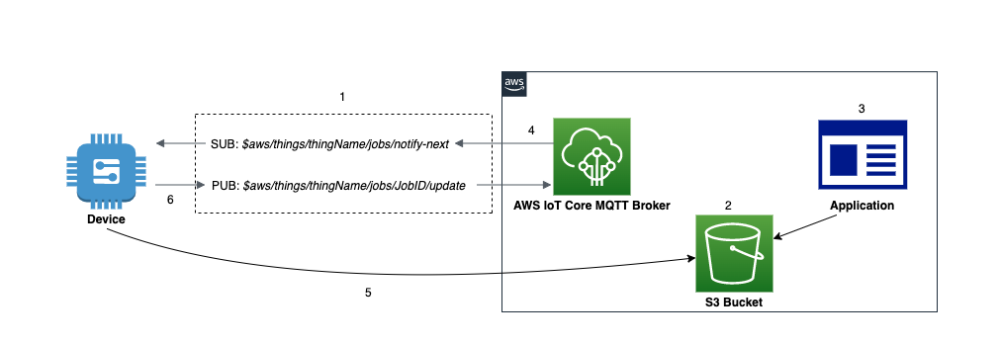

## Casos de Uso
- Realizar operaciones remotas en dispositivos conectados a IoT Core
    - _Quiero descargar e instalar actualizaciones de aplicaciones o firmware para dispositivos remotos en una flota_
    - _Quiero aplicar un parche de seguridad o rotar certificados en un dispositivo remoto_
    - _Quiero reiniciar un dispositivo en el campo_
    - _Quiero realizar solución de problemas remotos_

## Arquitectura de Referencia

- _AWS IoT Core_ es el broker de mensajes MQTT que procesa mensajes en nombre de los clientes
- _Dispositivo_ es el objeto IoT que se va a controlar
- _Aplicación_ es la lógica remota que emite comandos
- _Job_ es la ejecución de una tarea en un dispositivo

1. El _Dispositivo_ establece comunicación con el servicio _AWS IoT Core_ y se suscribe al tema de notificación de trabajos `$aws/things/thingName/jobs/notify-next`.
2. Se crea un documento de trabajo y se almacena en un bucket de S3. Este documento JSON contiene información que el _Dispositivo_ necesita para realizar un _Job_. También contiene una o más URLs donde el _Dispositivo_ puede descargar una actualización u otros datos.
3. Una _Aplicación_ o usuario crea un _Job_ en IoT Core para ser ejecutado en el dispositivo. Los datos necesarios para el _Job_ se almacenan en un bucket de S3.
4. El servicio de IoT Jobs publica un mensaje en el tema de trabajos `$aws/things/thingName/jobs/notify-next` notificando al _Dispositivo_ de un _Job_ pendiente.
5. El _Dispositivo_ recibe la notificación y recupera los detalles del trabajo desde el bucket de S3.
6. El _Dispositivo_ puede actualizar el estado de la ejecución de un trabajo publicando mensajes de estado en el tema de actualización de trabajos `$aws/things/thingName/jobs/JobID/update`. Estos estados pueden incluir _"IN_PROGRESS"_, _"FAILED"_, _"SUCCEEDED"_ o _"REJECTED"_.
7. (Opcional) Las aplicaciones de gestión y monitoreo pueden suscribirse a ciertos temas para realizar un seguimiento del estado de los trabajos.

## Suposiciones
Este enfoque de implementación asume que los dispositivos ya están aprovisionados dentro de AWS IoT. Por favor, consulte la [Guía de inicio de AWS IoT Core](https://docs.aws.amazon.com/iot/latest/developerguide/iot-gs.html) para obtener detalles sobre cómo conectar su dispositivo a AWS IoT.
Esta implementación también asume que ya se han otorgado los permisos adecuados dentro de las Políticas de IoT Core y los recursos de S3.

## Implementación

Para crear un trabajo, primero debe crear un documento de trabajo que sea una descripción de las operaciones remotas que deben realizar los dispositivos. Un documento de trabajo contiene una o más URLs donde el dispositivo puede descargar una actualización u otros datos. El documento de trabajo puede almacenarse en un bucket de Amazon S3 o incluirse en línea con el comando que crea el trabajo.

__Documento de Trabajo de Ejemplo__:

```json
{ 
"operation": "download",
"version" : "1.0", 
"directory" : "/installs",
"files":{
    "fileName" : "sample_file",
    "url" : "S3_URL or S3_Presigned_URL"
        }
}
```


{}
Tu documento de trabajo puede contener una URL prefirmada de Amazon S3 que apunta a tu archivo de código (u otro archivo). Las URLs prefirmadas de Amazon S3 son válidas por un tiempo limitado y, por lo tanto, no se generan hasta que un dispositivo solicita un documento de trabajo. Debido a que la URL prefirmada no se ha creado cuando estás creando el documento de trabajo, pones una URL de marcador de posición en tu documento de trabajo. Una URL de marcador de posición se ve como la siguiente: **${aws:iot:s3-presigned-url:https://s3.region.amazonaws.com/<_bucket_>/<_codefile_>}** donde bucket es el bucket de Amazon S3 que contiene el archivo de código y code file es la clave de Amazon S3 del archivo de código.
{}

{}
Para más ejemplos de documentos de trabajo, consulta el ejemplo [jobs-agent.js](https://www.npmjs.com/package/aws-iot-device-sdk) en el SDK de AWS IoT para JavaScript.
{}


{}

Por favor, consulta este [ejemplo de trabajos](https://github.com/aws/aws-iot-device-sdk-python-v2/blob/main/samples/jobs.py) para más detalles y ejemplos.

- Instalar SDK desde PyPI: `python3 -m pip install AWSIoTPythonSDK`
- Reemplaza las variables globales con un endpoint, clientId y credenciales válidos
- Inicia en una sesión de terminal separada antes de ejecutar la aplicación: `python3 device.py`


```python
#device.py - Demonstrates device perspective of a job agent on device waiting for a job and executing it

import AWSIoTPythonSDK
import json
from AWSIoTPythonSDK.MQTTLib import AWSIoTMQTTClient
import urllib.request

#initialize the MQTT client
myMQTTClient = AWSIoTMQTTClient("iot-jobs-thing")
myMQTTClient.configureEndpoint("YOUR_ENDPOINT", 8883)
myMQTTClient.configureCredentials("PATH_TO_ROOT_CA","PATH_TO_CLIENT_PRIVATE_KEY_FILE", "PATH_TO_CLIENT_CERTIFICATE_FILE")
myMQTTClient.connect()

print("Client Connected")

#function to handle jobs
def executeJob(client, userdata, message):
  
    jobfile = json.loads(message.payload.decode('utf-8;'))

    if 'execution' in jobfile:
        job_id = jobfile['execution']['jobId']
            
        job_update_topic = "$aws/things/iot-jobs-thing/jobs/"+ job_id + "/update"

        #publish status update to IoT Core jobs service 
        myMQTTClient.publish(job_update_topic, json.dumps({ "status" : "IN_PROGRESS"}),0)
        print ("Job Execution Started")
            
        #execute job based on parameters in job document
        try:
            url = jobfile['execution']['jobDocument']['files']['url']
            urllib.request.urlretrieve(url, jobfile['execution']['jobDocument']['directory'])
                
            #if successful, publish completion update to jobs service
            myMQTTClient.publish(job_update_topic, json.dumps({ "status" : "SUCCEEDED"}),0)

        except:
            #if failed, publish failure message to job service. Can optimize here.
            myMQTTClient.publish(job_update_topic, json.dumps({ "status" : "FAILED"}),0)

#listen for pending jobs
myMQTTClient.subscribe("$aws/things/iot-jobs-thing/jobs/notify-next", 1, executeJob)

print("Device waiting for job")

input("Please enter to close the connection")

myMQTTClient.disconnect()
print("Client Disconnected")

```
{}


{}
Puedes usar la consola de AWS IoT, la API HTTPS de Jobs, la interfaz de línea de comandos de AWS o los SDKs de AWS para crear y gestionar trabajos. Para más información, consulta [API de gestión y control de trabajos](https://docs.aws.amazon.com/iot/latest/developerguide/jobs-http-api.html), [Referencia de comandos de AWS CLI: iot](https://docs.aws.amazon.com/cli/latest/reference/iot/index.html) o [SDKs y herramientas de AWS](https://aws.amazon.com/tools).
{}

## Consideraciones

Esta implementación cubre los aspectos básicos del uso de trabajos de IoT y MQTT para aplicar actualizaciones. No cubre ciertos aspectos que pueden surgir en producción o en casos de uso más complejos. Tampoco cubre la lógica de la aplicación para desplegar trabajos en dispositivos remotos.

### Firma de Código
La firma de código se puede usar para validar la integridad del código mediante la validación contra una firma digital. Si el documento de trabajo tiene una firma de archivo de código, debes verificar la firma antes de proceder con el procesamiento de la solicitud de trabajo. Para firmar el código, importas un certificado de firma de código de terceros con ACM que se usa para firmar actualizaciones en FreeRTOS y AWS IoT Device Management. Consulta la [documentación de AWS Signer](https://docs.aws.amazon.com/signer/latest/developerguide/Welcome.html) para más información.

### Limitar el Acceso a los Datos en el Documento de Trabajo
Para permitir que un dispositivo tenga acceso seguro y limitado en el tiempo a datos más allá de los incluidos en el propio documento de trabajo, puedes usar URLs prefirmadas de Amazon S3. Puedes colocar tus datos en un bucket de Amazon S3 y agregar un enlace de marcador de posición a los datos en el documento de trabajo. Cuando el servicio de Jobs recibe una solicitud para el documento de trabajo, analiza el documento de trabajo en busca de enlaces de marcador de posición y los reemplaza con URLs prefirmadas de Amazon S3.

Cuando un dispositivo solicita el documento de trabajo, AWS IoT genera la URL prefirmada y reemplaza la URL de marcador de posición con la URL prefirmada. Tu documento de trabajo se envía entonces al dispositivo.

Cuando creas un trabajo que usa URLs prefirmadas de Amazon S3, debes proporcionar un rol de IAM que otorgue permiso para descargar archivos del bucket de Amazon S3 donde se almacenan los datos o actualizaciones. El rol también debe otorgar permiso para que AWS IoT asuma el rol. Por favor, consulta la [documentación de gestión de trabajos](https://docs.aws.amazon.com/iot/latest/developerguide/create-manage-jobs.html) para más información.

### Configuración de Trabajos
Los trabajos pueden configurarse para ejecutarse en un objetivo de dispositivos o grupos de dispositivos, ya sea una vez _(trabajo instantáneo)_ o ejecutarse continuamente cada vez que se agregan nuevos dispositivos a un grupo de dispositivos _(trabajo continuo)_.

Puedes especificar la rapidez con la que los objetivos son notificados de una ejecución de trabajo pendiente. Esto te permite crear un despliegue escalonado para gestionar mejor las actualizaciones, reinicios y otras operaciones.

También puedes crear un conjunto de condiciones para abortar los despliegues cuando se cumplan los criterios que especifiques. Esto incluye opciones de tiempo de espera del trabajo. Por favor, consulta la documentación de IoT Core [aquí](https://docs.aws.amazon.com/iot/latest/developerguide/iot-jobs.html) para más información.

### Desplegar Trabajos a Múltiples Conjuntos de Objetivos
Las plantillas de trabajos te permiten preconfigurar trabajos para que puedas desplegarlos a múltiples conjuntos de dispositivos objetivo. Proporcionan una forma eficiente de crear configuraciones estándar para acciones remotas que necesitas desplegar repetidamente en tus dispositivos.

Puedes crear trabajos a partir de plantillas de trabajos utilizando la AWS CLI y la consola de AWS IoT. Los operadores también pueden crear trabajos a partir de plantillas de trabajos utilizando Fleet Hub para aplicaciones web de AWS IoT Device Management. Para más información sobre cómo trabajar con plantillas de trabajos en aplicaciones de Fleet Hub, consulta [Trabajar con plantillas de trabajos en Fleet Hub para AWS IoT Device Management](https://docs.aws.amazon.com/iot/latest/fleethubuserguide/aws-iot-monitor-technician-job-templates.html).