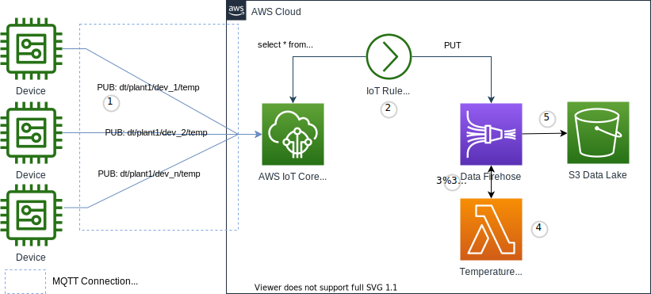

Fan-in es un patrón de comunicación de muchos a uno para consumir datos de telemetría de muchos dispositivos a través de un solo canal de procesamiento de datos.

{}
Esta implementación se centra en el uso de una Acción de Regla de AWS IoT para poner datos de telemetría en un flujo de Amazon Kinesis Data Firehose. El flujo es una consolidación de datos para múltiples dispositivos en una sola planta. El flujo invoca una función Lambda para enriquecer y transformar los payloads de los mensajes de telemetría, luego entrega esos datos a un bucket de S3 para almacenamiento y análisis futuro. Por favor, consulta los [Patrones de Comunicación MQTT](https://docs.aws.amazon.com/whitepapers/latest/designing-mqtt-topics-aws-iot-core/mqtt-communication-patterns.html), específicamente la sección _Fan-in_. Este documento técnico proporciona patrones de temas alternativos que van más allá del alcance de esta implementación. <!--También puedes consultar un estudio de caso de un cliente para un ejemplo del mundo real aquí: https://www.youtube.com/watch?v=BkinvmBRFHY  #comentado debido a la validación de enlaces rotos con captcha-->
{}

## Casos de Uso

- Filtrar datos
  - _Quiero eliminar todos los valores que ocurren durante un cierto período de tiempo_
- Transformar valores de datos en un formato listo para usar
  - _Quiero convertir todas las lecturas de temperatura en Celsius a Fahrenheit_
  - _Quiero reformatear los datos del sensor en un formato estándar_
- Agregar datos
  - _Quiero calcular la suma, mínimo, máximo, promedio (por ejemplo, función de agregación) de valores de agrupaciones de dispositivos antes del almacenamiento_
- Enriquecer los datos del dispositivo con datos de otras fuentes de datos
  - _Quiero agregar metadatos del dispositivo desde nuestro modelo de dispositivo almacenado en una base de datos_

## Arquitectura de Referencia



- _Devices_ son los objetos IoT que transmiten telemetría
- _AWS IoT Core_ es el broker de mensajes MQTT que procesa mensajes en nombre de los clientes
- _IoT Rule_ realiza las acciones sobre el mensaje
- _Kinesis_ es el flujo de Amazon Kinesis Data Firehose para procesar y entregar mensajes a un almacenamiento
- _Lambda_ ejecuta tu código para actuar sobre los mensajes entrantes y transformarlos o enriquecerlos antes del almacenamiento
- _S3_ es el Data Lake donde los datos se almacenarán para análisis y procesamiento posterior o ETL

1. _Devices_ establecen una conexión MQTT con el endpoint de _AWS IoT Core_, y luego publican mensajes en el tema `dt/plant1/dev_n/temp` (telemetría de datos). Este es un tema específico de ubicación y dispositivo para entregar mensajes de telemetría para un dispositivo o sensor dado.
1. La _IoT Rule_ consulta un tema comodín `dt/plant1/+/temp` desde el _AWS IoT Core_ para consolidar mensajes de dispositivos para plant1 y coloca esos mensajes en un flujo de _Amazon Kinesis Data Firehose_.
1. El flujo de _Amazon Kinesis Data Firehose_ almacena en búfer los mensajes, por tiempo o tamaño, en matrices de eventos y notifica a una función Lambda pasando la matriz de eventos para su procesamiento.
1. La función _Lambda_ realiza la acción deseada sobre los eventos devolviéndolos a _Kinesis_ junto con modificaciones en la carga útil de datos y un estado de procesamiento exitoso o fallido de cada evento.
1. Finalmente, _Amazon Kinesis Data Firehose_ entrega los mensajes al bucket de S3 para su análisis y procesamiento posterior. 

{}

```plantuml
@startuml
!define AWSPuml https://raw.githubusercontent.com/awslabs/aws-icons-for-plantuml/v7.0/dist
!includeurl AWSPuml/AWSCommon.puml
!includeurl AWSPuml/InternetOfThings/all.puml
!includeurl AWSPuml/Analytics/Kinesis.puml
!includeurl AWSPuml/Storage/SimpleStorageServiceS3.puml
!includeurl AWSPuml/Compute/Lambda.puml

'Comment out to use default PlantUML sequence formatting
skinparam participant {
    BackgroundColor AWS_BG_COLOR
    BorderColor AWS_BORDER_COLOR
}
'Hide the bottom boxes
hide footbox

participant "<$IoTGeneric>\nDevices" as devices
participant "<$IoTCore>\nMQTT Broker" as broker
participant "<$IoTRule>\nRule" as rule
participant "<$Kinesis>\nStream" as stream
participant "<$Lambda>\nLambda" as lambda
participant "<$SimpleStorageServiceS3>\nS3 Bucket" as bucket

== Publish, Transform, Enrich, and Store ==
devices -> broker : connect(iot_endpoint)
devices -> broker : publish("dt/plant1/dev_1/temp")
devices -> broker : publish("dt/plant1/dev_2/temp")
devices -> broker : publish("dt/plant1/dev_n/temp")
broker <- rule : select * from \n'dt/plant1/+/temp'
rule -> stream : put_records(events)
stream -> lambda: handle(events)
stream <- lambda: response
stream -> bucket: put_objects(enriched_events)


@enduml
```

{}

## Implementación

Para experimentar rápidamente, puedes probar este patrón publicando mensajes con el cliente de prueba MQTT en la consola de AWS IoT o utilizando el [Simulador de Dispositivos IoT](https://aws.amazon.com/solutions/implementations/iot-device-simulator/). En una implementación del mundo real, configurarás múltiples dispositivos como Cosas de AWS IoT que se comuniquen de manera segura con tu endpoint de _AWS IoT Core_.

{}
La configuración y los ejemplos de código se centran en el diseño general de _fan-in_. Por favor, consulta la [Guía de inicio de AWS IoT Core](https://docs.aws.amazon.com/iot/latest/developerguide/iot-gs.html) para obtener detalles sobre la creación de cosas, certificados, obtención de tu endpoint y publicación de telemetría en tu endpoint. La configuración y los ejemplos de código a continuación se utilizan para demostrar la capacidad básica del patrón _Fan-in_. Consulta las Guías del Desarrollador de [AWS Lambda](https://docs.aws.amazon.com/lambda/latest/dg/welcome.html) y [Amazon Kinesis Data Firehose](https://docs.aws.amazon.com/firehose/latest/dev/what-is-this-service.html) para una discusión más profunda de estos servicios.
{}

### Suposiciones

Este enfoque de implementación asume que todos los _Dispositivos_ no están conectados a internet o a _AWS IoT Core_ en todo momento. Cada _Dispositivo_ publica telemetría de temperatura en un solo tema. La implementación también asume que todas las lecturas de temperatura se emiten con un valor de nombre de sensor de Temperatura Celsius o Temperatura Fahrenheit y siguen los formatos de carga útil de mensajes que se describen a continuación. También se mencionan opciones alternativas en las secciones a continuación.

### Dispositivos

Una vez conectados a _AWS IoT Core_, los dispositivos transmitirán datos de telemetría a temas MQTT específicos de la planta y del dispositivo. El siguiente ejemplo demuestra temas MQTT y cargas útiles para device1 y device2 en plant1. Tu implementación podría soportar cientos, miles o millones de dispositivos. Copia y pega los nombres de los temas y las cargas útiles de los mensajes a continuación en las entradas de suscripción y publicación del cliente de prueba MQTT para simular el tráfico de dispositivos que vamos a fan-in. Puedes suscribirte a cada tema para ver los mensajes específicos del dispositivo a medida que los publicas o puedes suscribirte al tema comodín `dt/plant1/+/temp` para ver los mensajes en conjunto.


{}

Nombre del tema MQTT para la temperatura de device1 en plant1.
```yaml
dt/plant1/dev_1/temp
```

Payload JSON de telemetría de temperatura en Celsius para device1 en plant1.

```json 
{
    "timestamp": 1601048303,
    "sensorId": 17,
    "deviceSerial": "sd89w7e82349",
    "sensorData": [
        {
        "sensorName": "Temperature Celsius",
        "sensorValue": 34.2211224
        }
    ]
}
```

{}
{}

Nombre del tema MQTT para la temperatura de device2 en plant1.

```yaml
dt/plant1/dev_2/temp
```

Payload JSON de telemetría de temperatura en Fahrenheit para device2 en plant1.

```json
{
    "timestamp": 1601048303,
    "sensorId": 4,
    "deviceSerial": "324l5;k;a3",
    "sensorData": [
        {
        "sensorName": "Temperature Fahrenheit",
        "sensorValue": 120.3806
        }
    ]
}
```

{}


### AWS Lambda para Transformar Datos de Telemetría

En la consola de AWS _Lambda_ crea una nueva función _Lambda_. Para usar el código a continuación, elige `Author from scratch` con un runtime de Python 3.8 y pega el código a continuación en el editor de código. Para crear tu propia función, elige la opción `Use a blueprint` y selecciona el Blueprint `kinesis-firehose-process-record-python` que luego modificarás según tus requisitos.

1. Nombra tu función `fan-in_device_temperature_converter`
1. Para Execution role elige `Create a new role with basic Lambda permissions`
1. Haz clic en `Create Function`
1. Cambia de la vista `Code` a la vista `Configuration` y haz clic en `Edit` en el panel de Configuración General
1. Cambia el tiempo de espera a 3 minutos y 0 segundos y haz clic en `Save` (_Amazon Kinesis Data Firehose_ requiere al menos un tiempo de espera de 1 minuto para un transformador _Lambda_)



{}

```python
import base64
import json

print('Loading function')


def lambda_handler(event, context):
    output = []

    for record in event['records']:
        print(record['recordId'])
        payload = json.loads(base64.b64decode(record['data']).decode('utf-8'))

        transformedPayload = {}
        transformedPayload['deviceSerial'] = payload['deviceSerial']
        transformedPayload['timestamp'] = payload['timestamp']
        
        for data in payload['sensorData']:

            if data['sensorName'] == 'Temperature Celsius':
                transformedPayload['temperature'] = (data['sensorValue'] * 9/5) + 32  
            else:
                transformedPayload['temperature'] = data['sensorValue']

        output_record = {
            'recordId': record['recordId'],
            'result': 'Ok',
            'data': base64.b64encode(json.dumps(transformedPayload).encode('utf-8'))
        }
        
        output.append(output_record)

    print('Successfully processed {} records.'.format(len(event['records'])))

    return {'records': output}    
```

{}


Los mensajes serán transformados por esta función al formato siguiente, que está aplanado y tiene todas las lecturas de temperatura en Fahrenheit después de convertir desde Celsius.

```json
{"deviceSerial": "sd89w7e82349", "timestamp": 1601048303, "temperature": 93.59802032}
```
```json
{"deviceSerial": "324l5;k;a3", "timestamp": 1601048303, "temperature": 120.3806}
```

Además de usar _Lambda_ desde _Amazon Kinesis Data Firehose_, también puedes aprovechar [AWS IoT Analytics](https://aws.amazon.com/iot-analytics/) para lograr el procesamiento _Fan-in_ de mensajes con transformaciones y comportamientos de enriquecimiento.

### Bucket de Destino de Amazon S3

Usa la Consola de AWS o la CLI de AWS para crear un nuevo bucket de S3 como destino para el flujo de entrega de Kinesis Firehose para almacenar los datos del dispositivo de plant1. Reemplaza `<AccountId>` con tu ID de cuenta de AWS.

Comando CLI
```yaml
aws s3 mb s3://fan-in-telemetry-<AccountId>
```

Los destinos de _Amazon Kinesis Data Firehose_ también pueden incluir [Amazon Redshift](https://aws.amazon.com/redshift/?whats-new-cards.sort-by=item.additionalFields.postDateTime&whats-new-cards.sort-order=desc), [Amazon ElasticSearch](https://aws.amazon.com/elasticsearch-service/), Endpoints HTTP y proveedores de servicios de terceros.

### Amazon Kinesis Data Firehose

En la Consola de AWS para _Amazon Kinesis Data Firehose_

1. Haz clic en `Create Delivery Stream`
1. Nombra tu flujo `fan-in_device_temperature_stream`
1. Deja la Fuente como `Direct PUT or other sources` y haz clic en `Next`
1. Elige `Enabled` para Transform source records with AWS Lambda y selecciona la función creada anteriormente `fan-in_device_temperature_converter`
1. Deja la versión de la función Lambda como `$LATEST`
1. Deja la conversión del formato de registro `Disabled` y haz clic en `Next`
1. Deja tu Destino como `Amazon S3`
1. En S3 Destination elige el bucket que creaste anteriormente `fan-in-telemetry-<AccountId>`
1. Desplázate hacia abajo y haz clic en `Next`
1. En la pantalla Configure settings desplázate hacia abajo y haz clic en `Next`
1. En la pantalla Review haz clic en `Create delivery stream`

Alternativamente, tu _AWS IoT Rule_ puede lograr el patrón Fan-in con acciones que envían mensajes a [Amazon Kinesis Data Streams](https://aws.amazon.com/kinesis/data-streams/) donde otras aplicaciones pueden leer y actuar sobre los datos de telemetría en búfer, [Amazon Kinesis Data Analytics](https://aws.amazon.com/kinesis/data-analytics/) para realizar procesamiento de análisis de datos en tiempo real con SQL o Apache Flink, colas de mensajes SQS donde puedes procesar mensajes de manera asíncrona, o cualquiera de las [Acciones de Reglas de AWS IoT](https://docs.aws.amazon.com/iot/latest/developerguide/iot-rule-actions.html) soportadas.

### IoT Rule

Desde la Consola de AWS IoT, en el menú Act, elige Create a Rule.
1. Ingresa un nombre para tu regla `FanIn_Device_Temperature`
1. Proporciona una descripción como 'Processes temperature data from all devices in plant1.' 
1. Para la declaración de consulta de la regla, deja la versión SQL predeterminada de 2016-03-23 y reemplaza la consulta predeterminada con `select * from 'dt/plant1/+/temp'`
1. Agrega una acción `Send a message to an Amazon Kinesis Firehose Stream`
1. Haz clic en `Configure Action` y continúa con los detalles
1. Selecciona el Stream que creaste anteriormente `fan-in_device_temperature_stream`
1. Deja Separator como 'No separator'
1. Crea un nuevo rol y proporciona un nombre `IoT_Rule_fan-in_Kinesis_Role`
1. Haz clic en `Add Action`
1. Desplázate hacia abajo y haz clic en `Create Rule`

### Consideraciones

Esta implementación cubre los aspectos básicos de un patrón de fan-in de telemetría de dispositivos. No cubre ciertos aspectos que pueden surgir en el uso en producción.

### Entrega de Mensajes Retrasada

_Los dispositivos_ pueden retener mensajes para reintentos de entrega si la conectividad con el _Broker MQTT_ en _AWS IoT Core_ se pierde temporalmente. El flujo de _Amazon Kinesis Data Firehose_ marca los eventos con marcas de tiempo en la llegada aproximada del evento al flujo. _Los dispositivos_ que publican mensajes de telemetría deben incluir una marca de tiempo en el mensaje que represente el tiempo real en que ocurrió el evento. Se necesita un procesamiento adicional de los datos de telemetría almacenados en S3 para crear una estructura de carpetas basada en la marca de tiempo del evento del dispositivo en lugar de la marca de tiempo del evento de _Amazon Kinesis Data Firehose_ si planeas crear particiones para ETL y análisis con [AWS Glue](https://aws.amazon.com/glue/) y [Amazon Athena](https://aws.amazon.com/athena/).


### Cuotas del Servicio

La consideración principal sobre las cuotas del servicio para el _Fan-in_ se describe en la sección de Patrones de Comunicación MQTT del documento técnico [Designing MQTT Topics for AWS IoT Core](https://docs.aws.amazon.com/whitepapers/latest/designing-mqtt-topics-aws-iot-core/mqtt-communication-patterns.html). En lugar de usar el patrón _Fan-in_ sobre-suscribiendo múltiples dispositivos a un solo tema de dispositivo, usa un tema por dispositivo y luego usa el Motor de Reglas de AWS IoT con un patrón de suscripción comodín para enrutar a Amazon Kinesis Data Firehose como se demuestra en esta implementación. En esta implementación también debes estar al tanto de las cuotas aplicables a cada servicio utilizado en tu implementación. Asegúrate de entender si alguna de estas es una preocupación para tu diseño y si son ajustables.
1. El _Broker de Mensajes de AWS IoT Core_ tiene [cuotas de servicio](https://docs.aws.amazon.com/general/latest/gr/iot-core.html#message-broker-limits) en cuanto al número de solicitudes de conexión por segundo por cuenta (500 - ajustable), por cliente (1 - no ajustable) así como el máximo de conexiones concurrentes de clientes entrantes, solicitudes de publicación, suscripciones por conexión y más.
1. El _Motor de Reglas de AWS IoT_ tiene [cuotas de servicio](https://docs.aws.amazon.com/general/latest/gr/iot-core.html#rules-limits) que gobiernan las invocaciones de reglas por segundo (20,000 - ajustable), el máximo de acciones por regla (10 - no ajustable) y más.
1. Revisa las [cuotas de servicio](https://docs.aws.amazon.com/firehose/latest/dev/limits.html) de _Amazon Kinesis Data Firehose_. Ten en cuenta que cada flujo de entrega almacena registros de datos por hasta 24 horas, el tamaño del búfer de _Lambda_ está entre 1 MiB y 3 MiB, y el intervalo del búfer varía de 60 segundos a 900 segundos.
1. _AWS Lambda_ tiene [cuotas de servicio](https://docs.aws.amazon.com/lambda/latest/dg/gettingstarted-limits.html) en cuanto a ejecuciones concurrentes (1,000 - ajustable), almacenamiento para el tamaño de la función y la capa, asignación de memoria (128 MB a 10,240 MB, en incrementos de 1 MB), tiempo de espera (15 minutos - no ajustable) y más.
1. Con _Amazon S3_, aunque no hay preocupaciones específicas con esta implementación, puedes familiarizarte con las [cuotas de servicio](https://docs.aws.amazon.com/general/latest/gr/s3.html) de _Amazon S3_ para estar al tanto de los límites en cuanto a políticas de bucket, reglas de replicación, notificaciones de eventos, tamaños de objetos y más.
