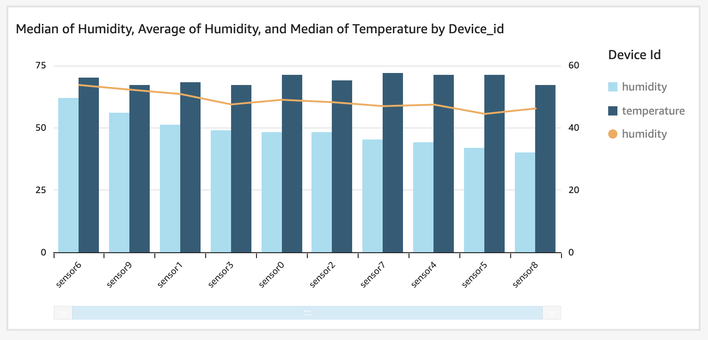

Extract, Transform and Load (ETL) de datos de telemetría de IoT es el proceso que transforma y prepara datos de telemetría para análisis, informes y archivado. Un _Pipeline de AWS IoT Analytics_ puede filtrar, seleccionar atributos, eliminar atributos, aplicar funciones matemáticas, enriquecer datos o estado del dispositivo y aplicar lógica personalizada de AWS Lambda a los datos.

## Casos de Uso

- Archivado
    - _Necesito un archivo casi en tiempo real de los sensores transmitidos a AWS IoT Core con consultas SQL sobre el broker MQTT_
    - _Necesito archivar en masa datos de sensores desde un historiador de Supervisión, Control y Adquisición de Datos (SCADA) u otro almacén de datos_
- Transformar Datos
    - _Necesito transformar datos de sensores, pero no tengo habilidades especializadas de desarrollador ETL o una herramienta ETL_
    - _Necesito iterar rápidamente en transformaciones ETL en datos de sensores_
    - _Necesito experimentar y comparar diferentes transformaciones ETL en los mismos datos de sensores_
    - _Necesito reprocesar conjuntos de datos que ya he ingerido y procesado con nuevas o actualizadas transformaciones_
- Analizar
    - _Necesito realizar análisis fácilmente en datos de sensores sin configurar una herramienta de Inteligencia de Negocios (BI) o un DataLake_
    - _Necesito hacer que los datos de sensores transformados estén fácilmente disponibles para análisis en una herramienta BI o en un cuaderno de AI/ML_

## Arquitectura de Referencia

- _Devices_ son las cosas IoT que transmiten telemetría
- _AWS IoT Core_ es el broker de mensajes MQTT que procesa mensajes en nombre de los clientes y utiliza una Acción de Regla
- _SCADA Historian_ es un almacenamiento de datos en las instalaciones de datos del dispositivo.
- _Amazon Kinesis_ es un destino de transmisión para la migración de datos del historiador.
- _Amazon Lambda_ ejecuta una función sin servidor para procesar datos de transmisión desde Kinesis y colocarlos en lotes en un Canal.
- _AWS IoT Analytics_ comprende
  - _IoT Analytics Channel_ donde los mensajes sin procesar se almacenan por un período de tiempo. Los dispositivos pueden enviar datos a múltiples Canales.
  - _IoT Analytics Pipeline_ que realiza actividades ETL en mensajes consumidos de un canal.
  - _IoT Analytics Datastore_ es donde un Pipeline escribe datos.
  - _IoT Analytics Dataset_ es una vista materializada sobre un Datastore que opcionalmente puede ser entregada a S3.
- _Amazon QuickSight_ es la herramienta de BI donde creas y publicas paneles de análisis.
- _Jupyter_ es el cuaderno de flujo de trabajo de análisis que contenedorizas para realizar análisis sobre tu Conjunto de Datos SQL.
- _Amazon S3_ es el sumidero de almacenamiento para IoT Analytics y permite que los datos se almacenen de manera segura y sean accesibles por otros procesos o consumidos como parte de tu DataLake.



{}

1. _Devices_ establecen una conexión MQTT con el endpoint de _AWS IoT Core_, y luego publican mensajes en el tema `dt/plant1/device/aggregate` (telemetría de datos). Este es un tema específico de ubicación y dispositivo para entregar mensajes de telemetría para un dispositivo o sensor dado.
1. Una Regla de Tópico publica los resultados de una consulta SQL comodín `dt/plant1/+/aggregate` desde el Broker MQTT y luego coloca los mensajes en el _IoT Channel_ que almacena esos datos en un bucket de S3 por un período de tiempo determinado.
1. El _IoT Analytics Pipeline_ ejecuta un flujo de trabajo de actividades que incluye leer del Canal, realizar filtrado y transformaciones, y escribir en el Datastore.
1. El _IoT Analytics Datastore_ hace que los datos transformados estén disponibles para los Conjuntos de Datos de origen.
1. El _IoT Analytics Dataset_ es una vista materializada definida en SQL sobre un Datastore, múltiples Conjuntos de Datos pueden ser creados sobre un solo Datastore.
1. _Amazon QuickSight_ lee de un Conjunto de Datos y muestra visualizaciones y paneles.
1. Los cuadernos _Jupyter_ permiten realizar análisis interactivos.
1. _S3 DataLake_ almacena datos del Canal, Datastore y opcionalmente del Dataset.

```plantuml
@startuml
!define AWSPuml https://raw.githubusercontent.com/awslabs/aws-icons-for-plantuml/v7.0/dist
!includeurl AWSPuml/AWSCommon.puml
!includeurl AWSPuml/InternetOfThings/all.puml
!includeurl AWSPuml/Analytics/QuickSight.puml
!includeurl AWSPuml/Storage/SimpleStorageServiceS3.puml

'Comment out to use default PlantUML sequence formatting
skinparam participant {
    BackgroundColor AWS_BG_COLOR
    BorderColor AWS_BORDER_COLOR
}
'Hide the bottom boxes
hide footbox

participant "<$IoTGeneric>\nDevices" as devices
participant "<$IoTCore>\nMQTT Broker" as broker
participant "<$IoTRule>\nRule" as rule
participant "<$IoTAnalyticsChannel>\nChannel" as channel
participant "<$IoTAnalyticsPipeline>\nPipeline" as pipeline
participant "<$IoTAnalyticsDataStore>\nDataStore" as datastore
participant "<$QuickSight>\nQuickSight" as quicksight
participant "<$SimpleStorageServiceS3>\nS3 Bucket" as bucket

== Publish, Archive, Transform, and Store ==
devices -> broker : connect(iot_endpoint)
devices -> broker : publish("d1/topic")
devices -> broker : publish("d2/topic")
devices -> broker : publish("d3/topic")
broker <- rule : select * from \n'+/topic'
rule -> channel : batchPutMessage(\n\tmessages)'

channel <- pipeline : p1.read(raw_data)
pipeline -> datastore: p1.put(xformed_data)
channel <- pipeline : p2.read(raw_data)
pipeline -> datastore: p2.put(xformed_data)
channel <- pipeline : p3.read(raw_data)
pipeline -> datastore: p3.put(xformed_data)
datastore <- quicksight: read
channel -> bucket: put(raw_data)
pipeline -> bucket: put(xformed_data)

@enduml
```

{}
{}

1. _AWS Database Migration Service (DMS)_ lee datos de una base de datos de historiador y los coloca en un _Amazon Kinesis Data Stream_. Una función _Lambda_ luego lee datos de Kinesis usando el SDK y usa IoT Analytics Channel batchPutMessage para poner datos en el _IoT Analytics Channel_. Este patrón demuestra cómo AWS IoT Analytics hace que los mismos flujos de ETL y análisis estén disponibles para tiempo casi real y por lotes.
1. Una Regla de Tópico publica los resultados de una consulta SQL comodín `dt/plant1/+/aggregate` desde el Broker MQTT y luego coloca los mensajes en el _IoT Channel_ que almacena esos datos en un bucket de S3 por un período de tiempo determinado.
1. El _IoT Analytics Pipeline_ ejecuta un flujo de trabajo de actividades que incluye leer del Canal, realizar filtrado y transformaciones, y escribir en el Datastore.
1. El _IoT Analytics Datastore_ hace que los datos transformados estén disponibles para los Conjuntos de Datos de origen.
1. El _IoT Analytics Dataset_ es una vista materializada definida en SQL sobre un Datastore, múltiples Conjuntos de Datos pueden ser creados sobre un solo Datastore.
1. _Amazon QuickSight_ lee de un Conjunto de Datos y muestra visualizaciones y paneles.
1. Los cuadernos _Jupyter_ permiten realizar análisis interactivos.
1. _Amazon S3 DataLake_ almacena datos del Canal, Datastore y opcionalmente del Dataset.


```plantuml
@startuml
!define AWSPuml https://raw.githubusercontent.com/awslabs/aws-icons-for-plantuml/v7.0/dist
!includeurl AWSPuml/AWSCommon.puml
!includeurl AWSPuml/InternetOfThings/all.puml
!includeurl AWSPuml/Analytics/Kinesis.puml
!includeurl AWSPuml/Database/all.puml
!includeurl AWSPuml/Analytics/QuickSight.puml
!includeurl AWSPuml/Storage/SimpleStorageServiceS3.puml
!includeurl AWSPuml/Compute/Lambda.puml

'Comment out to use default PlantUML sequence formatting
skinparam participant {
    BackgroundColor AWS_BG_COLOR
    BorderColor AWS_BORDER_COLOR
}
'Hide the bottom boxes
hide footbox

participant "<$Database>\nSCADA" as historian
participant "<$DatabaseMigrationService>\nDMS" as dms
participant "<$Kinesis>\nKinesis" as stream
participant "<$Lambda>\nLambda" as lambda
participant "<$IoTAnalyticsChannel>\nChannel" as channel
participant "<$IoTAnalyticsPipeline>\nPipeline" as pipeline
participant "<$IoTAnalyticsDataStore>\nDataStore" as datastore
participant "<$QuickSight>\nQuickSight" as quicksight
participant "<$SimpleStorageServiceS3>\nS3 Bucket" as bucket

== Batch, Archive, Transform, and Store ==
historian <- dms : read(data)
dms -> stream : put(data)
stream <- lambda : read(data)
lambda -> channel : batchPutMessage(\n\tmessages)'

channel <- pipeline : p1.read(raw_data)
pipeline -> datastore: p1.put(xformed_data)
datastore <- quicksight: read
channel -> bucket: put(raw_data)
pipeline -> bucket: put(xformed_data)

@enduml
```

{}



## Implementación

En esta implementación configurarás un flujo de archivado y procesamiento ETL de IoT Analytics y luego usarás un script en Python para simular dispositivos que publican mensajes en tu endpoint de AWS IoT Core para probar tu configuración. Al desplegar en producción, configurarás múltiples dispositivos como Cosas de AWS IoT que se comuniquen de manera segura con un Gateway y/o tu endpoint de AWS IoT Core.

{}
El flujo de procesamiento para el camino **1a** se cubre en la implementación a continuación. El flujo **1b** tiene el mismo flujo de procesamiento que **1a** para el paso 2 y más allá una vez que los datos se colocan en el Canal. En el flujo **1b** los datos en masa se obtienen de una base de datos de historiador SCADA y se envían al _IoT Analytics Channel_ usando [BatchPutMessage](https://docs.aws.amazon.com/iotanalytics/latest/APIReference/API_BatchPutMessage.html) por una función Lambda después de que DMS replica los datos a Kinesis. Consulta el blog de AWS titulado *Injecting data into AWS IoT Analytics from a Kinesis Data Stream* para consumir datos de Kinesis con una Lambda. Consulta [AWS DMS with a Kinesis target](https://docs.aws.amazon.com/dms/latest/userguide/CHAP_Target.Kinesis.html) para leer datos de una base de datos de historiador y escribir en Kinesis.
{}

<!--- Link update required: Refer to the aws blog titled Injecting data into [AWS IoT Analytics from a Kinesis Data Stream](https://aws.amazon.com/blogs/iot/injecting-data-into-aws-iot-analytics-from-amazon-kinesis-data-streams/) to consume Kinesis data with a Lambda.  --->

### Suposiciones

Esta implementación asume que estás cómodo usando la Interfaz de Línea de Comandos de AWS (CLI). Si no has instalado la CLI de AWS, sigue las instrucciones de [instalación de la CLI de AWS](https://docs.aws.amazon.com/cli/latest/userguide/install-cliv2.html). La implementación también asume que estás usando el perfil predeterminado de la CLI de AWS o has configurado las variables de sesión correspondientes [AWS_PROFILE](https://docs.aws.amazon.com/cli/latest/userguide/cli-configure-envvars.html) y [AWS_DEFAULT_REGION](https://docs.aws.amazon.com/cli/latest/userguide/cli-configure-envvars.html). De lo contrario, si estás usando un perfil nombrado, asegúrate de agregar los argumentos `--profile <profile-name> y --region <aws-region>` a tus comandos de CLI.

## IoT Analytics Channel

Primero establece un Canal para los Datos de Analytics. Los datos del Canal pueden almacenarse en un bucket de S3 administrado por AWS o por el cliente; en este caso, usaremos el predeterminado administrado por AWS. La retención de almacenamiento puede ser indefinida o basada en tiempo en años y días; en este caso, usaremos la opción predeterminada de indefinida.

```yaml
aws iotanalytics create-channel --channel-name etl_archive_telemetry
```

## Regla de Tópico de IoT Core

Una Regla de Tópico de IoT Core pondrá mensajes en un canal en lotes a medida que se publican en el Broker MQTT. Necesitarás crear un rol de IAM con una relación de confianza para iot.amazon.com y permiso para BatchPutMessage(s) a IoT Analytics y, para mayor comodidad, también usaremos esta política para permitir que IoT Analytics e IoT Core escriban registros en CloudWatch.

Primero crea una política que permita a IoT Core asumir el EtlAnalyticsRole para que pueda escribir en tu Canal.
```yaml
aws iam create-role --role-name EtlAnalyticsRole --assume-role-policy-document file://policy_assume_role.json
```
Guarda el siguiente JSON en un archivo llamado policy_assume_role.json antes de ejecutar el comando anterior.

```json
{
    "Version": "2012-10-17",
    "Statement": [
        {
            "Effect": "Allow",
            "Principal": {
                "Service": [
                    "iot.amazonaws.com",
                    "iotanalytics.amazonaws.com"
                ]
            },
            "Action": "sts:AssumeRole"
        }
    ]
}
```

A continuación, crea y adjunta una política a tu EtlAnalyticsRole dando a tu Regla de Tópico los permisos necesarios.

```yaml
aws iam put-role-policy --role-name EtlAnalyticsRole --policy-name EtlAnalyticsPolicy --policy-document file://policy_etl_analytics.json
```

Guarda el siguiente JSON en un archivo llamado policy_etl_analytics.json. Asegúrate de reemplazar `<REGION>` con tu región y `<ACCOUNT-ID>` con tu ID de cuenta antes de ejecutar el comando anterior.

```json
{
    "Version": "2012-10-17",
    "Statement": [
        {
            "Effect": "Allow",
            "Action": "iotanalytics:BatchPutMessage",
            "Resource": [
               "arn:aws:iotanalytics:<REGION>:<ACCOUNT-ID>:channel/etl_archive_telemetry"
            ]
        },
        {
            "Effect": "Allow",
            "Action": [
                "logs:CreateLogStream",
                "logs:DescribeLogStreams",
                "logs:PutLogEvents"
            ],
            "Resource": [
                "arn:aws:logs:<REGION>:<ACCOUNT-ID>:log-group:/iotanalytics/pipeline:*"
            ]
        }
    ]
}
```

Para habilitar el registro para IoT Analytics e IoT Core, ejecuta los siguientes comandos y asegúrate de reemplazar `<ACCOUNT-ID>` con tu ID de cuenta. Este paso es opcional.


```yaml
aws iotanalytics put-logging-options --logging-options roleArn=arn:aws:iam::<ACCOUNT-ID>:role/EtlAnalyticsRole,level=ERROR,enabled=true
aws iot set-v2-logging-options --role-arn arn:aws:iam::<ACCOUNT-ID>:role/EtlAnalyticsRole --default-log-level DEBUG
```

Ahora puedes crear la regla de tópico.

```yaml
aws iot create-topic-rule --rule-name etl_archival --topic-rule-payload file://topic_rule.json
```

Guarda el siguiente JSON en un archivo llamado topic_rule.json. Asegúrate de reemplazar `<ACCOUNT-ID>` con tu ID de cuenta antes de ejecutar el comando anterior.

```json
{
    "sql": "SELECT * FROM 'dt/plant1/+/aggregate'",
    "ruleDisabled": false,
    "awsIotSqlVersion": "2016-03-23",
    "actions": [
        {
            "iotAnalytics": {
                "channelName": "etl_archive_telemetry",
                "roleArn": "arn:aws:iam::<ACCOUNT-ID>:role/EtlAnalyticsRole"
            }
        }
    ],
    "errorAction": {
        "cloudwatchLogs": {
            "roleArn": "arn:aws:iam::<ACCOUNT-ID>:role/EtlAnalyticsRole",
            "logGroupName": "/aws/iot-rules/etl_data"
        }
    }
}
```

## IoT Analytics Datastore

El IoT Analytics Datastore es una ubicación de almacenamiento para la salida después de que un flujo de trabajo de IoT Analytics Pipeline realiza ETL. El Datastore está respaldado por S3, ya sea en un bucket administrado por AWS o por el cliente; para simplificar, esta implementación utiliza un bucket administrado por AWS. Al igual que un Canal, el almacenamiento es indefinido o basado en tiempo en años y días; en este caso, usaremos la opción predeterminada de indefinida. Un Datastore también debe elegir un formato de datos de JSON o Parquet con una definición de esquema, esto no se puede cambiar después de la creación. En este caso, usaremos Parquet con un esquema definido. Ten en cuenta que se define un nuevo campo 'temperature_fahrenheit' que llenaremos más tarde con nuestro Pipeline; si creas nuevos campos en otra actividad más adelante, tendrás que recrear tu Datastore con un esquema Parquet actualizado. No necesitas definir un esquema para JSON, pero Parquet proporciona compresión y velocidad. Ejecuta el comando a continuación para crear un Datastore.


```yaml
aws iotanalytics create-datastore --cli-input-json file://datastore.json
```

Guarda el siguiente JSON en un archivo llamado datastore.json antes de ejecutar el comando anterior.

```JSON
{
    "datastoreName": "etl_archival_store",
    "datastoreStorage": {
        "serviceManagedS3": {}
    },
    "retentionPeriod": {
        "unlimited": true
    },
    "fileFormatConfiguration": {
        "parquetConfiguration": {
            "schemaDefinition": {
                "columns": [
                    {
                        "name": "device_id",
                        "type": "string"
                    },
                    {
                        "name": "temperature",
                        "type": "int"
                    },
                    {
                        "name": "temperature_fahrenheit",
                        "type": "int"
                    },
                    {
                        "name": "humidity",
                        "type": "int"
                    },
                    {
                        "name": "timestamp",
                        "type": "string"
                    }
                ]
            }
        }
    },
    "datastorePartitions": {
        "partitions": [
            {
                "timestampPartition": {
                    "attributeName": "timestamp",
                    "timestampFormat": "yyyy-MM-dd HH:mm:ss"
                }
            }
        ]
    }
}
```

## IoT Analytics Pipeline

El IoT Analytics Pipeline puede contener una serie de actividades en un flujo de trabajo ETL. La primera actividad es obligatoria, leer desde un Canal. La última actividad también es obligatoria, escribir en un Datastore. Entre estas, puedes agregar una serie de actividades necesarias para tus datos. Realizaremos una simple ecuación matemática convirtiendo Celsius a Fahrenheit. Ejecuta el comando a continuación para crear el Pipeline.


```yaml
aws iotanalytics create-pipeline --cli-input-json file://pipeline.json
```

Guarda el JSON a continuación en un archivo llamado pipeline.json antes de ejecutar el comando anterior.

```JSON
{
    "pipelineName": "calculate_fahrenheit",
    "pipelineActivities": [
        {
            "channel": {
                "name": "read_channel",
                "channelName": "etl_archive_telemetry",
                "next": "calculate_fahrenheit"
            }
        },
        {
            "math": {
                "name": "calculate_fahrenheit",
                "attribute": "temperature_fahrenheit",
                "math": "(temperature * 9/5) + 32 ",
                "next": "write_datastore"
            }
        },
        {
            "datastore": {
                "name": "write_datastore",
                "datastoreName": "etl_archival_store"
            }
        }
    ]
}
```

## Simulación de Dispositivos

Nuestro entorno de IoT Analytics está configurado y nuestro Pipeline está listo para realizar ETL en los datos entrantes. Para esta implementación, ejecutaremos algunos hilos para simular dispositivos y generar datos. Siéntete libre de analizar el código y modificar la configuración del dispositivo y la publicación, pero ten en cuenta que no puedes usar una cantidad de sensores mayor que el número de hilos disponibles en la computadora en la que ejecutas esto. Asegúrate de reemplazar `<IOT-CORE-ENDPOINT>` con tu endpoint de IoT Core. Puedes ver tu endpoint en la página del servicio IoT Core bajo Configuración, Endpoint de Datos del Dispositivo. También puedes recuperar el endpoint a través de la CLI ejecutando el siguiente comando.

```yaml
aws iot describe-endpoint
```

Asegúrate de tener python 3 instalado en tu máquina. Luego ejecuta el siguiente comando.

```yaml
python3 data_generator.py
```

Antes de ejecutar el comando anterior, guarda el siguiente código python en un archivo llamado data_generator.py

```python
#!/usr/bin/env python3

import random
import time
import boto3
import json
from multiprocessing import Pool
from datetime import datetime


iot_client = boto3.client(
    "iot-data", endpoint_url="https://<IOT-CORE-ENDPOINT>"
)


def read(sensor):
    message = {}
    message["device_id"] = f"sensor{sensor}"
    message["temperature"] = random.randrange(45, 92, 2)
    message["humidity"] = random.randrange(0, 99, 2)
    message["timestamp"] = datetime.now().strftime("%Y-%m-%d %H:%M:%S")
    print(message)

    topic = f"dt/plant1/{message['device_id']}/aggregate"
    iot_client.publish(topic=topic, payload=json.dumps(message))


if __name__ == "__main__":
    sensor_count = 10  # maps to physical threads on your machine
    seconds_between_publishing = 2
    publishes = 100

    with Pool(sensor_count) as p:
        for _ in range(publishes):
            p.map(read, range(sensor_count))
            time.sleep(seconds_between_publishing)

```

## IoT Analytics Datasets

Un IoT Analytics Dataset es una vista materializada de los datos en un Datastore. Puedes crear muchos Datasets a partir de un solo Datastore. Cuando realices análisis en QuickSight o con un cuaderno de Jupyter, leerás el Dataset como tu fuente de datos. Crearemos dos Datasets a continuación, uno con los datos sin procesar del cual construiremos una visualización en QuickSight más adelante y otro con algunos valores estadísticos agregados como un ejemplo de un segundo Dataset. Si deseas previsualizar los datos, puedes tomar las consultas SQL del JSON a continuación y usar la Consola de AWS para IoT Analytics Datastore y ejecutar una consulta de prueba en el flujo de creación del Dataset.

Ejecuta el comando a continuación para crear un Dataset.


```yaml
aws iotanalytics create-dataset --cli-input-json file://dataset_raw.json
```

Copia el JSON a continuación en un archivo llamado dataset_raw.json antes de ejecutar el comando anterior.

```JSON
{
    "datasetName": "raw_data",
    "actions": [
        {
            "actionName": "onetime_action",
            "queryAction": {
                "sqlQuery": "select * from etl_archival_store"
            }
        }
    ]
}
```

Ejecuta el comando a continuación para crear un Dataset.

```yaml
aws iotanalytics create-dataset --cli-input-json file://dataset_group_by.json
```

Copia el JSON a continuación en un archivo llamado dataset_group_by.json antes de ejecutar el comando anterior.


```JSON
{
    "datasetName": "group_by_data",
    "actions": [
        {
            "actionName": "onetime_action",
            "queryAction": {
                "sqlQuery": "SELECT device_id, avg(temperature) AVG_TEMP, max(temperature) MAX_TEMP, min(temperature) MIN_TEMP, avg(humidity) AVG_HUMIDTY FROM etl_archival_store group by (device_id) order by device_id"
            }
        }
    ]
}
```

## Visualización en QuickSight

Tus conjuntos de datos han sido creados, pero están vacíos. Para llenarlos necesitamos ejecutarlos. No configuramos un horario, así que los ejecutaremos manualmente ahora. Ejecuta el comando a continuación, o elige ejecutar tu conjunto de datos desde la consola.

```yaml
aws iotanalytics create-dataset-content --dataset-name raw_data
```

Navega a QuickSight desde la Consola de AWS. Elige "Sign up for QuickSight" si aún no lo has hecho. La edición estándar es adecuada para este ejercicio. Elige Enterprise si deseas usar funciones avanzadas o Enterprise Q si deseas funciones avanzadas y AI/ML Insights.

- Para la configuración estándar, deja "Authentication Method" con el valor predeterminado de "Use IAM federated identities & QuickSight-managed users"
- Deja tu región configurada en la región en la que has construido tus activos de IoT Analytics.
- Proporciona un Nombre de Cuenta de QuickSight universalmente único
- Ingresa una dirección de correo electrónico de notificación
- Bajo "QuickSight access to AWS services" asegúrate de marcar la casilla junto a IoT Analytics

Una vez que tu cuenta esté creada, elige Datasets en el menú de la izquierda, luego haz clic en el botón New dataset.
En la lista de servicios encuentra AWS IoT Analytics y elígelo, luego selecciona raw_data y deja el nombre del conjunto de datos como raw_data.

- Elige Clustered Combo Bar Chart
- En Field Wells configura el eje X a device ID
- Agrega humidity a las barras y la función de agregación de mediana
- Agrega temperature a las barras y la función de agregación de mediana
- Agrega humidity average a las líneas



### Reprocesamiento del Pipeline

Un ingeniero identificó que los sensores de humedad están reportando datos en un rango de 0-99, pero tus usuarios finales requieren ver estos informes con valores de 1-100. Para corregir esto, actualizaremos el pipeline para sumar 1 a cada valor de Humidity.

```yaml
aws iotanalytics update-pipeline --cli-input-json file://pipeline.json
```

Guarda el JSON a continuación en tu archivo existente llamado pipeline.json antes de ejecutar el comando anterior.

```JSON
{
    "pipelineName": "calculate_fahrenheit",
    "pipelineActivities": [
        {
            "channel": {
                "name": "read_channel",
                "channelName": "etl_archive_telemetry",
                "next": "calculate_fahrenheit"
            }
        },
        {
            "math": {
                "name": "calculate_fahrenheit",
                "attribute": "temperature_fahrenheit",
                "math": "(temperature * 9/5) + 32 ",
                "next": "update_humidity"
            }
        },
        {
            "math": {
                "name": "update_humidity",
                "attribute": "humidity",
                "math": "humidity + 1",
                "next": "write_datastore"
            }
        },
        {
            "datastore": {
                "name": "write_datastore",
                "datastoreName": "etl_archival_store"
            }
        }
    ]
}
```

Ahora que hemos actualizado nuestro pipeline, necesitaremos reprocesarlo para que los valores corregidos de humedad estén disponibles para análisis. Después de que el reprocesamiento esté completo, también necesitaremos actualizar nuestros Datasets. Puedes ver tanto la regla actualizada como el estado del reprocesamiento en la Consola de AWS.

```yaml
aws iotanalytics start-pipeline-reprocessing --pipeline-name calculate_fahrenheit
```

Después de un momento, puedes crear el contenido actualizado de tu Dataset.

```yaml
aws iotanalytics create-dataset-content --dataset-name raw_data
```

Si deseas actualizar SPICE en QuickSight, navega a QuickSight, elige Datasets, selecciona raw_data y elige refresh now.

### Consideraciones

Las actividades del Pipeline pueden ser más robustas que el ejemplo que creamos y pueden contener más pasos de los que incluimos. Consulta la [Guía del Usuario](https://docs.aws.amazon.com/iotanalytics/latest/userguide/pipeline-activities.html) para obtener una visión general de todas las actividades.

Además, podrías crear otro pipeline que lea configuraciones del dispositivo desde la sombra del dispositivo o atributos del dispositivo desde el registro del dispositivo, como la versión del software, para comparar cómo el estado del dispositivo afecta las lecturas del dispositivo. Intenta agregar otro pipeline propio para mejorar los datos en tu datastore.

Cubrimos la obtención de datos del Broker MQTT y de un Historiador. AWS SiteWise también es una fuente viable de datos para IoT Analytics, así como S3.

En esta implementación cubrimos el uso de buckets administrados por AWS, también puedes usar tus propios buckets para almacenar datos del Canal, DataStore y DataSet. Un bucket administrado por el cliente es especialmente útil como destino de un Dataset para su inclusión con otros datos en un DataLake. Tienes la opción de enviar la salida del Dataset a un bucket de S3, AWS IoT Events, QuickSight o un cuaderno de Jupyter.

Los conjuntos de datos que creamos se basaron en SQL. Se pueden crear análisis más complejos con un flujo de trabajo automatizado usando un contenedor Docker y este enfoque permite contenedorización de un cuaderno de Jupyter. Consulta la [Guía del Usuario](https://docs.aws.amazon.com/iotanalytics/latest/userguide/automate.html) para obtener detalles sobre cómo funciona esto. Si tomas este enfoque, incluso puedes incrustar visualizaciones de tu conjunto de datos de contenedor en la consola de IoT Analytics.

### Limpieza

Los siguientes comandos de CLI limpiarán los recursos de IoT Core, IoT Analytics e IAM que creaste en esta guía, en el orden correcto. Ejecútalos para asegurarte de no acumular costos de facturación de AWS. Una vez que se completen los comandos a continuación, también necesitarás navegar a la consola de CloudWatch o usar la CLI para establecer un período de retención en los registros o eliminarlos según tus necesidades.

```yaml
aws iotanalytics put-logging-options --logging-options roleArn=arn:aws:iam::<ACCOUNT-ID>:role/EtlAnalyticsRole,level=ERROR,enabled=false
aws iot set-v2-logging-options --role-arn arn:aws:iam::<ACCOUNT-ID>:role/EtlAnalyticsRole --default-log-level DISABLED
aws iot delete-topic-rule --rule-name etl_archival
aws iam delete-role-policy --role-name EtlAnalyticsRole --policy-name EtlAnalyticsPolicy
aws iam delete-role --role-name EtlAnalyticsRole
aws iotanalytics delete-pipeline --pipeline-name calculate_fahrenheit
aws iotanalytics delete-channel --channel-name etl_archive_telemetry
aws iotanalytics delete-datastore --datastore-name etl_archival_store
aws iotanalytics delete-dataset --dataset-name raw_data
aws iotanalytics delete-dataset --dataset-name group_by_data
```
