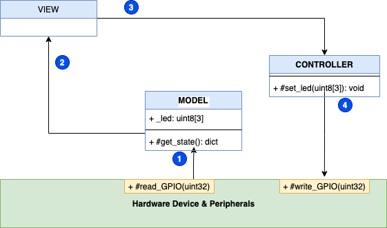
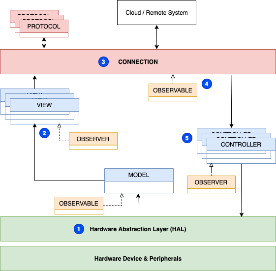

## Desafío

Los dispositivos IoT tienen un conjunto común de preocupaciones:

* reportar el estado actual del dispositivo, sensores adjuntos y actuadores
* procesar mensajes de control (tanto remotos como locales)
* presentar información de estado

El software del dispositivo también debe ser fácil de probar y reutilizar en múltiples proyectos, plataformas de hardware, lenguajes y SDKs. Algunos dispositivos son 'unidireccionales', solo reportan estado o toman acción, mientras que otros son 'bidireccionales', realizando ambas acciones. El patrón de diseño de software debe ser generalmente componible para soportar todos estos usos, así como acomodar una variedad flexible de periféricos, fuentes de comandos e interfaces.

## Solución

Un patrón de diseño de software de dispositivo IoT basado en el patrón de diseño [Model-View-Controller](https://es.wikipedia.org/wiki/Modelo%E2%80%93vista%E2%80%93controlador).

### Modelo Vista Controlador Básico

La preocupación del componente **modelo** es representar el estado general del dispositivo: señales, métricas, periféricos, datos de visualización y estado actual de la(s) variable(s) de control. El componente **vista** maneja la presentación de los datos del **modelo**. El **controlador** es responsable de tomar acciones para cambiar el estado o la configuración del dispositivo.

1. El **modelo**, y solo el **modelo** lee del dispositivo.

2. La **vista** solo lee del **modelo** y nunca del hardware directamente.

3. Si la **vista** necesita efectuar alguna presentación local (como encender un LED adjunto), la **vista** debe usar el **controlador** para hacer ese cambio.

4. Solo el **controlador** tiene permitido escribir en el hardware.

### Consideraciones Básicas del Modelo Vista Controlador

Las preocupaciones de leer y escribir en el hardware están separadas entre el **modelo** (solo lectura) y el **controlador** (solo escritura). Esta separación facilita las pruebas y la simulación (ver [Mocks aren't Stubs](https://martinfowler.com/articles/mocksArentStubs.html) para una breve introducción a los objetos simulados y cómo pueden usarse para probar software) y también puede usarse para limitar el acceso a cambios mutantes (escrituras) que pueden requerir acceso privilegiado u otra seguridad (incluyendo auditoría).

La preocupación del componente **modelo** es escanear las entradas de manera regular (como una interrupción de temporizador) o cuando ocurren cambios (como un disparador de borde). Para ciertas plataformas de hardware, puede ser necesario que el **modelo** configure disparadores o callbacks. Aunque esta configuración a menudo implica la escritura de registros, esa configuración no viola la restricción del **modelo** de solo leer del hardware.

Tenga en cuenta que no hay setters (expuestos) como parte del modelo. Esto se debe a que toda la activación de cambios debe ser manejada por el controlador y el modelo registraría estos cambios cuando se midan directamente desde el hardware.

El **modelo** se implementa mejor mediante un patrón de diseño [Singleton](https://es.wikipedia.org/wiki/Singleton) y es fácilmente extensible con llamadas bloqueantes y no bloqueantes.

### Modelo Vista Controlador Práctico

Muchas plataformas de hardware aparentemente requerirían una violación de la separación de lectura-escritura del **modelo**-**controlador**. Por ejemplo, registros con máscaras de bits para múltiples líneas GPIO u otros registros con diferente comportamiento de lectura/escritura. También pueden ser necesarias múltiples **vistas**, como una para LEDs o pantallas locales y otra para manejar el formato de datos en JSON o Protobuf para sistemas remotos. Agrupar actuaciones (como Pantalla, LEDs, etc.) también lleva a usar múltiples **controladores**.

1. Una **Capa de Abstracción de Hardware (HAL)**, un patrón [Fachada](https://es.wikipedia.org/wiki/Facade_pattern), donde los detalles de las máscaras de bits o números GPIO u otras especificaciones pueden ser abstraídos y hechos semánticos para la aplicación en cuestión creando llamadas API como `#LED_On` que envolverían la funcionalidad de establecer un Pin GPIO particular en alto o bajo.

2. Múltiples **vistas** ahora leen los datos del modelo.

3. La **conexión** instancia **protocolos** según sea necesario para comunicarse local y remotamente.

4. Las comunicaciones recibidas de los sistemas remotos se mantienen en una implementación _Observable_ por la **conexión**.

5. Múltiples **controladores** se suscriben a la **conexión** _Observable_ como *Observadores*.

### Consideraciones Prácticas del Modelo Vista Controlador

El **HAL** contiene de manera única el mapeo de las especificaciones del hardware a la representación de la aplicación. Esto facilita las pruebas ya que se puede usar un HAL simulado cuando el hardware no está disponible. Esta _Fachada_ ayuda a la portabilidad en que la implementación de `#LED_On` puede ser modificada a lógica activa-alta o activa-baja, números de pines GPIO cambiados, etc.

Tener múltiples **vistas** leyendo el **modelo** _Singleton_ podría causar agotamiento de recursos u otros problemas en tiempo de ejecución. El uso del [Patrón Observador](https://es.wikipedia.org/wiki/Observer_pattern) como intermediario puede romper este bloqueo, así como proporcionar un punto de integración conveniente para instalar vistas adicionales para depuración/registro u otros usos sin impactar el **modelo**. El **modelo** implementa la interfaz _Observable_ mientras que las diversas **vistas** implementan _Observer_. Las **vistas** luego se registran con el **modelo** en tiempo de ejecución evitando la creación de cualquier dependencia.

La **conexión** implementa el Patrón [Estrategia](https://es.wikipedia.org/wiki/Strategy_pattern) así como la interfaz _Observable_. Como una _Estrategia_, la **conexión** instancia objetos **protocolo** según sea necesario para diferentes transportes (como MQTT y nombre de tema). El **protocolo** también escribirá en un _Observable_ gestionado por la **conexión**. Los detalles del tema, transporte, sistema remoto, etc. están todos separados del informe (**vista**) y procesamiento (**controlador**) facilitando las pruebas a través de simulaciones y la componibilidad para diferentes aplicaciones (como algunos dispositivos que solo tienen algunos grupos de señales, etc.).

## Consideraciones

### Seguridad

En muchos sistemas, particularmente aquellos que accionan sistemas físicos como motores, solenoides o relés, las vías para bloquear o fallar de manera segura para esos sistemas deben mantenerse lo más cortas posible. Siempre que sea posible, estos sistemas de bloqueo y sensores deben configurarse de manera que deshabiliten la activación de sistemas potencialmente peligrosos. Por ejemplo, coloque un interruptor de límite en serie con un circuito de activación de motor. Esto asegura que ninguna falla de software, ataque o desintermediación pueda derrotar los controles de seguridad diseñados.

Debido a esta relación crítica de los controles de seguridad con la operación del dispositivo, el estado de los sensores y controles debe ser monitoreado e informado. Aquí también, se debe tener cuidado para asegurar que el monitoreo de la señal no pueda de ninguna manera afectar la función del control. Una forma común de hacer esto sería usar un [buffer](https://electronics.stackexchange.com/questions/150967/what-are-input-output-buffers-for-pads), [seguidor](https://www.thecoderscorner.com/electronics/microcontrollers/psu-control/64-buffering-an-arduino-output-pin-for-more-power/) o dispositivo de [drenaje abierto](https://embeddedartistry.com/blog/2018/06/04/demystifying-microcontroller-gpio-settings/) para aislar la señal de control del sistema de medición. Considere si las señales fueran a ser enrutadas a pines GPIO, tal buffer evitaría que una mala configuración del pinmux a salida derrotara el control de seguridad.

Para cualquier dispositivo y sistema, primero revise los componentes y subsistemas en cuanto a cómo afectan la seguridad general del sistema y minimice el impacto potencial de errores de software o ataques al sistema. También se debe llevar a cabo una discusión similar sobre seguridad y superficies de ataque, pero eso está más allá del alcance de este documento.

### Botones Locales

Cuando el usuario presiona el botón local (en una entrada GPIO, por ejemplo), ¿cómo se debe procesar esto? Deseamos tener una respuesta de baja latencia y el sistema debe funcionar sin conexión a la nube. Pero cuando tengamos conectividad, la aplicación móvil también debe mostrar el estado con baja latencia.

* El estado del botón (arriba/abajo/borde/etc.) debe ser monitoreado y mantenido por el **modelo**.
* Las **vistas** suscritas pueden monitorear estas señales:

  * La primera **vista** solicitaría un **protocolo** 'local' de la **conexión** e informaría el estado.

  * La segunda **vista** informaría a cualquier sistema remoto.

* La implementación del **protocolo** 'local' actualizaría el _Observable_ gestionado por la **conexión**.
* Un **controlador** está suscrito a este _Observable_ como un _Observador_ y tomaría la acción apropiada.

Se mantiene la separación completa de preocupaciones, mientras se mantiene la funcionalidad completa solo local y se mantienen actualizados los sistemas remotos.