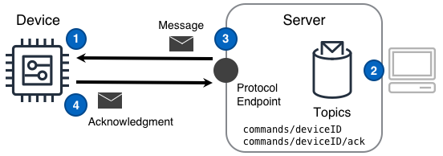

## Desafío

Se espera que las soluciones IoT interactúen con los dispositivos de tal manera que la solución, o las personas que usan la solución, puedan pedir de manera confiable a los dispositivos que realicen una acción. Además, esta interacción debe ocurrir a través de redes intermitentes, a menudo utilizando dispositivos con recursos limitados.

## Solución

Las soluciones IoT utilizan el patrón de Comando para pedir a los dispositivos que realicen una acción y asegurar interacciones confiables aprovechando un concepto simple: ninguna acción solicitada se considera exitosa a menos que se reconozca como exitosa.

El patrón de Comando mostrado en el siguiente diagrama puede proporcionar esta funcionalidad.



### Pasos del Diagrama

1. Un [dispositivo]() se configura para comunicarse con un endpoint de protocolo para que los mensajes de Comando puedan ser enviados y recibidos.
2. Un componente de la solución publica un [mensaje de Comando]() dirigido a uno o más dispositivos.
3. El servidor utiliza el endpoint del protocolo para enviar el mensaje de Comando a cada dispositivo previamente configurado.
4. Al completar la acción solicitada por el Comando, el dispositivo publica un mensaje de finalización de comando al servidor a través del endpoint del protocolo.

## Consideraciones

Es importante notar que el patrón de Comando no es "telemetría inversa". En cambio, el patrón de Comando aborda el desafío inherente para una solución que necesita activar de manera confiable acciones en un dispositivo que opera en una ubicación remota.

Al implementar este patrón, considere las siguientes preguntas:

#### ¿Ha considerado primero la Réplica del Estado del Dispositivo?

Dado que la ejecución de comandos realmente resulta en el cambio de estado en un dispositivo, el patrón de [Réplica del Estado del Dispositivo]() (DSR) es el método preferido para ejecutar comandos en una solución IoT. En situaciones donde DSR no es adecuado o excede algunos límites de implementación, entonces considere este patrón de Comando y una implementación personalizada de control.

#### ¿Cómo puede la solución rastrear el progreso de los comandos de cada dispositivo?

Cada comando debe tener un tipo único en la solución y cada mensaje de comando debe contener un ID de mensaje globalmente único. El ID del mensaje de comando permite a la solución rastrear el estado de comandos distintos y el tipo de comando permite diagnosticar cualquier problema potencial en categorías de comandos a lo largo del tiempo. Los mensajes deben ser idempotentes y no permitir ser omitidos o duplicados sin el conocimiento del dispositivo _y_ del solicitante.

#### ¿Algunos comandos en la solución se ejecutan significativamente más tiempo que la norma?

Cuando algunos comandos se ejecutan más tiempo que la norma, un simple mensaje de finalización de comando `SUCCESS` o `FAILURE` no será suficiente. En su lugar, la solución debe aprovechar al menos tres estados de comando: `SUCCESS`, `FAILURE` y `RUNNING`. `RUNNING` debe ser devuelto por el dispositivo en un intervalo esperado hasta la finalización del comando. Al usar un estado `RUNNING` reportado en un intervalo esperado, una solución puede determinar cuándo un comando de larga duración realmente falla silenciosamente.

#### ¿Un tipo específico de comando requiere autorización humana?

Cuando un comando en una solución requiere aprobación humana antes de que un dispositivo deba tomar acción, se debe agregar un componente de flujo de trabajo humano a la solución. Este componente interceptaría comandos de tipos particulares y los pondría en cola para la aprobación humana antes de enviarlos realmente a un dispositivo.

#### ¿Algún tipo de comando necesita ser revertido a un estado anterior?

Si una solución tiene algunos comandos que pueden necesitar ser revertidos, casi siempre es más fácil gestionar esa reversión desde la propia solución en lugar de esperar que cada dispositivo entienda y recuerde las consideraciones de reversión. Por ejemplo, se envía un comando a un dispositivo para mover un actuador desde una posición actual reportada de `0`° a una nueva posición de `90`°. Si el comando necesita ser revertido, la solución debe enviar un nuevo comando para mover el actuador de vuelta a `0`°.

En el caso de que las reversiones sean necesarias incluso cuando no hay conectividad con el servidor, la solución puede aprovechar un [gateway]() para registrar los estados anteriores de los dispositivos y realizar reversiones basadas en esos valores.

## Ejemplos

### Solicitud/respuesta simple sobre transporte confiable

Un componente emite una solicitud a un dispositivo para accionar un motor, utilizando una calidad de servicio para garantizar la entrega.

#### El componente envía un comando a un dispositivo objetivo

El componente envía el mensaje de solicitud de comando al tema `commands/deviceID` al que el dispositivo está suscrito:

```json
{
  "cmd": "MOTOR_1_ON",
  "tid": "CAFED00D",
  "status": "REQUEST"
}
```
El componente también rastrea el ID de transacción del mensaje `CAFED00D`, como emitido y pendiente para el dispositivo.

#### El dispositivo procesa el mensaje

El dispositivo recibe el mensaje del tema `commands/deviceID`, activa `motor 1` y responde con un acuse de recibo en el tema `commands/deviceID/ack` al que el componente está suscrito. El componente recibe el siguiente acuse de recibo después de un período de tiempo:

```json
{
  "tid": "CAFED00D",
  "status": "SUCCESS"
}
```

#### El dispositivo y el componente completan el proceso de comando (transacción)

El dispositivo ya no rastrea la solicitud de comando. El componente asigna el valor `SUCCESS` al ID de transacción de `CAFED00D` y elimina la transacción de la lista de solicitudes pendientes, lo que indica que el comando se ha completado. Un resultado de `FAILURE` podría indicar un problema físico del dispositivo que debe investigarse.

### Transacción a un dispositivo fuera de línea o no disponible

Un componente emite una solicitud a un dispositivo para accionar un motor, pero el dispositivo está fuera de línea.

#### El componente envía un comando a un dispositivo no disponible

El componente envía el mensaje de solicitud de comando al tema `commands/deviceID` al que el dispositivo está suscrito:

```json
{
  "cmd": "MOTOR_1_ON",
  "tid": "CAFED00D",
  "status": "REQUEST"
}
```
El componente también rastrea el ID de transacción del mensaje `CAFED00D`, como emitido y pendiente para el dispositivo. **El dispositivo está fuera de línea y no recibe el mensaje.**

#### Tiempo de espera y reemisión del comando

Después de un período de tiempo establecido, el componente volverá a enviar el mensaje de solicitud de comando en un período de tiempo lineal o de retroceso _con el mismo ID de transacción_, y rastrea el estado del reintento. Después de una cantidad establecida de reintentos, el componente determinará que el dispositivo no recibió el comando, o no pudo responder, y tomará la acción apropiada.