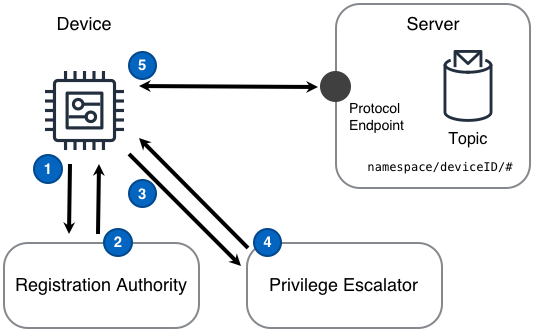

## Desafío

Las soluciones IoT necesitan que los dispositivos realicen algún tipo de escalamiento de privilegios para pasar de cero privilegios a un dispositivo completamente registrado y operativo en esa solución. Al pasar de _ningún_ privilegio a _todos_ los privilegios, **deberían** haber pasos discretos y planificados. Cada paso utilizado para ganar privilegios debe seguir el enfoque de menor privilegio. Además, puede haber sistemas de identidad y privilegios existentes que deben incorporarse en la solución IoT.

## Solución

Una solución IoT puede gestionar los desafíos de arranque de un dispositivo desglosando esos desafíos en un flujo a través de dos conceptos distintos: una _autoridad de registro_ y un _escalador de privilegios_.

Una **autoridad de registro** es el componente que valida los certificados, tokens o credenciales compartidas esperadas recibidas del dispositivo y luego devuelve credenciales de la solución para su uso por el dispositivo. Una autoridad de registro será al menos una colección de políticas que dicten la capacidad de los dispositivos no registrados para suscribirse o publicar en temas definidos en el servidor.

Un **escalador de privilegios** permite que un dispositivo con credenciales de corta duración y menor privilegio comparta más atributos sobre sí mismo o exhiba un comportamiento adecuado antes de obtener mayores privilegios en la solución. Un paso de escalamiento de privilegios distinto también permite la inyección de aprobación humana en el proceso de escalamiento de privilegios, si la solución lo requiere.

Aunque hay situaciones en las que una implementación podría combinar el registro con la capacidad de obtener privilegios completamente escalados, al desglosar los desafíos como lo hace este diseño, cada desafío puede abordarse de manera distinta, utilizando sistemas nuevos o heredados.

El diseño de Arranque del Dispositivo mostrado en el siguiente diagrama puede proporcionar esta funcionalidad.

### Pasos del Diagrama

1. El dispositivo se enciende y obtiene una medición de un sensor que opera en un entorno remoto de la solución IoT.
2. El dispositivo publica un mensaje en el tema `bootstrap/deviceID` que contiene la medición. Este mensaje se envía a través de un protocolo de transporte a un endpoint de protocolo disponible por el Servidor.
3. El Servidor puede entonces aplicar una o más [reglas]() a los mensajes para realizar un enrutamiento detallado sobre algunos o todos los datos de la [medición del mensaje](). Estas reglas distribuyen los mensajes a al menos una ruta de procesamiento **`(4)`** y una ruta de almacenamiento sin procesar **`(5)`**
4. La ruta de procesamiento de mensajes realiza cálculos fundamentales necesarios por otros componentes de la solución y almacena los resultados procesados.
5. La ruta de almacenamiento de mensajes sin procesar guarda el mensaje original sin procesar de una manera que soporte la reproducción en orden de los mensajes originales.
6. En algún momento en el futuro, un componente puede leer mensajes sin procesar desde un punto en el tiempo y reproducir esos mensajes en un tema `bootstrap/deviceID/replay`. La solución procesa los mensajes reproducidos según sea necesario.

## Consideraciones

Al implementar este diseño, considere las siguientes preguntas:

#### ¿El proceso de fabricación del dispositivo crea y coloca el token inicial en el dispositivo?

Si **no**, entonces el dispositivo debe tener un mecanismo para recibir un token seguro o [certificado](https://en.wikipedia.org/wiki/Public_key_certificate) después de que el dispositivo sea fabricado. Tal mecanismo podría involucrar la configuración de un dispositivo a través de una conexión Bluetooth Low Energy ([BLE](https://en.wikipedia.org/wiki/Bluetooth_Low_Energy)) desde una aplicación móvil. Esto tiene la ventaja adicional de poder asociar inmediatamente un dispositivo a un cliente mientras están conectados a una aplicación móvil.

Si **sí - con token/credenciales compartidas**, en este caso, es importante que el token inicial o las credenciales compartidas se utilicen para habilitar solo los privilegios mínimos necesarios para registrarse con la solución. Una vez que la autoridad de registro valida el token inicial o las credenciales compartidas, se deben seguir el resto de los pasos de este diseño.

Si **sí - con certificado**, el dispositivo puede ser fabricado de manera segura y la necesidad de una Autoridad de Registro puede reducirse si no eliminarse por completo. Esto es fácil de decir y difícil de lograr, ya que muchos procesos de fabricación están desconectados intencionalmente de la nube. Independientemente, dado que la solución puede tener un paso completo eliminado cuando las claves son introducidas por el fabricante, la experiencia del cliente y la simplicidad general del sistema se beneficiarán.

#### ¿Cómo se asocian los clientes con sus dispositivos?

En casi todos los casos, cuando los dispositivos son aprovisionados, necesitamos asociar el dispositivo a un cliente o a un perfil de dispositivo dentro de un sistema establecido. Esto implica recopilar información adicional del dispositivo para completar el registro del dispositivo. Recopilar esta información adicional se puede lograr con una o una combinación de las siguientes opciones:

- Los dispositivos son aprovisionados durante el proceso de fabricación con [certificados](https://en.wikipedia.org/wiki/Public_key_certificate) y esos certificados pueden ser pre-mapeados a un perfil de dispositivo. Esto es común para soluciones con grandes flotas de dispositivos conocidos.
- Los dispositivos informan su modelo y números de serie durante su comunicación con la Autoridad de Registro, esa información puede ser pre-mapeada a un perfil de dispositivo.
- Los dispositivos utilizan BLE u otra forma de comunicación local para recibir información sobre su identidad, como un perfil de cliente. Manejar esto a través de una aplicación móvil es la forma más común de aprovisionamiento de dispositivos. El uso de comunicación local puede combinarse con la instalación de certificados durante la fabricación, permitiendo que tanto la asociación del cliente como el proceso de registro se completen en un solo paso.

#### ¿Está utilizando certificados de dispositivo?

Aunque la idea de intentar aprovisionar cada dispositivo en una solución con un certificado puede ser desalentadora, es con mucho la forma más segura de aprovisionar dispositivos. Es importante establecer autenticación mutua para prevenir amenazas como los ataques de [hombre en el medio](https://en.wikipedia.org/wiki/Man-in-the-middle_attack). Al arrancar sus dispositivos, los certificados siempre deben ser su primera opción para la identidad del dispositivo.

#### ¿La autoridad de registro necesita soportar la integración de autorización personalizada con una solución existente del cliente?

Si **sí**, el paso de la autoridad de registro del diseño puede implementarse utilizando una Interfaz de Programación de Aplicaciones ([API](https://en.wikipedia.org/wiki/Application_programming_interface)) frente a una solución existente del cliente. Esta API puede entonces realizar el trabajo de la autoridad de registro mientras aprovecha la solución existente del cliente.

## Ejemplos

    <tbd completar escenario>
