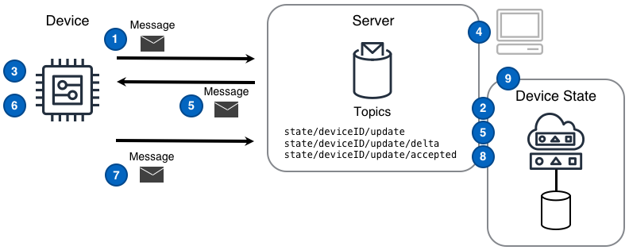

## Desafío

Se espera que las soluciones IoT interactúen con los dispositivos para realizar y rastrear cambios de estado del dispositivo. Este desafío se manifiesta de dos maneras. Primero, incluso cuando se experimenta conectividad de red intermitente, la solución necesita que el dispositivo realice una acción que cambie el estado de un dispositivo, y segundo, el dispositivo necesita que la solución refleje un cambio de estado que ha ocurrido en el dispositivo.

Verificar los cambios de estado es una capacidad fundamental necesaria para todos los escenarios de comando y control.

## Solución

Las soluciones IoT que aprovechan el patrón de Réplica del Estado del Dispositivo son capaces de gestionar los cambios de estado relacionados con el dispositivo de manera confiable, escalable y sencilla.

El patrón de Réplica del Estado del Dispositivo describe cómo replicar el estado actual de un dispositivo, el estado futuro deseado y la diferencia entre los estados actual y deseado. El patrón de Réplica del Estado del Dispositivo es similar al patrón de [Comando]() en que ambos utilizan [mensajes]() como desencadenantes de acciones y mensajes de reconocimiento cuando las acciones se completan. Sin embargo, el patrón de Réplica del Estado del Dispositivo va más allá del patrón de Comando, al adoptar un enfoque prescriptivo tanto para la gestión del estado relacionado con el dispositivo como para cómo se comunican el estado y los cambios. Usar el patrón de Réplica del Estado del Dispositivo permite a las soluciones conocer y verificar los estados y cambios de estado del dispositivo.

### Réplica del Estado de Componente a Dispositivo

Una solución IoT debe aprovechar el siguiente patrón cuando un _componente_ de la solución IoT es la fuente del cambio de estado deseado y ese cambio debe ser replicado en un dispositivo.

### Pasos del Diagrama de Componente a Dispositivo

1. Un dispositivo reporta el **estado inicial del dispositivo** publicando ese estado como un [mensaje]() al [tema]() `state/deviceID/update`.
2. La Réplica del Estado del Dispositivo que rastrea este dispositivo lee el mensaje del tema `state/deviceID/update` y registra el estado del dispositivo en un almacén de datos persistente.
3. Un dispositivo se suscribe al tema de mensajes delta `state/deviceID/update/delta` sobre el cual llegarán los mensajes de cambio de estado relacionados con el dispositivo.
4. Un componente de la solución publica un mensaje de estado deseado en el tema `state/deviceID/update` y la Réplica del Estado del Dispositivo que rastrea este dispositivo registra el estado deseado del dispositivo en un almacén de datos persistente.
5. La Réplica del Estado del Dispositivo publica un mensaje delta en el tema `state/deviceID/update/delta` y el servidor envía el mensaje al dispositivo.
6. Un dispositivo recibe el mensaje delta y realiza los cambios de estado deseados.
7. Un dispositivo publica un mensaje reflejando el nuevo estado en el tema de actualización `state/deviceID/update` y la Réplica del Estado del Dispositivo que rastrea este dispositivo registra el nuevo estado en un almacén de datos persistente.
8. La Réplica del Estado del Dispositivo publica un mensaje en el tema `state/deviceID/update/accepted`.
9. Un componente de la solución ahora puede solicitar el estado actualizado y actual de la Réplica del Estado del Dispositivo.

### Réplica del Estado de Dispositivo a Componente

Una solución IoT debe aprovechar el siguiente patrón cuando el _dispositivo_ es la fuente del cambio de estado que debe ser comunicado a los componentes de la solución IoT.

### Pasos del Diagrama de Dispositivo a Componente

1. Un dispositivo reporta el **estado inicial del dispositivo** publicando ese estado como un mensaje al tema de actualización `state/deviceID/update`.
2. Un componente se suscribe al tema de mensajes delta `state/deviceID/update/delta` sobre el cual llegarán los mensajes de cambio de estado relacionados con el dispositivo.
3. Un dispositivo detecta que su propio estado ha cambiado y reporta un nuevo valor de estado al tema de actualización `state/deviceID/update`.
4. La Réplica del Estado del Dispositivo que rastrea este dispositivo registra el estado deseado del dispositivo en un almacén de datos persistente.
5. La Réplica del Estado del Dispositivo publica un mensaje delta en el tema `state/deviceID/update/delta` y el servidor envía el mensaje al componente suscrito.
6. Un componente recibe el mensaje delta y utiliza el valor cambiado según sea necesario.

## Consideraciones

Al implementar este patrón, considere las siguientes preguntas:

#### ¿Cómo puede un componente obtener simplemente el estado actual de una Réplica del Estado del Dispositivo?

Usando un estilo de interacción pub/sub, un componente puede escuchar los temas `state/deviceID/get/accepted` y `state/deviceID/get/rejected` y luego publicar un mensaje en el tema `state/deviceID/get`. La Réplica del Estado del Dispositivo respondería con el estado en el tema `state/deviceID/get/accepted`. Si la Réplica del Estado del Dispositivo expone una API REST, un componente puede ejecutar un GET contra el tema `state/deviceID/get` y esperar una respuesta directa.

#### ¿Cómo sabe un dispositivo qué cambió mientras estaba desconectado?

La primera acción que un dispositivo debe tomar al conectarse o restablecer una conexión es obtener el estado deseado actual y compararlo con su último estado conocido. Idealmente, el servidor que rastrea la Réplica del Estado del Dispositivo puede calcular el delta automáticamente, por lo que un dispositivo que se conecta se suscribiría a `state/deviceID/update/delta` y luego puede actuar sobre cualquier cambio que haya ocurrido mientras estaba en un estado desconectado.

## Ejemplo

<tbd written scenario>
