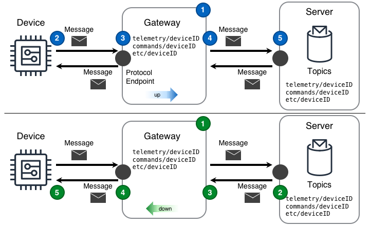

## Desafío

[Endpoints]() en una solución IoT a menudo no son lo suficientemente capaces para conectarse directamente a internet ni están operando en redes con acceso directo a internet. Incluso con estas limitaciones, obtener datos de los endpoints e interactuar con ellos requiere un mecanismo de conectividad.

## Solución

Las soluciones IoT utilizan el diseño de Gateway para superar las limitaciones comunes experimentadas por los endpoints. Al hacerlo, un gateway permite una comunicación confiable y segura con endpoints que de otro modo serían inaccesibles. Además, un gateway permite mantener el aislamiento entre los endpoints locales y la conectividad a la nube.

El diseño de Gateway mostrado en el siguiente diagrama puede proporcionar esta funcionalidad. En el diagrama, el Servidor reside en una nube. El Gateway reside en una red a la que el Dispositivo puede acceder.

Ambos diseños en el diagrama anterior exponen un endpoint de gateway utilizando el mismo tipo de endpoint de protocolo que el servidor. En ambos diagramas de gateway _up_ y _down_, el gateway está conectado al servidor.

#### Gateway ascendente (también conocido como "Norte")

1. el diseño de gateway "ascendente" está configurado para reflejar mensajes "ascendentes"; en el diagrama, los mensajes que llegan desde el dispositivo con el [tema]() `telemetry/deviceID` se reflejarán hacia el servidor utilizando el mismo tema.
2. El dispositivo publica un mensaje que contiene la medición a través de un protocolo de transporte al endpoint de protocolo local expuesto por el gateway.
3. El gateway recibe el mensaje.
4. El gateway publica el mensaje al servidor en el mismo tema que el mensaje recibido.
   - si el gateway no tiene éxito al enviar el mensaje al servidor, el mensaje se procesa utilizando un [enfoque](#what-approach-should-be-used-when-storing-messages-for-later-delivery) de mensaje ascendente.
5. El servidor recibe el mensaje.

#### Gateway descendente (también conocido como "Sur")

1. el diseño de gateway "descendente" está configurado para escuchar al servidor y reflejar mensajes "descendentes"; en el diagrama, los mensajes que llegan desde el servidor con el [tema]() `commands/deviceID` se reflejarán hacia el dispositivo que escucha mensajes con el mismo tema.
2. El servidor publica un mensaje al gateway a través del endpoint del protocolo de transporte.
3. El gateway recibe el mensaje.
4. El gateway publica el mensaje al dispositivo que escucha en el endpoint del gateway en el mismo tema que el mensaje recibido.
   - si el gateway no tiene éxito al enviar el mensaje al dispositivo, el mensaje se procesa utilizando un [enfoque](#what-approach-should-be-used-when-storing-messages-for-later-delivery) de mensaje descendente.
5. El dispositivo recibe el mensaje.

## Consideraciones

Al implementar este diseño, considere las siguientes preguntas:

#### ¿Por qué el Gateway debería reflejar/enrutar explícitamente solo ciertos temas en una dirección determinada?

Dado que los temas de mensajes son la interfaz a través de la cual los componentes en una solución IoT interactúan entre sí, al configurar un diseño de Gateway para tomar pasos explícitos para reflejar ciertos temas en ciertas direcciones, los dispositivos en la solución solo tendrán la capacidad de interactuar con esos temas que son esenciales para realizar la función prevista del dispositivo. Esto se alinea bien con la mejor práctica de seguridad de seguir el [principio de privilegio mínimo](https://en.wikipedia.org/wiki/Principle_of_least_privilege) para las comunicaciones de dispositivo a nube y de nube a dispositivo.

#### ¿Cómo debe el Gateway procesar los datos cuando la red hacia el Dispositivo no está disponible?

La respuesta simple es que el Gateway necesita un _enfoque de mensaje descendente_ utilizado para guardar los mensajes en el gateway hasta que puedan ser reportados al dispositivo.  
Desafortunadamente, la respuesta simple oculta la realidad, que es más compleja. Una cosa clave a determinar es el [enfoque](#what-approach-should-be-used-when-storing-messages-for-later-delivery) correcto a tomar con los mensajes descendentes cuando la red está ausente.

#### ¿Cómo debe el Gateway procesar los datos cuando la red hacia el Servidor no está disponible?

La respuesta simple es que el Gateway necesita un _enfoque de mensaje ascendente_ utilizado para guardar los mensajes en el gateway hasta que puedan ser reportados al servidor.

Desafortunadamente, la respuesta simple oculta la realidad, que es más compleja. Una cosa clave a determinar es el [enfoque](#what-approach-should-be-used-when-storing-messages-for-later-delivery) correcto a tomar con los mensajes ascendentes cuando la red está ausente.

#### ¿Qué enfoque se debe utilizar al almacenar mensajes para su entrega posterior?

Generalmente, el almacenamiento local y el procesamiento de mensajes en el gateway seguirán un enfoque de Primero en Entrar, Primero en Salir (también conocido como **FIFO**). Dicho esto, la respuesta _podría_ ser diferente dependiendo de los datos realmente contenidos en el mensaje. En este caso, determinar cómo el enfoque de registro del gateway influye en los datos realmente reportados puede ayudar a evitar problemas futuros en la solución.

Las categorías generales de enfoques a considerar son: **FIFO**, **Eliminación** y **Agregación** como se muestra en el siguiente diagrama.

**FIFO** – Este [enfoque](<https://en.wikipedia.org/wiki/FIFO_(computing_and_electronics)>) es generalmente sencillo de implementar y útil en una amplia variedad de situaciones. En el diagrama de procesamiento de mensajes, los datos de este enfoque llegan desde la izquierda y salen hacia la derecha cuando el almacenamiento local asignado está lleno. Ejemplos de datos incluyen: mediciones de operaciones y telemetría de propósito general.

**Eliminación** – Este enfoque es útil para retener valores puntuales absolutos a costa de la pérdida de detalle de la curva. En el diagrama de procesamiento de mensajes, los datos de este enfoque llegan desde la izquierda. Una vez que el almacenamiento local se ha llenado más allá de un _punto de eliminación_, alguna lógica de barrido elimina cada otra (o cada `N`ésima) muestra. Ejemplos de datos incluyen: [kW](https://en.wikipedia.org/wiki/Watt#Kilowatt), [Amperaje](https://en.wikipedia.org/wiki/Amperage), [Voltaje]

**Agregación** – Este [enfoque](https://en.wikipedia.org/wiki/Aggregate_function) es útil cuando la forma detallada de la curva no es tan importante como los valores mínimos, máximos, promedio y suma durante un período de tiempo. En el diagrama de procesamiento de mensajes, los datos de este enfoque llegan desde la izquierda. Una vez que el almacenamiento local se ha llenado más allá de un _punto de agregación_, alguna lógica de barrido realiza la agregación en los valores almacenados. Ejemplos de datos incluyen: [kWh](https://en.wikipedia.org/wiki/Kilowatt_hour), [insolación](https://en.wikipedia.org/wiki/insolation), [flujo](https://en.wikipedia.org/wiki/Flow_measurement), [tiempo de CPU](https://en.wikipedia.org/wiki/CPU_time), [temperatura](https://en.wikipedia.org/wiki/Temperature), [velocidad del viento](https://en.wikipedia.org/wiki/Wind_speed), etc.

#### ¿Qué topología de red de área local es utilizada por los dispositivos conectados a un gateway?

Hay dos topologías que los dispositivos toman más comúnmente: una [red de malla](https://en.wikipedia.org/wiki/Mesh_networking) y una red de concentrador y radios (también conocida como [red en estrella](https://en.wikipedia.org/wiki/Network_topology#Star)).

**Red de concentrador y radios** - Un gateway en una red de concentrador y radios proporciona toda la conectividad de los dispositivos hacia y desde la nube, comunicación de dispositivo a dispositivo, y capacidades locales adicionales como almacenamiento de datos de series temporales, análisis de datos e inferencia de aprendizaje automático. Dado que el gateway en esta topología proporciona comunicación de dispositivo a dispositivo, los _mensajes ascendentes_ pueden venir _desde_ un dispositivo hacia el gateway y luego inmediatamente _bajar_ a otro dispositivo, **o** los _mensajes ascendentes_ pueden venir _desde_ un dispositivo con destino al punto final del protocolo del servidor. El tema del mensaje debe ser enrutable por el gateway a cualquiera de los dos tipos de destino.

**Red de malla** – Un gateway en una red de malla proporciona capacidades de enrutamiento a la nube para algunos o todos los dispositivos en la malla. Dado que los dispositivos físicamente cercanos entre sí se comunican directamente, un gateway generalmente no es responsable de la comunicación de dispositivo a dispositivo; sin embargo, el gateway puede proporcionar capacidades locales adicionales como almacenamiento de datos de series temporales, análisis de datos e inferencia de aprendizaje automático.

En ambas topologías de red, ya sea de concentrador y radios o de malla, para habilitar el enrutamiento explícito de todos los mensajes, cada dispositivo y el propio gateway deben ser direccionables mediante un tema de mensaje único.

## Example

    <tbd written scenario>
