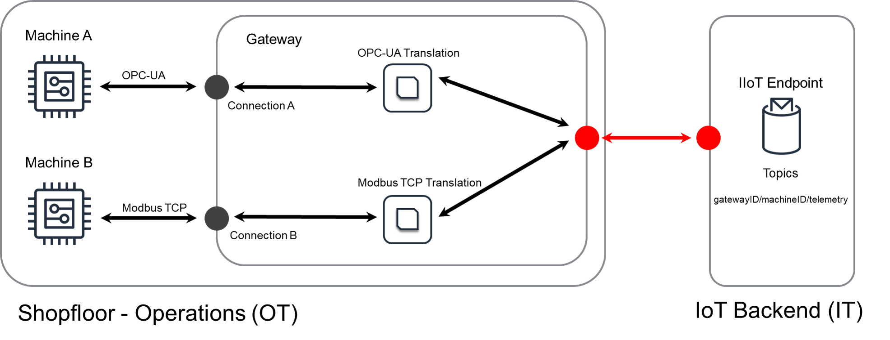

## Desafío

En el borde de una solución IoT, los dispositivos a menudo están interconectados y tienen que intercambiar datos localmente, es decir, sin mover datos a través de internet.
Como algunos dispositivos locales pueden usar diferentes protocolos que no son compatibles entre sí, los protocolos deben ser traducidos.
Por ejemplo, en soluciones industriales IoT, las interfaces de las máquinas a menudo usan diferentes protocolos y extraer la información de estas máquinas para monitoreo requiere que la información sea traducida a un formato común que pueda ser enviado a un punto final de protocolo en la nube o para uso de otro dispositivo local, o incluso de una persona local.
Otro ejemplo es en implementaciones de hogares inteligentes, donde los dispositivos que usan diferentes estándares necesitan intercambiar datos para controlar la generación de energía renovable dependiendo del consumo de energía interno del hogar.

Típicamente, mover todos los datos en una forma no traducida a software que realiza la traducción en la nube no es factible por varias razones:

- El volumen o la velocidad de los datos generados por los dispositivos locales es demasiado alto.
- Los dispositivos usan una pila de comunicación que no está basada en el [Protocolo IP](https://es.wikipedia.org/wiki/Protocolo_de_Internet), o simplemente no es utilizable para la comunicación a través de internet. Por ejemplo, [conexiones seriales](https://es.wikipedia.org/wiki/Comunicación_serial) y [Bluetooth](https://es.wikipedia.org/wiki/Bluetooth).
- Conectar los dispositivos directamente a internet crearía un riesgo de seguridad. Esto a menudo surge porque el protocolo local no soporta mecanismos de cifrado o autenticación.

## Solución

Las soluciones IoT abordan estos desafíos aplicando el [Gateway]() en combinación con lógica de borde que se ejecuta en el gateway.
La lógica de borde en el gateway ejecuta la traducción de los protocolos industriales a un formato/protocolo de datos común que puede ser procesado por sistemas de TI de backend como bases de datos, lagos de datos o servicios web.

El diseño de Traducción de Protocolos mostrado en el siguiente diagrama puede ser utilizado para resolver estos desafíos.


- La parte izquierda de este diagrama representa los dispositivos en el borde de la solución IoT que están conectados con al menos un [Gateway]().
- El gateway es el único componente conectado a internet y la flecha roja indica que esta conexión debe estar cifrada/protegida adecuadamente.
- El gateway ejecuta la lógica de traducción de protocolos local para traducir diferentes protocolos a un protocolo común.
- Si los datos generados por uno de los dispositivos conectados deben ser enviados a la nube, el gateway transmitirá de manera segura los datos en un formato común después de que se haya realizado la traducción.
  Dado que el diseño de Traducción de Protocolos extiende el diseño de Gateway, la solución también puede permitir que un dispositivo **`B`** actúe sobre los datos generados por el dispositivo **`A`** o viceversa. En este caso, el gateway tendría lógica de traducción de protocolos para traducir los datos emitidos por el dispositivo **`A`** a un formato para uso en la nube y también lógica de traducción de protocolos para traducir los datos destinados a la nube en el formato utilizable por el dispositivo **`B`**.

El diseño de Traducción de Protocolos también cumple un propósito de seguridad:
Las conexiones dentro de la red local pueden ser inseguras (negras) porque algunos de los protocolos utilizados no tienen características de seguridad, mientras que las conexiones hacia la nube (rojas) están aseguradas por mecanismos contemporáneos de cifrado y autenticación.
Si bien cifrar todas las conexiones es deseable, en muchos casos esto impediría el uso de protocolos bien establecidos para ciertas aplicaciones que no soportan tales mecanismos de seguridad. Además, para ciertos dispositivos y aplicaciones, reemplazar dispositivos que no soportan mecanismos de seguridad contemporáneos no es económicamente viable. A menudo, esto significa que usar protocolos inseguros localmente en una solución es un compromiso aceptable.

## Consideraciones

Al implementar este diseño, considere las siguientes preguntas:

#### ¿Cambia el esquema para la lógica de traducción si la conexión no está basada en IP?

En general, el esquema no cambia.
En el ejemplo [a continuación](#example-industrial-iot-data-extraction), la conexión IP siempre se definió usando una dirección IP.
Por ejemplo, para usar una conexión serial con Modbus, se utilizaría la ruta de hardware serial correspondiente en lugar de la dirección IP y se debe cargar un cliente específicamente para conexiones seriales Modbus en lugar del cliente TCP, pero el diseño aún necesita consistentemente la dirección de un dispositivo.

#### ¿Hay una manera de retrasar/agrupación/agregar mensajes en el gateway?

La agregación o agrupación de datos no es parte de este diseño, ya que se discute en las consideraciones del diseño de Gateway.
El diseño de Gateway contiene [consideraciones]() sobre cómo la lógica de traducción de protocolos puede extenderse con mecanismos que agrupen resultados o calculen agregaciones sobre ellos.

#### ¿Cómo debe el proceso de traducción de protocolos manejar los datos traducidos cuando la red hacia el servidor no está disponible?

El diseño de Gateway contiene algunas [consideraciones]() para este escenario.
En pocas palabras, el gateway no podrá publicar datos mientras la conexión esté perdida. Para evitar la pérdida de datos, se recomienda implementar un enfoque de mensaje ascendente para cualquier mensaje traducido utilizando un mecanismo de almacenamiento local.

#### ¿Por qué existen protocolos inseguros utilizados en soluciones IoT?

La razón es porque la seguridad es un campo en evolución y muchos de los protocolos aún en uso fueron diseñados hace décadas.
Por ejemplo, la primera versión de Modbus se publicó en 1979 en una época en la que el cifrado y la ciberseguridad no eran una prioridad para el diseño de un protocolo. Hay una historia similar para los protocolos utilizados en otras aplicaciones.
Si bien sería preferible que todos los dispositivos soportaran protocolos modernos y seguros, esto a menudo no es factible ya que reemplazar dispositivos que usan protocolos más antiguos puede ser costoso. Además, los mecanismos de seguridad modernos a veces exceden la capacidad de cómputo de los dispositivos, particularmente si funcionan con baterías.

#### ¿Cuál es el riesgo de que los dispositivos que usan protocolos inseguros se conecten directamente a internet?

Exponer dispositivos con protocolos inseguros a internet probablemente resultará en pérdida de datos o incluso ataques que manipulen los dispositivos locales y los datos del dispositivo.
Además, los atacantes pueden posiblemente controlar los dispositivos y usarlos para propósitos que pueden ser peligrosos para los humanos a su alrededor, o para dejar los dispositivos inoperables.
Por lo tanto, no se recomienda conectar dispositivos que usan protocolos inseguros directamente a Internet. En su lugar, use un gateway seguro para que sirva como la porción "orientada a internet" de la red local.

#### ¿Qué tipo de hardware debe usarse para un gateway que realiza traducción de protocolos?

Esto depende en gran medida de la aplicación y el entorno de la aplicación.
Por ejemplo, en el ejemplo de IoT industrial a continuación, el gateway comúnmente residiría en una PC industrial o hardware similar robusto. Otras aplicaciones pueden desplegar la lógica de traducción de protocolos en teléfonos móviles u otros dispositivos similares.

## Ejemplo - Extracción de Datos de IoT Industrial

Este es un ejemplo de implementación de una traducción de protocolos en un gateway en el contexto de la extracción de datos de IoT industrial.

> Nota: estos ejemplos no son código listo para producción. Existen con el propósito de educación.

Las máquinas industriales a menudo están equipadas con, o consisten en, sensores y otro hardware como controladores lógicos programables ([PLC]()) que se utilizan para monitorear o controlar el comportamiento de la máquina.
Como requisito previo para un gran conjunto de casos de uso de [Industria 4.0](), es necesario acceder a los datos de las máquinas industriales y sus componentes.
Las dos principales razones por las cuales simplemente conectar estas máquinas a una red o a internet no es viable están en línea con los desafíos mencionados anteriormente:

- **Protocolos:** Existen muchos estándares de comunicación diferentes para los componentes mencionados de las máquinas industriales, por ejemplo, [OPC-UA](https://en.wikipedia.org/wiki/OPC_Unified_Architecture), [Modbus](https://en.wikipedia.org/wiki/Modbus), [CANBus](https://en.wikipedia.org/wiki/CAN_bus), [Profibus](https://en.wikipedia.org/wiki/Profibus).
  Algunos de estos estándares no han sido diseñados para su uso en internet y algunos, por ejemplo, Modbus serial, ni siquiera están basados en el [Protocolo IP](https://en.wikipedia.org/wiki/Internet_Protocol).
- **Seguridad:** Conectar un activo industrial directamente a internet es un riesgo de seguridad. Por ejemplo, Modbus en su versión básica no tiene ningún tipo de mecanismo de seguridad para autenticar un sistema que lee o escribe en el equipo industrial subyacente.

Para superar estos desafíos, la aplicación del diseño de traducción de protocolos requiere el despliegue de un [Gateway]() para conectar las máquinas, así como para proporcionar una conexión segura a la nube.
La red local en el lado izquierdo del siguiente diagrama se llama comúnmente _planta de producción_ en la fabricación, o dominios de _tecnología operativa (OT)_.



El propio gateway contiene lógica de traducción que traduce entre el protocolo de la máquina y el protocolo común utilizado por los sistemas de TI.
En el ejemplo anterior, hay dos máquinas - **`A`** y **`B`**.
Supongamos que `Machine A` tiene una interfaz que sigue el [estándar OPC-UA](https://en.wikipedia.org/wiki/OPC_Unified_Architecture) y `Machine B` usa [Modbus](https://en.wikipedia.org/wiki/Modbus).
Los siguientes ejemplos de pseudo-código demuestran la lógica de traducción de protocolos que necesita ejecutarse en el gateway.

#### Traducción de Protocolo OPC-UA

OPC-UA es un protocolo moderno basado en IP que tiene características de seguridad como cifrado en tránsito y autenticación utilizando combinaciones de certificados o nombre de usuario/contraseña.
Este pseudo-código muestra cómo acceder a un objetivo OPC-UA en sintaxis Python:

```python
[... load some libraries, loggers ...]
# ######## STEP 1: load the library ########
from opcua import Client as OPCUAClient
POLLING_FREQUENCY = 5 # seconds

# definition of the data format to be retrieved
OPCUA_VARIABLES = {
	KEY_STATE				:	["Objects", "2:PLC1", "2:MAIN", "DrillState"],
	KEY_PRESSURE			:	["Objects", "2:PLC1", "2:MAIN", "Pressure"],
}

# generate a OPCUA url and create a client with it
url = opc.tcp://192.168.2.2:4840 # assumes OPC-UA server at 192.168.2.2 on port 4840 on local network
client = OPCUAClient(url) # connect to the machine specified by the URL

# This function will run endlessly and poll the OPC-UA server
def poll_opcua_server():
	while True:
		try:
			# ######## STEP 2: Connect to the data source ########
			client.connect()
			rootNode = client.get_root_node()	# get the root node of the OPCUA tree
			# ######## STEP 3: Load the data from the source ########
			results = {}
			for name, path in OPCUA_VARIABLES.items():	# payload defines names -> path relations
				results[name] = rootNode.get_child(path).get_data_value()	# get the value from the node identified by path
			# ######## STEP 4: Publish the machine data ########
			# publish the result to the IoT endpoint as needed
			logger.info("Publishing the following extraction result: " + str(results))
		except Exception as e:
			logger.error("Error while accessing OPCUA server: {0}".format(str(e)))
			logger.error("Error type: " + str(type(e)))
		finally:
			client.disconnect()
		time.sleep(POLLING_FREQUENCY)
# execute polling of opcua server
poll_opcua_server()
```

Este pseudo-código utiliza una biblioteca de código abierto específicamente para OPC-UA que está disponible para Python.
La primera línea carga esta biblioteca, más específicamente la clase cliente de la biblioteca.
El resto del script es sencillo:
La clase cliente se utiliza para establecer una conexión, leer el resultado de la fuente de datos (`Machine A`), y luego publicar el resultado en el punto final de IoT.
Tenga en cuenta que el código requerido para publicar en el punto final de IoT específico utilizado por el gateway depende del backend específico que se esté utilizando y, por lo tanto, se omite.
Además, este pseudo-código no utiliza ningún mecanismo de autenticación OPC-UA para mantener el ejemplo simple. El código real autenticaría el componente de traducción.

#### Traducción de Protocolo Modbus

Al igual que con la traducción OPC-UA, este pseudo-código asume que los datos son accesibles a través de una interfaz de máquina, pero en este caso la interfaz implementa el protocolo Modbus.
De manera similar a la traducción OPC-UA, este pseudo-código intenta acceder a una máquina con la dirección IP `192.168.2.2` en la red local, es decir, este ejemplo utiliza la variante TCP/IP del protocolo [Modbus](https://en.wikipedia.org/wiki/Modbus).
El código para una interfaz serial Modbus requeriría un cliente Modbus diferente, pero el resto de la lógica permanecería sin cambios:

```python
[... load some libraries, loggers ...]
# ######## STEP 1: load the library ########
from pymodbus.client.sync import ModbusTcpClient as ModbusClient
POLLING_FREQUENCY = 1 	# second(s)
# Instantiate the client for your modbus slave device.
mbClient = ModbusClient("192.168.2.2", port=5020)

def poll_measurements(frequency=POLLING_FREQUENCY):
	while True:
		# ######## STEP 2: Connect to the data source ########
		try:
			# connect to modbus slave device
			if not(mbClient.is_socket_open()):
				mbClient.connect()
		except Exception as e:
			time.sleep(1)
			continue
		# ######## STEP 3: Load the data from the source ########
		try:
			# read the holding registers (32 is chosen as a sufficient number of registers to hold the payload)
			readResult = mbClient.read_holding_registers(address=0x0, count=32, unit=1)
		except Exception as e:
			mbClient.close()
			time.sleep(1)
			continue
		# ######## STEP 4: Publish the machine data ########
		# publish the result to the IoT endpoint as needed
		logger.info("Publishing the following extraction result: " + str(results))
		time.sleep(frequency)

poll_measurements()
```

La estructura de este pseudo-código es la misma que antes:
La primera línea carga una biblioteca de código abierto que proporcionará acceso fácil a los activos Modbus.
Después, el pseudo-código se conecta al maestro Modbus y luego obtiene datos del maestro.

Es importante notar que el resultado de un maestro Modbus será más "no estructurado" en comparación con el ejemplo de OPC-UA anterior:
La variable `readResult` contendrá datos binarios no estructurados que deben ser reformateados dependiendo de cómo se escribieron los datos en el bus.
Esta es una diferencia fundamental entre un protocolo moderno como OPC-UA y Modbus cuando se trata de extracción de datos. Esta también es una fuente de complejidad que cualquier traducción de protocolo debe considerar.

#### Resumen de la Extracción de Datos de IoT Industrial

Como se muestra en las secciones anteriores, la lógica de traducción en el gateway tiene una estructura común de cuatro pasos:

1. Cargar una biblioteca específica del protocolo.
2. Establecer la conexión con el activo del cual se necesitan extraer los datos.
3. Recuperar los datos deseados de la máquina.
4. Opcionalmente procesar los datos de la máquina y luego reenviar los datos a los sistemas de TI (a través de internet).

Dependiendo del protocolo, establecer la conexión puede requerir credenciales u otros secretos de autenticación que deben almacenarse de manera segura en el gateway.
En los ejemplos anteriores, se han utilizado bibliotecas de código abierto para Modbus y OPC-UA, pero existen alternativas comerciales que también pueden ser utilizadas.