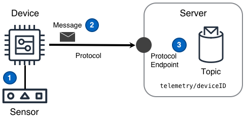

## Desafío

Las soluciones IoT necesitan recibir de manera confiable y segura datos medidos en un entorno remoto por diferentes dispositivos, potencialmente utilizando diferentes protocolos. Además, una vez que se reciben los datos medidos, la solución necesita procesar y enrutar los datos sensados para su uso por otros componentes de la solución.

## Solución

Las soluciones IoT utilizan el patrón de Telemetría para asegurar la entrega de datos sensados a través de redes intermitentes al soportar protocolos de comunicación adecuados, proporcionar recepción escalable de datos a diferentes frecuencias y volúmenes de reporte, y enrutar datos para su uso por otros componentes.

El patrón de Telemetría mostrado en el siguiente diagrama puede proporcionar esta funcionalidad.



### Pasos del Diagrama

1. El dispositivo obtiene una medición de un sensor que opera en un entorno remoto de la solución IoT.
2. El dispositivo publica un mensaje en el [tema de mensaje]() `telemetry/deviceID` que contiene la medición. Este mensaje se envía a través de un protocolo de transporte a un endpoint de protocolo disponible por el Servidor.
3. El Servidor puede entonces aplicar una o más [reglas]() a los mensajes para realizar un enrutamiento detallado sobre algunos o todos los datos de la medición del mensaje. El enrutamiento puede enviar un mensaje a otro componente de la solución.


## Consideraciones

El patrón de **Telemetría** se utiliza comúnmente cuando un proyecto tiene el requisito de "transmitir datos desde un dispositivo". Además, al implementar una solución IoT, la palabra _telemetría_ se usa a menudo tanto como una forma de describir el diagrama del patrón anterior _y_ como una descripción abreviada de toda la colección de desafíos inherentes a la detección y el envío de datos desde una ubicación remota a una solución más grande. Estas consideraciones se centran en temas que generalmente se relacionan con la implementación del diagrama anterior.

Al implementar este patrón, considere las siguientes preguntas:

#### ¿Cuál es la latencia de procesamiento deseada de _sensado a percepción_ o _sensado a acción_ de los mensajes de telemetría en la solución IoT?

Las soluciones IoT con requisitos de latencia de procesamiento a nivel de **microsegundos o milisegundos** deberían realizar ese procesamiento en el propio dispositivo o posiblemente en un [gateway]() conectado al dispositivo.  

Las soluciones IoT con requisitos de latencia de procesamiento a nivel de **segundos**, **minutos** o incluso **horas** deberían realizar ese procesamiento en la nube por defecto.  

En general, el procesamiento de mensajes en "segundos" hasta "pocos minutos" debería ser realizado por componentes conectados directamente al endpoint del protocolo. Comúnmente, el procesamiento de un componente será desencadenado por la llegada de mensajes que coincidan con ciertos criterios.  

El procesamiento de telemetría desde "pocos minutos" hasta "horas" debería realizarse de manera asincrónica. Cuando lleguen mensajes que coincidan con los criterios deseados, los eventos a menudo se colocarán en una cola de procesamiento y un componente realizará el trabajo necesario. Una vez completado, a menudo el componente emitirá un mensaje a un [tema de mensaje]() de "trabajo completado".

#### ¿Hay lecciones aprendidas que faciliten el procesamiento de datos de telemetría en la solución IoT?

**IDs Únicos de Dispositivos en la Solución** – Cada dispositivo en una solución debe tener un ID _único para la solución_. Aunque este ID no necesita ser verdaderamente único a nivel global, cada dispositivo debe tener un ID que sea y será siempre único dentro de la solución IoT. Al adoptar IDs únicos para dispositivos en la solución, la solución IoT podrá procesar y enrutar mejor los datos sensados para su uso por los componentes dentro de la solución.  
**Tiempos de Marca Tempranos** – Cuanto antes los datos sensados obtengan marcas de tiempo discretas en una solución IoT, antes podrá ocurrir un procesamiento y análisis más matizado de esos datos sensados.  
**Cálculos de Ventana Cerrada** - Rastrear la marca de tiempo `último_reportado` de un dispositivo podría determinar si/cuándo una ventana de agregación puede considerarse _cerrada_. Cualquier cálculo de ventana cerrada puede entonces ser fácilmente y con confianza almacenado en caché en toda una solución IoT. Estos cálculos en caché a menudo aumentan dramáticamente el rendimiento de la latencia de procesamiento _de sentido a percepción_ o _de sentido a acción_ de la solución IoT.

#### ¿Cómo se deben manejar los mensajes grandes?

Los mensajes grandes se definen en este patrón como cualquier mensaje más grande de lo que el protocolo de transporte soporta nativamente. Los mensajes grandes requieren una pregunta adicional que debe ser respondida, **"¿Se puede usar un protocolo secundario?"**

Si **sí**, se recomienda HTTPS.  
Si **no**, entonces el mensaje grande debe dividirse en partes, cada parte debe tener un identificador de parte único y cada parte debe ser lo suficientemente pequeña como para ser enviada utilizando el protocolo de transporte.


#### ¿Cómo se deben enviar los mensajes grandes cuando se usa un protocolo secundario?

Si los mensajes grandes deben ser **entregados lo antes posible**, el mensaje grande puede ser subido directamente a un servicio de almacenamiento de objetos altamente duradero y disponible globalmente.

Si los mensajes grandes **pueden ser enviados en lotes**, cada mensaje debe ser guardado como parte de un lote hasta que el lote pueda ser enviado. Dado que el almacenamiento en un dispositivo es a menudo un recurso limitado, el procesamiento por lotes de mensajes debe considerar los mismos [compromisos algorítmicos]() que un dispositivo actuando como un [gateway]().

#### ¿Cuáles son las frecuencias de muestreo vs. las frecuencias de reporte de un dispositivo?

**Frecuencia de muestreo** es la frecuencia con la que se recuperan los datos sensados, o _muestreados_ de un [sensor]() adjunto.

**Frecuencia de reporte** es la frecuencia con la que los datos muestreados almacenados en el dispositivo se envían a la solución IoT más amplia.

El código basado en el dispositivo obtendrá los datos sensados y los pondrá en cola para su entrega o entregará los datos sensados inmediatamente. Estos dos comportamientos diferentes a menudo se discuten como la _diferencia entre la frecuencia de muestreo y la frecuencia de reporte_. Cuando las frecuencias de muestreo y reporte son iguales y están alineadas, se espera que todos los datos sensados se entreguen inmediatamente. Cuando las dos frecuencias son diferentes, se debe considerar la elección del algoritmo de registro correcto para los datos en cola.

Los valores esperados para estas dos frecuencias son importantes al determinar la escala y el costo de una solución IoT.

#### ¿Es necesario mantener el orden de los mensajes entrantes?

Primero, las soluciones solo deben depender del orden cuando sea absolutamente necesario.

Si el orden **no es necesario**, entonces la solución puede procesar mensajes del tema inmediatamente al llegar.  
Si el orden **es necesario**, esta pregunta de seguimiento necesita una respuesta: "¿Durante cuánto tiempo un componente de la solución requiere mensajes ordenados?"

Si la respuesta de seguimiento es "menos de un horizonte de un segundo en un solo tema", la solución puede reunir mensajes de un tema `foo` en un búfer, luego, después de cada tic del reloj, el búfer se ordena y los mensajes se emiten en orden a otro tema `foo/ordered`.
Si la respuesta es "más de un horizonte de un segundo", la solución IoT debe escribir cada registro en un [almacén ordenado](). Cualquier componente de la solución que **requiera** que los mensajes siempre estén en orden, ahora puede leer y obtener actualizaciones del almacén ordenado.

#### ¿Cuáles son algunos de los factores de costo de la telemetría en una solución IoT?

Usualmente, los factores de costo más comunes en una solución IoT son el número de dispositivos, las frecuencias de muestreo y reporte del dispositivo, la latencia de procesamiento de telemetría necesaria de _sensado a percepción_ o _sensado a acción_, la [densidad de datos del dispositivo]() y finalmente la duración de retención del [archivo de telemetría]().

#### ¿Cada dispositivo "desalineará activamente" su intervalo de reporte con otros dispositivos?

Un error común que tiene un gran impacto ocurre cuando todos los dispositivos en una solución IoT o flota están configurados con las mismas frecuencias de reporte. Para evitar la [interferencia constructiva](http://en.wikipedia.org/w/index.php?title=Constructive_interference) oculta en este simple comportamiento, un dispositivo debe comenzar su intervalo de reporte solo después de que se despierte y haya pasado una duración aleatoria. Esta aleatoriedad en el tiempo de inicio produce un flujo de datos sensados más suave hacia la solución al evitar la interferencia constructiva que ocurre cuando los dispositivos se recuperan de inevitables interrupciones regionales de la red u otros impactos en la solución.

#### ¿Qué debe hacer un dispositivo cuando no puede conectarse a su endpoint predeterminado de la solución IoT?

**Duración esperada** – Cuando un dispositivo no puede conectarse con el endpoint predeterminado de la solución IoT durante una duración esperada, el dispositivo debe tener un comportamiento configurado para _poner en cola los mensajes del dispositivo_. Esta cola podría ser la misma respuesta proporcionada al determinar la diferencia entre las frecuencias de sensado y reporte del dispositivo. Además, cualquier dispositivo con la capacidad de poner en cola los mensajes del dispositivo debe considerar los mismos compromisos algorítmicos que un dispositivo actuando como un [gateway](). Estos compromisos surgen cuando el almacenamiento local no es suficiente para almacenar todos los mensajes durante la duración esperada y afectarán los datos sensados. Las categorías comunes de algoritmos a considerar son: **[FIFO](https://en.wikipedia.org/wiki/FIFO_(computing_and_electronics))**, **Eliminación** y **Agregación**.

**Duración a nivel de desastre** – Cuando un dispositivo no puede conectarse con elendpoint predeterminado de la solución IoT durante una duración a nivel de desastre, entonces se requiere un _cambio regional_. Para lograr esto, primero un dispositivo debe tener un endpoint de cambio preconfigurado. Luego, cuando un dispositivo se reoriente al endpoint de cambio, el dispositivo **ya está registrado** con la nueva región y ya tiene las credenciales adecuadas, el dispositivo simplemente comienza a enviar mensajes como si el nuevo endpoint fuera el predeterminado. De lo contrario, cuando el dispositivo **no está registrado** con la nueva región, el dispositivo necesitará completar un [arranque del dispositivo]() con el nuevo endpoint regional antes de enviar mensajes.

#### ¿Cómo se pueden almacenar los mensajes y hacerlos disponibles para su reproducción futura en la solución IoT?

Esto se puede lograr con el patrón de [archivo de telemetría]().

## Ejemplos

### Creación, entrega y enrutamiento de mensajes de telemetría.

Un ejemplo detallado de la lógica involucrada para recopilar datos de sensores y enviarlos a través de una solución IoT.

#### Un dispositivo toma muestras de un sensor y crea un mensaje

Ya sea con código en el dispositivo o código operando en un [gateway]() del dispositivo, un dispositivo toma muestras de un sensor de una manera similar al siguiente pseudocódigo:

```python
device_id = get_device_id()
while should_poll():  # loop until we should no longer poll sensors
    for sensor in list_of_sensors:
        # get timestamp of this 'sensor' reading
        ts = get_timestamp()
        # read the current sensor's value
        value = sensor.read_value()
        # add sensed data to message
        msq = create_message(device_id, sensor.get_id(), ts, value)
        send_sensor_message(msg)  # send or enqueue message
    # sleep according to the sampling frequency before next reading
    sleep(<duration>)
```

La función de pseudocódigo `create_message` anterior crea un mensaje basado en el `device_id`, el `sensor_id`, la marca de tiempo `ts` y el `value` leído del sensor.

#### El dispositivo da formato a un mensaje

Muchas soluciones existentes ya tendrán un formato de mensaje implementado. Sin embargo, si el formato del mensaje está abierto a discusión, se recomienda JSON. Aquí hay un ejemplo de formato de mensaje JSON:

```json
{
  "version": "2016-04-01",
  "deviceId": "<solution_unique_device_id>",
  "data": [
    {
      "sensorId": "<device_sensor_id>",
      "ts": "<utc_timestamp>",
      "value": "<actual_value>"
    }
  ]
}
```

#### El dispositivo entrega un mensaje

Una vez que los datos sensados se colocan en un mensaje, el dispositivo publica el mensaje en el endpoint del protocolo remoto con una frecuencia de reporte.

Al reportar mensajes utilizando el protocolo MQTT, los mensajes se envían con temas. Los mensajes enviados por un dispositivo con el tema `telemetry/deviceID/example` serían similares al siguiente pseudocódigo.

```python
# get device ID of the device sending message
device_id = get_device_id()
# get the collection of unsent sensor messages
sensor_data = get_sensor_messages()
# the device's specific topic
topic = 'telemetry/' + device_id + '/example'
# loop through and publish all sensed data
while record in sensor_data:
    mqtt_client.publish(topic, record, quality_of_service)
```
#### Mensajes enviados a suscriptores

Cada mensaje publicado atraviesa la red hasta el endpoint del protocolo. Una vez recibido, el software del servidor pone cada mensaje a disposición de las partes interesadas. Las partes a menudo registran su interés suscribiéndose a temas de mensajes específicos.

Además de tener componentes en la solución IoT que se suscriben directamente a un tema de mensajes, algunas soluciones IoT tienen un motor de reglas que permite que un motor de reglas se suscriba a mensajes entrantes. Luego, en una base de mensaje por mensaje, las reglas en un motor de reglas pueden procesar mensajes o dirigir mensajes a otros componentes en la solución IoT.