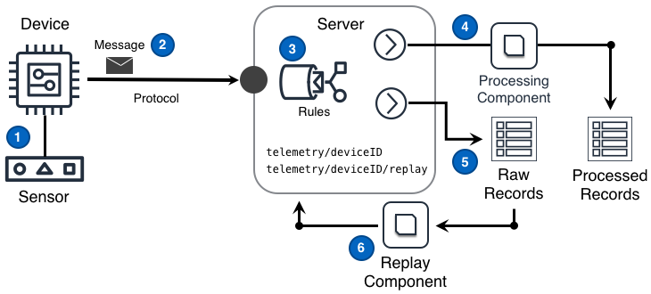

## Desafío

Para ofrecer conocimientos detallados de los datos, las soluciones IoT necesitan soportar análisis en tiempo real, en modo batch y predictivo de la información generada por la solución. Dado que cada modo de análisis se informa mejor al aprovechar los datos históricos _y_ los enfoques futuros para el análisis podrían no estar aún comprendidos, las soluciones IoT deben archivar datos de la manera más flexible posible para cumplir con los requisitos futuros.

## Solución

Las soluciones IoT aseguran que el negocio pueda obtener la colección más actual y en evolución de conocimientos al almacenar datos sin procesar de sensores de una manera que soporte la reproducción en orden de esas muestras sin procesar. La capacidad de almacenar y reproducir debe hacer que las muestras históricas sin procesar aparezcan casi como si las muestras estuvieran llegando en la secuencia de tiempo normal de muestras no históricas.

El diseño de Archivo de Telemetría mostrado en el siguiente diagrama puede proporcionar esta funcionalidad.

### Pasos del Diagrama

1. El dispositivo obtiene una medición de un sensor que opera en un entorno remoto de la solución IoT.
2. El dispositivo publica un mensaje en el tema `telemetry/deviceID` que contiene la medición. Este mensaje se envía a través de un protocolo de transporte a un endpoint de protocolo disponible por el Servidor.
3. El Servidor puede entonces aplicar una o más [reglas]() a los mensajes para realizar un enrutamiento detallado sobre algunos o todos los datos de la [medición del mensaje](). Estas reglas distribuyen los mensajes a al menos una ruta de procesamiento **`(4)`** y una ruta de almacenamiento sin procesar **`(5)`**
4. La ruta de procesamiento de mensajes realiza cálculos fundamentales necesarios por otros componentes de la solución y almacena los resultados procesados.
5. La ruta de almacenamiento de mensajes sin procesar guarda el mensaje original sin procesar de una manera que soporte la reproducción en orden de los mensajes originales.
6. En algún momento en el futuro, un componente puede leer mensajes sin procesar desde un punto en el tiempo y reproducir esos mensajes en un tema `telemetry/deviceID/replay`. La solución procesa los mensajes reproducidos según sea necesario.

## Consideraciones

Al implementar este diseño, considere las siguientes preguntas:

#### ¿Es necesaria la reproducción de registros para el procesamiento posterior?

Simplemente, **sí**. La mayoría de las soluciones deberían asumir que la respuesta a esta pregunta es "**sí**" ya que la reproducción de datos sin procesar de sensores permite que la solución IoT soporte la evolución de los conocimientos de una solución IoT a través de:

- actualizaciones de cálculos fundamentales que soportan un análisis bien realizado de datos históricos,
- la creación de nuevos tipos de registros procesados,
- implementación de nuevas características inesperadas, y
- la creación de perspectivas de datos completamente nuevas para el cliente.

An example of this consideration is [below](#ejemplo-de-consideración-de-reproducción-de-datos).

#### ¿Es importante asegurar el orden de los mensajes guardados?

Si **sí**: `necesita detalle`

Si **no**: `necesita detalle`

## Ejemplos

#### Ejemplo de Consideración de Reproducción de Datos

Un sitio físico está siendo monitoreado por la energía eléctrica ([kWh](https://en.wikipedia.org/wiki/Kilowatt_hour)) utilizada. Los sensores de energía se muestrean cada 30 segundos y las muestras se reportan en la solución una vez por minuto. A medida que llegan los mensajes sin procesar, se almacenan y un proceso de "promedio de 15 minutos" calcula automáticamente el promedio de 15 minutos de la energía monitoreada utilizada. Los resultados calculados se almacenan como registros en el repositorio de registros procesados de la solución. Estos nuevos registros procesados son luego utilizados por procesos analíticos adicionales y la interfaz de usuario de la solución IoT.

En una fecha posterior, está claro que los usuarios de la solución también quieren registros procesados que muestren la energía máxima utilizada cada 5 minutos. Para ofrecer este beneficio, se implementa un nuevo proceso de "máximo de 5 minutos". Este nuevo proceso reproduce los registros históricos sin procesar y calcula el máximo de 5 minutos en cada intervalo histórico. Una vez completado, cada resultado calculado se almacena como un nuevo tipo de registro procesado.

Sin la retención de las muestras sin procesar, la solución se limitaría a realizar cálculos solo en los datos que lleguen después de que la función de "máximo de 5 minutos" se implemente en la solución. Más importante aún, sin las muestras sin procesar originales, los usuarios no podrían analizar el sitio físico utilizando la función de 5 minutos, antes del momento en que se implementó la función.